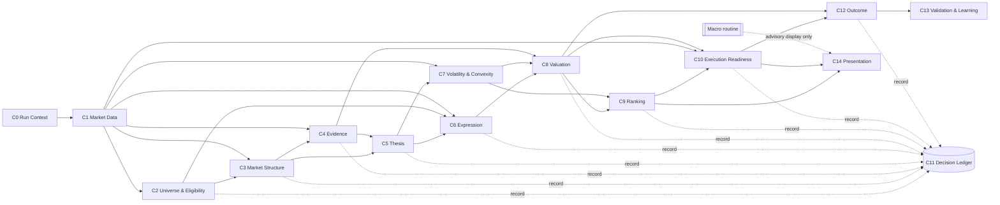
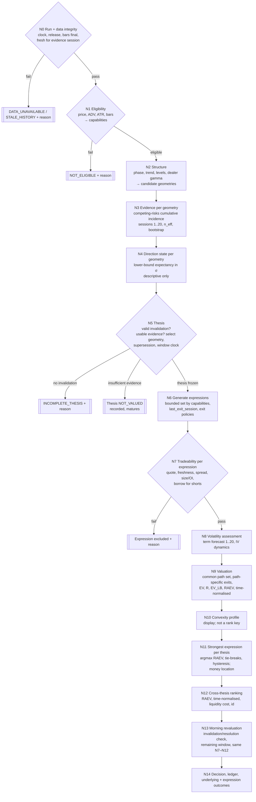

# AVSHUNTER — Business Domain Design Addendum

| Item | Value |
|---|---|
| Version | **2.0 — reconciled to governing specification v1.1** (16 Sep 2026) |
| Previous version | 1.0 draft (15 Sep 2026), preserved in git history |
| Status | **APPROVED by ACK (16 Sep 2026).** Design only, no code changed. |
| Governed by | `Enhancements/knowledge/AVSHUNTER_END_TO_END_DDD_BEHAVIOURAL_SPECIFICATION.md` v1.1 (signed off) and method notes 01–07 |
| Governs | `END_TO_END_PIPELINE_MAP_AND_FIX_DESIGN.md` and code. Where that document conflicts with this addendum, this addendum wins. |

This addendum adds **calculation-level design detail** under the governing specification: aggregates, invariants, the decision tree with the calculation at each node, valuation formulas, cheap-convexity metrics, ranking, and the mapping to existing code. It may add detail; it may not contradict the specification. Section references "spec §n" point to the specification.

### What changed from version 1.0 (superseded content)

| v1.0 content | Status in v2.0 | Governing source |
|---|---|---|
| `hold_sessions ∈ {5, 10, 20}`; hold chosen by evidence; `dte ≥ hold + buffer` | **SUPERSEDED** — one 1–20 session window with a window clock; expressions carry an absolute, immutable `last_exit_session` | spec §9, §10 (C3) |
| Context numbering C1–C11, Volatility inside Valuation | **SUPERSEDED** — C0–C14; Volatility & Convexity is C7 and runs before Valuation (C8) | spec §1, §11 |
| Evidence "per state × direction × horizon" | **SUPERSEDED** — per candidate geometry, competing-risks cumulative incidence over sessions 1–20 | spec §7, §8 (C1, C2) |
| Thesis completeness excludes when "no horizon has an evidence packet" | **SUPERSEDED** — insufficient evidence → thesis `NOT_VALUED`, recorded, matures; direction state never gates | spec §9 (S1) |
| Long-option generation by delta band 0.15–0.85 | **SUPERSEDED** — bounded strike band from thesis levels; no Greek-based pre-selection | spec §10 (R-B) |
| Short shares only; Q1 open | **SUPERSEDED** — long shares (BULL) and short shares (BEAR) in scope | spec §10 (Q1) |
| Ticker without chain excluded / `NO_CHAIN` | **SUPERSEDED** — capability `OPTIONS_DATA_UNAVAILABLE`; share expressions only | spec §6 (S2) |
| Two EV lower-bound definitions (§4.3 Dirichlet 20th percentile; §7.2 stress-min of EV − z·SE) | **SUPERSEDED** — one definition (§4.3) | this addendum |
| Rank key includes `cheap_convexity_score` | **SUPERSEDED** — RAEV, time-normalised return, liquidity cost, id; convexity displayed only until validated | spec §11, §13 (C9) |
| "Horizons compared on LB per session" | **SUPERSEDED** — time-normalised return as first tie-break | spec §12 (C9) |
| `vanguard/ev_engine_v2.py` listed as a dead copy | **CORRECTED** — it is the copy the EIL and final decision engine load (v2.1.0) | forensic report §8 |
| Macro as external advisory context | Unchanged | spec §14 |

---

## 1. Business problem

For every eligible ticker, answer three questions every session:

1. **Is there a thesis?** A directional view with a structural invalidation, an optional structural target and a 1–20 session opportunity window, with measured evidence of whether and when it resolves.
2. **Is there money in it, and where?** Expected profit, after costs and uncertainty, for every way of expressing the thesis — long options, debit verticals, and the ticker itself (long shares for BULL, short shares for BEAR).
3. **What is the strongest expression, and how does it rank against every other opportunity?** Rank, don't gate.

### Business requirements (ACK, 15–16 Sep 2026)

| Requirement | Design response |
|---|---|
| DDD design principles | Bounded contexts C0–C14, one owner per concept, ubiquitous language, domain events, append-only ledger (§2) |
| Decision-tree calculation logic using the data and correct algorithms | Decision tree with the calculation at each node; only integrity, thesis completeness and tradeability exclude (§3) |
| Identify cheap convexity | Convexity profile per option expression from C7; cheapness against forecast volatility and daily IV history (§5) |
| EV engine working correctly | One valuation core: common path set, path-specific exits, forced exit at `last_exit_session`, ask/bid with absolute spread floor, block-bootstrap lower bound (§4) |
| Rank instead of gate | Hard exclusions limited to integrity and tradeability (plus a thesis without invalidation, which cannot be valued); direction state descriptive (§6) |
| Strongest expression; money in the option or the ticker | Per-thesis argmax RAEV across options and shares on the same paths; money location (§6.3) |
| Expressions | Long calls / puts, debit verticals, long shares (BULL), short shares (BEAR, subject to borrow) |
| Ranking objective | RAEV per $ at risk; time-normalised return first tie-break |
| Trade window | 1–20 sessions; superseding thesis inherits the clock |

### Data questions (investigated 15 Sep 2026; still current)

- **Short-share data:**
  - MarketData.app has no short-interest, short-volume or borrow endpoint. The scanner stub `fetch_short_borrow_data` returns nothing and the VMS scorer assigns a **neutral 25/100** to the short/borrow component (`scripts/avshunter_universe_scanner.py:1037-1052, 1667-1668`) — missing → neutral (forbidden by spec Invariant B).
  - The existing Polygon/Massive key returns FINRA short interest (`/stocks/v1/short-interest`, bi-weekly) and daily short volume (`/stocks/v1/short-volume`). Unused.
  - **Borrow fee / availability** are not available from MarketData or Polygon. Options: Tastytrade `GET /market-metrics` via OAuth (session login discontinued 1 Dec 2025; no credentials in `.env`), IBKR SLB, ORTEX, iBorrowDesk (unofficial).
  - Until borrow data is integrated, short-share expressions carry `BORROW_DATA_UNAVAILABLE` and are not valued; short interest and short volume may be used as evidence/context features only (subject to validation).
- **Earnings data:** the morning gate reads `earningsAnnouncement` from the Polygon ticker snapshot, which does not exist → earnings silently `UNKNOWN`. MarketData.app `GET /v1/stocks/earnings/{symbol}/` works with the existing key. Earnings are display/context for manual review (spec §14) and an event-load metric (§5).

---

## 2. Domain model (DDD)

### 2.1 Bounded contexts

Numbering matches the governing specification.

| # | Context | Owns (aggregate / value objects) | Question it answers | Existing code to build on |
|---|---|---|---|---|
| C0 | **Run Context** | `RunContext` (run_id, decision_clock, evidence_session, release_id, clean_tree, config versions) | Which run, clock, release and configuration? | run plans / session authority (`data/canonical/run_plans.sqlite`, session clock in `canonical_data/session_clock.py`) |
| C1 | **Market Data** | `BarSeries`, `OptionChainSnapshot`, `Quote`, `ProviderFinality`, `CaptureCoverage`, `FreshnessState` | What was observed, when, is it final and is it fresh? | `domain/market_evidence.py`, `domain/provider_finality.py`, `domain/quote_units.py`, `canonical_data/*` (registry, projection outbox) |
| C2 | **Universe & Eligibility** | `UniverseSnapshot`, `EligibilityAssessment`, `InstrumentCapabilities` | May this ticker be analysed, why not, and which instrument families exist? | Discovery filters (to extract) |
| C3 | **Market Structure** | `StructureAssessment`, `CandidateGeometry`, `DealerPositioning` | What is the structure, which target/invalidation geometries does it propose, and where is dealer gamma? | Wyckoff engine, `domain/market_structure_evidence.py`, `macro_domain/gamma_exposure.py` (correct GEX engine) |
| C4 | **Evidence** | `EvidencePacket` per geometry | Historically, across the point-in-time universe, what happened from states and geometries like this, and when? | Actuarial v7 (to rebuild), `domain/actuarial_observation.py`, EV3 barrier-label mechanics |
| C5 | **Thesis** | **`Thesis` aggregate root** | What exactly do we believe, over which window, and when is it wrong? | `domain/thesis_direction.py`, `contracts/thesis_geometry.py`, thesis continuity guard |
| C6 | **Expression** | **`CandidateExpressionSet`** of `LongOption`, `DebitVertical`, `LongShares`, `ShortShares`, each with `ExitPolicy` and `last_exit_session` | What are all the tradeable ways to express this thesis? | `domain/contract_family_generation.py`, `domain/option_contract_liquidity.py` |
| C7 | **Volatility & Convexity** | `VolatilityAssessment` (term forecast 1–20, IV dynamics), `CheapConvexityProfile` | What volatility is expected, what is charged, is convexity cheap? | `domain/volatility_budget.py`, Phantom chain history (weekly IV since 2024) |
| C8 | **Valuation** | `PathSet`, `ExpressionValuation` (EV, R, EV_LB, RAEV, time-normalised return) | How much money is in each expression? | `domain/contract_economics_v2.py`, `dividend_adjusted_black_scholes`, EV3 first-passage and vertical valuation (§7.2) |
| C9 | **Ranking** | `OpportunityBook`, `RankingPolicy` | Which expression is strongest per thesis, and how do all opportunities order? | hysteresis concept from `domain/dynamic_options_ranking.py` |
| C10 | **Execution Readiness** | `MorningRevaluation`, `ExecutionDecision` | With live quotes now, is the ranked expression still valid and executable? | `domain/execution_authority.py`, `domain/long_option_execution.py`, morning gate (to merge) |
| C11 | **Decision Ledger** | `LedgerRecord` (append-only) | What was decided and not decided, before outcomes were known? | decision/outcome append-only ledger (`data/canonical/decision_outcome_ledger.sqlite`) |
| C12 | **Outcome** | `UnderlyingOutcome`, `ExpressionOutcome` | What happened to the underlying and to each expression? | `domain/decision_outcome.py`, `domain/dynamic_options_outcomes.py` |
| C13 | **Validation & Learning** | `ValidationReport`, `Scorecard`, model versions, authority states | Were probabilities, timing, valuations, selections and ranks right? | `domain/outcome_learning.py` |
| C14 | **Presentation** | `LabReadModel` | What does the trader see? (read-only) | `domain/lab_signal_book_v4.py`, `domain/presentation.py` |
| — | **Macro context** (external) | Scheduled routine's dated context file | Advisory context for manual review | No domain authority |

### 2.2 Context map



Rules:

- **Upstream owns, downstream reads.** A downstream context never rewrites an upstream aggregate (Expression cannot change the Thesis target; Presentation cannot change a rank; Execution cannot move a `last_exit_session`).
- **Anti-corruption layers** translate providers (MarketData, Polygon, broker) and legacy CSV schemas into domain objects at the boundary; domain modules stay free of pandas, files, SQLite and HTTP (existing `domain/` convention).
- **C8 Valuation is the single place money is computed.** Morning (C10) calls the same valuation service with live quotes; there is no second economics implementation. Legacy EV v2 and EV3 outputs are never EV.
- **C11 Ledger is written by every context** as outputs are published (spec §15).

### 2.3 Aggregates and invariants

| Aggregate | Invariants |
|---|---|
| `EligibilityAssessment` | State `ELIGIBLE` / `NOT_ELIGIBLE` with reason codes; integrity and tradeability thresholds only; carries `InstrumentCapabilities` (`options_available`, `long_shares_available`, `short_shares_available` incl. `BORROW_DATA_UNAVAILABLE`); a missing option chain is a capability, never an exclusion. |
| `CandidateGeometry` | Direction ∈ {BULL, BEAR}; invalidation required, structural, correct side of reference; `target_state` ∈ {LEVEL, NONE}; target > 0 and correct side when LEVEL; distances in σ; derivation rule recorded; no synthetic targets (no R-multiple fallback). |
| `EvidencePacket` | One per geometry; cumulative incidence of target-first and stop-first for sessions 1..20 non-decreasing; incidence(target) + incidence(stop) + survival = 1 at every session; `n_eff` by independent time blocks; block-bootstrap intervals; ambiguous count; only matured, cleaned labels; BEAR mirrored. `INSUFFICIENT_EVIDENCE` with reason when not estimable. |
| `Thesis` | Selected `geometry_id` with usable evidence; `direction_state` ∈ {SUPPORTED, UNSUPPORTED, OPPOSED, INSUFFICIENT_EVIDENCE} is **descriptive**; `trade_window` = sessions 1–20 from `window_start_session`; superseding version inherits `window_start_session` and records `supersedes_thesis_id`; frozen once published; no hold bucket. |
| `CandidateExpressionSet` | Every expression references one `thesis_id` and matches thesis direction; only families allowed by capabilities; `last_exit_session` is an absolute session, `≤ window Day 20`, immutable; a changed contract is a new `expression_id`; exclusions only for integrity/tradeability, each with reason. |
| `PathSet` | One per thesis per run; conditioned on thesis state and geometry; reconciles with the `EvidencePacket` cumulative incidence within tolerance, otherwise the thesis is `NOT_VALUED`. |
| `ExpressionValuation` | Valued on the thesis `PathSet`; exits at first of resolution, `last_exit_session`, time-stop variant, Day 20; EV, R, EV_LB, RAEV, time-normalised return in stated units; every input dataset and configuration version recorded; `NOT_VALUED` with reason when any input is missing — never a default. |
| `OpportunityBook` | Rank derived only from `ExpressionValuation` + ranking policy version; deterministic tie-breaks; every valued expression present (including `NO_POSITIVE_EDGE`); hysteresis applications recorded; reproducible from stored inputs. |
| `LedgerRecord` | Append-only; written before outcome known; lineage ids complete; `actioned` flag. |
| `ExpressionOutcome` | For every valued expression; origin = decision time; matures at earliest of underlying resolution, `last_exit_session`, time stop; bid-side marks. |

### 2.4 Ubiquitous language

| Term | Meaning |
|---|---|
| Opportunity window | Sessions 1–20 after the thesis evidence session during which the thesis may resolve |
| Window clock | The thesis's `window_start_session`; never restarted by morning runs or supersession |
| Candidate geometry | A structurally derived (invalidation, optional target) pair proposed by Market Structure |
| Thesis | A frozen directional view: selected geometry, direction state, window clock, resolution distribution |
| Direction state | Descriptive evidence assessment of the thesis (SUPPORTED / UNSUPPORTED / OPPOSED / INSUFFICIENT_EVIDENCE); not a gate |
| Invalidation | The underlying price at which the thesis is wrong and positions are exited |
| Target | A structural level where the thesis expects to take profit; `NONE` when no structural level exists |
| Expected resolution distribution | Session distribution of first passage from the evidence packet (median, quantiles) |
| Instrument capability | Whether options, long shares or short shares exist for a ticker |
| Expression | One tradeable instrument structure plus its exit policy (long option, debit vertical, long shares, short shares) |
| Last exit session | Absolute session after which an expression cannot be held (expiry minus exit buffer, capped at window Day 20); immutable |
| Remaining sessions to last exit | Sessions between the current session and `last_exit_session`; derived each run |
| Exit policy | Base (target / invalidation / last exit) or an approved time-stop variant |
| Path set | The common set of underlying paths used to value all expressions of a thesis |
| Capital at risk (R) | Maximum loss per unit (§4.2) |
| EV | Expected profit per unit after entry/exit costs, over the path set |
| EV lower bound (EV_LB) | Lower bound of EV under uncertainty and stress (§4.3, one definition) |
| RAEV | EV_LB ÷ R — the ranking objective |
| Time-normalised return | (EV ÷ R) ÷ expected sessions held — first ranking tie-break |
| Cheapness | How much the model value of an option under forecast volatility exceeds its ask |
| Convexity ratio | Option return at target ÷ underlying return at target |
| Tradeable | Two-sided, fresh quote; spread within limit; size/OI available; borrow available for short shares |
| Strongest expression | Highest RAEV for a thesis, with approved tie-breaks and recorded hysteresis |
| Money location | Where positive RAEV exists: OPTION, TICKER, BOTH, NONE or NOT_VALUED |
| Authority state | `IMPLEMENTED_FOR_REPLICATION`, `NOT_YET_VALIDATED_FOR_PRODUCTION_AUTHORITY`, `SHADOW`, `AUTHORITATIVE` |

### 2.5 Domain events

`RunContextEstablished` → `MarketSnapshotPublished` → `UniverseSnapshotPublished` / `EligibilityAssessed` → `StructureAssessmentPublished` (with candidate geometries) → `EvidencePacketPublished` (per geometry) → `ThesisPublished` / `ThesisSuperseded` → `ExpressionSetGenerated` → `VolatilityAssessmentPublished` → `ExpressionValuationPublished` → `OpportunityBookPublished` → `ExecutionDecisionRecorded` → `UnderlyingOutcomeMatured` / `ExpressionOutcomeMatured` → `ValidationCompleted`.

Every event appends a `LedgerRecord` with the ids of the inputs it used, so any rank can be replayed and every outcome traced back to the evidence and valuation that produced it.

---

## 3. Decision tree (calculation logic)

Each node computes something from data. **Only three node types can exclude:** data integrity/eligibility (N0–N1), thesis completeness (no valid invalidation, N5), expression tradeability (N7). Insufficient evidence is not an exclusion: it produces a recorded `NOT_VALUED` thesis that still matures. Everything else produces a number that flows into valuation or ranking. Every node writes to the ledger.



### Node specifications

| Node | Inputs | Calculation | Output | Excludes? |
|---|---|---|---|---|
| N0 | Run context, bars, chains, finality, freshness | Clock and release fixed; bars complete to evidence session; history not older than required session; chain provider-final for session | pass / `DATA_UNAVAILABLE` / `STALE_HISTORY` | **Yes** (integrity) |
| N1 | Bars, chain availability, borrow data | Price, 20-day ADV, ATR(14), ATR%, bar count against eligibility thresholds; capabilities from chain and borrow availability | `EligibilityAssessment` + capabilities | **Yes** (integrity/tradeability thresholds only); missing chain is a capability |
| N2 | Bars, chains | Wyckoff phase, trend, support/resistance, structural levels; candidate geometries (invalidation required, target LEVEL/NONE, distances in σ); dealer gamma via one GEX engine (γ·OI·100·S²·0.01, grid flip, GEX walls on correct side) or `GEX_UNAVAILABLE` | `StructureAssessment` + `CandidateGeometry[]` | No |
| N3 | Cleaned point-in-time universe history, geometry distances | Competing-risks cumulative incidence of target-first and stop-first by session 1..20 (Aalen-Johansen or discrete hazard), shrinkage to pooled hazards, `n_eff` by time blocks, block bootstrap; same-session double touch = `AMBIGUOUS`, counted as stop-first; BEAR mirrored (note 01) | `EvidencePacket` per geometry or `INSUFFICIENT_EVIDENCE` | No |
| N4 | Evidence packets | Underlying expectancy in σ (spec §9 formula; `target_state=NONE` variant); `SUPPORTED` if lower bound > 0, `OPPOSED` if upper bound < 0, else `UNSUPPORTED`; `INSUFFICIENT_EVIDENCE` if packet null | `direction_state` per geometry | No — descriptive |
| N5 | Geometries, states, packets, live theses | Select geometry with highest lower-bound expectancy among those with usable evidence (tie-break structural priority, id) — authority `IMPLEMENTED_FOR_REPLICATION`; apply supersession (same thesis / new version inheriting clock); resolution distribution (median, quantiles) | `Thesis` (frozen) | **Yes** only if no valid invalidation; all-insufficient evidence → `NOT_VALUED` (recorded, not excluded) |
| N6 | Thesis, chain, capabilities, configuration | Bounded generation (spec §10): expiries with `last_exit_session` in the useful window up to max DTE; long-option strikes in band around reference and target (or invalidation when NONE); verticals from strike set with short leg at/beyond target, or approved fixed widths when NONE, else `VERTICALS_NOT_APPLICABLE_NO_TARGET`; one share expression; base + approved time-stop exit policies; `last_exit_session = min(window Day 20, expiry − exit_buffer)` as absolute session | `CandidateExpressionSet` | No |
| N7 | Quotes, size/OI, borrow | Two-sided fresh quote; spread ≤ limit; size/OI ≥ minimum; expiry ≥ minimum usable session; short shares: borrow available and fee known | Tradeable / excluded with reason | **Yes** (per expression) |
| N8 | Bars, chain history, daily IV series | Realised-vol term forecast for sessions 1..20 (HAR-type, checkpoints 5/10/20); IV dynamics (spot-vol slope, stress shifts); quality states for placeholder IV / zero gamma | `VolatilityAssessment` | No |
| N9 | Thesis, packet, tradeable expressions, volatility, quotes | §4 | `PathSet`, `ExpressionValuation` | No (missing input → `NOT_VALUED`) |
| N10 | Valuations, chain, volatility, IV history | §5 | `CheapConvexityProfile` (display) | No |
| N11 | Valuations per thesis, previous book | argmax RAEV; tie-breaks time-normalised return, liquidity cost, id; hysteresis (§6.2); money location (§6.3) | Strongest expression | No |
| N12 | All valued expressions | §6.2 | `OpportunityBook` | No |
| N13 | Live quotes and spot (morning, manual run) | Check invalidation/resolution since close (becomes outcome, not rank); remaining window and `remaining_sessions_to_last_exit`; re-run N7–N12 with live bid/ask through the same services; better contract → new `expression_id` | Revalued book | Only via N7 or thesis already invalidated/resolved |
| N14 | Morning book | Execution action (BUY_NOW / BUY_SMALL / MONITOR / NO_EDGE / INVALIDATED); ledger records; outcome maturation for every thesis and valued expression | `ExecutionDecision`, `LedgerRecord`, outcomes | No |

---

## 4. Valuation — the EV engine (C8)

One valuation service, one set of formulas, used at EOD and in the morning. §7.2 gives the path-replay algorithm and code base; §4 defines the quantities.

### 4.1 Common notation

- d = +1 for BULL, −1 for BEAR; S₀ reference spot; L invalidation; U target (or none).
- Sessions k = 1..20 of the thesis window, counted from `window_start_session`; at a morning revaluation k starts from the current session.
- E = the expression's `last_exit_session` expressed as a window session (E ≤ 20); T = an approved time-stop session if the exit policy has one; the forced exit session is F = min(E, T).
- From the path set (reconciled with the evidence packet), for k = 1..F:
  - q_U(k) = probability the underlying first reaches U on session k (before L),
  - q_L(k) = probability it first reaches L on session k (before U),
  - s(F) = 1 − Σ_{k≤F} q_U(k) − Σ_{k≤F} q_L(k) = probability neither is touched by F, with the conditional return distribution F_F(r) of paths still unresolved at F.
  - When `target_state = NONE`: q_U ≡ 0; exits occur at L or at F. No reference level is used as a barrier.
- Exit price of the underlying: S_U = U; S_L = worse of L and that session's open (gap); S_F = S₀(1 + r), r ~ F_F (the path's actual return, never unchanged spot).
- τ(k) = remaining time to option expiry at exit; σ_exit(k) from the IV dynamics of C7.

### 4.2 Expression payoff per unit

| Expression | Entry cost (per unit) | Exit value at underlying price S on session k | Capital at risk R |
|---|---|---|---|
| Long option (strike K, right c/p) | ask₀ + commission | `bid_exit = max(V − max(h_min, c·V), 0)` with V = model value at (S, K, τ(k), σ_exit(k)), h_min absolute half-spread floor; − commission | ask₀ + commissions |
| Debit vertical (long K₁, short K₂) | ask₀(K₁) − bid₀(K₂) + commissions | long-leg bid_exit − short-leg ask_exit, capped to [0, width]; − commissions | net debit + commissions (0 < D < width) |
| Long shares (BULL) | ask₀ + commission | bid at exit − commission | (S₀ − S_L) incl. gap allowance + costs |
| Short shares (BEAR) | bid₀ (proceeds) − commission | − ask at exit − borrow_fee × S₀ × sessions held/252 (convention per configuration) − commission | (S_L − S₀) incl. gap allowance + borrow over expected hold + costs |

Profit per unit: π(S, k) = exit value − entry cost (short shares: proceeds − buy-back − fees). The short leg of a vertical carries early-assignment risk, disclosed on the valuation.

### 4.3 Expected value, uncertainty and time normalisation

```
EV = Σ_{k≤F} q_U(k) · π(U, k) + Σ_{k≤F} q_L(k) · π(S_L, k) + s(F) · E_{r~F_F}[ π(S₀(1+r), F) ]

expected_sessions_held = Σ_{k≤F} k·(q_U(k) + q_L(k)) + F·s(F)
time_normalised_return = (EV / R) / expected_sessions_held
```

**EV lower bound — single definition:**

```
for each approved stress scenario s ∈ {base, IV shift −Δ, IV shift +Δ, exit spread × m, stop gap}:
    EV_s(b) for b = 1..B week-block bootstrap resamples of the path set
    LB_s = q-th percentile of EV_s(b)             (q = valuation.ev_lb_quantile, configuration)
EV_LB = min_s LB_s
RAEV  = EV_LB / R
```

- Probabilities come only from the cleaned, point-in-time path set reconciled with the evidence packet (spec §12).
- Evidence shrinkage (towards pooled hazards) is applied in C4, not re-applied in valuation.
- `NOT_VALUED` with reason when any input is missing (no default probability, IV, spread or borrow fee).

### 4.4 Correctness requirements for the engine

1. First-passage probabilities indexed by exit session, not terminal-only.
2. Exit at the earliest of resolution, `last_exit_session`, time stop, Day 20; `last_exit_session` read, never recomputed.
3. Unresolved paths valued at the path's actual spot at the forced exit session, never at unchanged spot.
4. Exact barrier distances; no grid snapping.
5. Option value at exit uses remaining time and the C7 IV dynamics; never expiry intrinsic when exiting before expiry.
6. Entry at ask (natural debit), exit at bid (natural credit) with an absolute spread floor; commissions and borrow fees included.
7. Units: dollars per share-equivalent and per contract (× multiplier) both carried; ratios unitless.
8. Direction symmetry: BEAR is the mirror of BULL on mirrored evidence.
9. q_U + q_L + s = 1; EV reproducible from stored inputs and configuration versions.
10. No fallback or synthetic target; `target_state = NONE` values stop / forced-exit paths only.
11. Every expression of a thesis valued on the same `PathSet`.

---

## 5. Cheap convexity (C7)

Cheap convexity = an option expression whose payoff is strongly convex in the thesis direction **and** whose price is low relative to the volatility the evidence and forecast expect. It is a **profile attached to every option expression**. It is explanatory: the money effect of cheap or expensive volatility is already inside EV through the C7 forecast. It is **not a gate and not a ranking key** until C13 validation shows incremental value beyond RAEV (spec §11, Invariant G). Data coverage per metric: §7.3.

Horizon convention: metrics use the thesis **expected resolution distribution** (median session m, or the expression's forced exit F where relevant), not a hold bucket.

| Metric | Formula | Reading |
|---|---|---|
| Model cheapness | `(V(S₀, K, τ₀, σ_forecast(m)) − ask₀) / ask₀` with σ_forecast from C7 term forecast | > 0: option priced below forecast-vol value |
| Variance risk premium | `σ_IV(ATM, matched tenor) − σ_forecast(matched sessions)` | < 0: implied cheap vs expected realised |
| IV percentile | Rank of current 30-day constant-maturity ATM IV within its own trailing 252 sessions (daily point-in-time IV series; weekly history only as an interim, disclosed) | Low: cheap relative to own history |
| Breakeven-to-expected-move | `|K_breakeven − S₀| / (S₀ · σ_forecast(m)·√(m/252))` | < 1: breakeven inside the expected move |
| Convexity ratio at target | `(π_option(U) / R) ÷ (|U − S₀| / S₀)`; not applicable when `target_state = NONE` | High: option magnifies the thesis move |
| Gamma per premium | `Γ · S₀² · 0.01 / ask₀` | High: more convexity per dollar |
| Theta burden | `|Θ| · m / (EV_gross + ε)` | Low: time decay small vs expected payoff |
| Term structure slope | `σ_IV(next expiry) − σ_IV(front expiry)` from actual listed expiries (≥ 7 DTE) | Upward slope: front options relatively cheap |
| Skew in thesis direction | BEAR: `σ_IV(25Δ put) − σ_IV(25Δ call)`; BULL: reverse; interpolated at \|Δ\| = 0.25 | Low: thesis-direction wing not overpriced |
| Event load | Earnings/event before `last_exit_session` flag and event IV premium | Explains elevated IV; separates event from structural cheapness |
| Upper-tail share | `E[π·1{top decile}] / R` on the path set | High: payoff concentrated in favourable tail |

A composite `cheap_convexity_score` (equal-weight cross-sectional percentile ranks) may be displayed with authority state `SHADOW`. A metric with missing inputs is excluded from the composite and the count of metrics used is published — never replaced by a neutral value. Weights may only be fitted from C13 outcomes.

---

## 6. Ranking instead of gating (C9)

### 6.1 Hard exclusions (only these)

| Class | Condition | Node |
|---|---|---|
| Integrity | Bars not final or stale for the evidence session; history stale; chain not final; required inputs corrupt | N0 |
| Eligibility (integrity / tradeability thresholds) | Price range, ADV, ATR, minimum bars | N1 |
| Thesis completeness | No valid structural invalidation (thesis cannot be valued) | N5 |
| Tradeability | No two-sided fresh quote; spread above limit; size/OI below minimum; short shares without borrow | N7 (per expression) |

Not exclusions (recorded, visible, mature): `INSUFFICIENT_EVIDENCE` → thesis `NOT_VALUED`; `OPPOSED` / `UNSUPPORTED` → valued and ranked; `OPTIONS_DATA_UNAVAILABLE` → share expressions only; `VERTICALS_NOT_APPLICABLE_NO_TARGET`; `NOT_VALUED` expressions; `NO_POSITIVE_EDGE`.

Excluded items are **still recorded** with reason codes (for outcome learning and audit) but not ranked.

### 6.2 Ranking

```
RAEV = EV_LB / R
Within thesis and across theses, rank key =
  (RAEV descending,
   time_normalised_return descending,
   liquidity cost ascending,
   expression_id)
```

- Everything that acted as a gate in the legacy pipeline — direction conflict, weak evidence, liquidity within limits, IV richness, missing structural target, composite scores — acts through EV, EV_LB (uncertainty) or the tie-breaks.
- `RAEV ≤ 0` items remain in the book labelled `NO_POSITIVE_EDGE`.
- No hand-tuned weights inside RAEV; all penalties are costs or uncertainty.
- **Hysteresis:** keep the previous run's strongest expression for the same thesis unless the new leader's RAEV exceeds it by more than switching cost + `ranking.hysteresis_margin` (derived from bootstrap interval overlap); never keeps an expression with RAEV ≤ 0 or no longer tradeable; every application recorded.
- Portfolio concentration (sector, cluster, correlation) reported, not applied.

### 6.3 Strongest expression and money location

For each thesis: `strongest = argmax RAEV over tradeable, valued expressions` (tie-breaks as §6.2).

| Money location | Condition |
|---|---|
| OPTION | best option-family RAEV > 0 and (no share expression, share RAEV ≤ 0, or option RAEV higher) |
| TICKER | share expression (long shares for BULL, short shares for BEAR) RAEV > 0 and higher than best option RAEV |
| BOTH | both > 0; record the RAEV ratio |
| NONE | no expression with RAEV > 0 |
| NOT_VALUED | evidence, quotes or borrow data unavailable (with reason) |

### 6.4 How earlier open decisions resolve

| Earlier decision | Resolution |
|---|---|
| D1 Direction conflict | Not a gate. Opposing evidence lowers q_U and raises q_L, so EV and RAEV fall; `direction_state = OPPOSED` is shown (spec S1). |
| D2 Evidence families | Evidence enters through the per-geometry competing-risks packet (C4). Catalyst direction evidence and relative_strength_20d retired (ACK). Other features become state dimensions only if they add measured lift. |
| D3 Missing target | `target_state = NONE`; valued with stop / forced-exit paths only; no fallback target (spec S3). |
| D4 Convexity / physics / Heston | Convexity rebuilt as §5 profile, display-only until validated. Physics retired. Heston overwrite retired; provider greeks for display, explicit-IV model inside valuation. |
| D5 Win probability | Replaced by evidence cumulative incidence with intervals. |
| D6 Tier | Replaced by rank and RAEV bands for display, one definition. |
| D7 Hold owner | **Superseded.** No hold. Thesis owns the 1–20 window and clock; expressions own `last_exit_session`; time stops are exit-policy variants valued by C8 (spec C3, C13). |
| D8 Trigger GO | Trigger becomes a timing feature shown with the rank; not a gate. |
| D9 EIL end of day | Removed from ranking; live microstructure only in N7/N13 tradeability. |
| D10 Macro | Display-only context for manual review; no gate, floor, score or rank (ACK). |
| D11 Event guards | Display-only for manual review until impact is understood (ACK). |
| D12 EV authority | Legacy EV v2 invalid as EV; EV3 non-authoritative; C8 gains authority only after spec §24 gates. |
| D13 GEX | One engine in C3; `GEX_UNAVAILABLE` when data insufficient; display/feature only until validated. |

---

## 7. Existing code mapping and defects to fix

Source: read-only audits 15–16 Sep 2026 (EV3 engine; other valuation modules; cheap-convexity data coverage; forensic mapping; GEX; IV history; data freshness). [V] verified in code/data, [I] inferred. This section is evidence for the strangler migration; the existing code is an asset mine, not a design reference.

### 7.1 What values money today, and what actually decides

| Module | What it computes | Decides anything? | Verdict |
|---|---|---|---|
| `vanguard/ev_engine_v2.py` (v2.1.0) — **the copy actually loaded** by `execution_intelligence_runner.py` (sys.path order) and by `final_decision_engine.py` | Heuristic "p" blend × delta-gamma option return × multipliers; efficiency clamp `_clamp(cev/abs(sev),0.30,1.30)` (:228) | **Yes** — `ev2_ev_conf_adj` feeds `final_decision_engine.py:399`, EIL advisory field (`execution_intelligence_runner.py:441, 933`), EOD `ev_conf_adj`/`ev_status` (`eod_candidate_engine.py:2642-2643`), Lab EV warning (`lab_control.py`, now relabelled `LEGACY_EV_*`), Lab priority 10%, Lab EV display (relabelled "Legacy EV (not real EV)") | **RETIRE** with the legacy decision path. Run 20260914: passed all 1,449 rows while EV3 found all 245 evaluable contracts negative. |
| `ev_engine_v2.py` (root, v2.2.0, PATCH-05) — not loaded by EIL | Same heuristic design | No (in the EIL path) | **DELETE** after migration. [V] PUT not direction-aware (upside move stats, stop below entry for PUT, :95-112); multipliers < 1 multiply negative EV toward 0 (:371) so worse spreads/data *improve* EV; move double-counted (:337); "p" not a probability; mid entry, premium default 1.0, DTE horizon, fixed 10%/5% target/stop. Same efficiency-floor defect as the vanguard copy. |
| `vanguard/ev_engine.py` | Older copy | No | **DELETE** |
| `vanguard/ev_engine_v3.py` + `ev3_stage0.py` | First-passage barrier probabilities (target/stop/timeout) from actuarial paths; CRR option exit pricing; LB ranking; long options and debit verticals | Advisory (authority deliberately retired 4 Sep, commit `667620e`) | **REBUILD into C8** (keep first-passage + vertical valuation + LB ranking mechanics). [V] HIGH: timeout valued at unchanged spot (:647, :450); grid snapping — target up, stop down, payoff at exact levels (:175-176); exit spread as today's fraction, no commissions (:350). MED: mean exit day only; constant IV with −15% stress only, fixed dollar anchor offset (:319); n_eff summed across correlated fallback states (:218); no gap at stop. Model-limit rejections (hold ≠ 5/10/20, off-grid distance, theta > 20% of mid, DTE > 180) all superseded. |
| `domain/contract_economics_v2.py` | Scenario grid × timing × IV shock; ask entry, bid-like exit; convexity second difference | **Yes** — contract choice within family via `ranking_score_v2` | **BASE for C8 pricing/scenarios**; add the path-set probability measure; remove its selection role (no pre-valuation selector). [V] no probabilities (1.5σ treated as certain → favours low-delta lottery contracts [I]); thesis target absent from utility; PUT arithmetic S(1−kσ) can go ≤ 0 → ValueError |
| `domain/deterministic_option_valuation.py` (DOI-5) | Target/invalidation × timing × IV shocks; utility median(favourable)+min(adverse) | Disclosure only | **KEEP pricer** (`dividend_adjusted_black_scholes`, American check); **DELETE utility**. [V] 25 bp exit cost vs ~32% median spreads; target/invalidation treated as certain |
| `contracts/selected_contract_economics.py` | Vertical hydration (correct); intrinsic-at-target monetisability; r=0 time-value monetisability | **Yes** — `opportunity_tier.py:162-166, 242-247` (tier and BLOCK routing) despite "advisory" comment at `eod_candidate_engine.py:997` | **KEEP hydration; retire monetisability** (replaced by C8 EV). [V] target treated as certain (3R fallback can pass as structural [I]); `rr_premium_expected` conditional payoff mislabelled as expected; exit at mid; verticals never valued (CONTRACT_REPAIR); IV > 5 silently ÷100; `recompute_premium_rr` dead |
| `empirical_option_ev.py` | BS payoff over 13 actuarial return percentiles | No (tests only) | **FOLD idea into C8, DELETE module**. [V] BS crash when return ≤ −100%; exit at mid; calendar-minus-sessions DTE. [I] percentiles corrupted by outliers |
| `domain/dynamic_options_ranking.py` | Weighted score (det + probabilities − uncertainty) with hysteresis; chronological weight tuning | **Yes** — contract selection | **REPLACE by C9 RAEV ranking** (keep hysteresis concept under §6.2 constraints). [V] unbounded return added to probabilities; tuning maximises mean reward (no risk adjustment); replay vs live margin mismatch |
| `domain/volatility_budget.py` | σ·√(h/252) move fraction | Inputs only | **KEEP** (correct); generalise to a term forecast for C7 |
| `domain/reachability.py` | spot·(1 ± 1.5·move) "reachable target" | Inputs only | **RENAME** (`vol_reference_level`, display only — never a target); PUT ≤ 0 crash path |
| `scripts/compute_greeks_bs.py` | Third BS pricer | Used by empirical EV, time-value monetisability, `gamma_exposure_store.prepare_gex_greeks` | **DELETE** in favour of domain pricer (repoint GEX greek derivation) |
| `edge_detector.py:285` EVEngineV2 call | Result discarded; gate uses uncleaned `expected_value_20d` (with macro floors) | Gate | **DELETE** (Vanguard becomes a C3/C4 feature producer at most) |

Duplication today: three BS pricers; six definitions of "value at target"; four exit-cost conventions (mid, ask→mid, 25 bp, spread/2); three horizon conventions (DTE buckets, nearest 5/10/20, XNYS sessions) — all replaced by C8 and the 1–20 window.

### 7.2 Valuation core target (C8)

Built on `contract_economics_v2.py` + `dividend_adjusted_black_scholes` + C7 volatility, with EV3's first-passage path logic and vertical valuation. Algorithm (implements §4):

1. **Path set per thesis** (path replay, preferred over a cached outcome grid): for each historical path j (cleaned, point-in-time, direction-mirrored, conditioned on the thesis state) using the **exact** geometry distances:
   - exit session k_j = first touch of target or invalidation, else the expression's forced exit F (read from `last_exit_session` / time stop);
   - exit spot: target level; **worse of stop level and that session's open** (gap); if unresolved at F, the path's actual return to F: S₀·C_{t+F}/C_t;
   - path volatility scaled to the C7 forecast where the state sample's realised volatility differs;
   - the path set's cumulative incidence by session must reconcile with the evidence packet within tolerance, else the thesis is `NOT_VALUED`;
   - if a cached outcome grid is used instead, store per-session q_U(k), q_L(k) and unresolved return distributions for every F; interpolate distances, never snap.
2. **Option value at exit**: σ₀ backed out from entry mid per leg; exit IV σ_j = σ₀ + β_d·ln(S_j/S₀) + δ (β_d fitted spot-vol slope from C7; δ = 0 base, ±Δ stress); τ_j = remaining calendar time; CRR/American for puts and dividend names, BS otherwise.
3. **Fills and costs**: entry at ask (+ slippage); exit bid_j = max(V_j − max(h_min, c·V_j), 0); commissions per leg per side (per share = commission ÷ multiplier); long shares: ask entry, bid exit; short shares: bid entry, ask exit, borrow fee over sessions held, gap buffer at stop.
4. **Capital at risk R**: long option = entry debit; vertical = net debit; long shares = (entry − stop) incl. gap + costs; short shares = (stop − entry) incl. gap + expected borrow + costs.
5. **EV and uncertainty**: EV = weighted mean of π_j over paths; EV_LB per §4.3 (week-block bootstrap, stress minimum); n_eff = distinct week blocks across the union of pooled states (no double counting); time-normalised return per §4.3.
6. **Same path set for all expressions** of a thesis (long options, verticals, long/short shares) so RAEV values are directly comparable and money location (§6.3) is meaningful.
7. **No model-limit rejections**: off-grid distances, theta ratios, holds and long DTE are valued or `NOT_VALUED` with a reason, never silently rejected.

### 7.3 Cheap-convexity and market-structure data coverage (run 20260914_214012)

1,449 tickers; 1,316 (91%) have a chain for the session; 133 have none (→ capability `OPTIONS_DATA_UNAVAILABLE`, share expressions only).

| Metric | Computable today | Coverage | Action |
|---|---|---|---|
| IV / realised vol (RV20, RV60) | YES | 91% (RV 99.7%) | `iv_vs_hv` verified; add RV20/RV60 from `ohlcv_daily` |
| Variance risk premium | PARTIAL | 91% | Refit HAR-type term forecast on bars (C7); current `l3` horizon not tied to tenor, parameters not saved (`l3_garch_alpha`, `vol_of_vol` 0% non-null) |
| Model cheapness | PARTIAL | 91% | Depends on C7 term forecast |
| Term-structure slope | YES (recompute) | ~91% (stored `term_ratio` 27%) | Compute from actual front vs next expiry (≥ 7 DTE); stored logic seeks 10–25 and 40–60 day expiries that chains do not list |
| Skew in thesis direction | PARTIAL | 74% stored, ~85–91% recomputed | Stored columns ×100 (unit drift); interpolate at \|Δ\| = 0.25 per expiry |
| Gamma per premium $, vega per premium $ | YES | 91% | Use ask consistently |
| Breakeven ÷ expected move | YES (recompute) | 91% | Do not use stored `expected_move_pct` (1.64× IV·√(DTE/365) at median, 49 rows > 100%) |
| Theta burden | YES | 91% | Replace undocumented `move_theta_ratio`; horizon = expected resolution median |
| Convexity ratio at target | PARTIAL | ≤ 91% | Not applicable when `target_state = NONE` |
| IV percentile (daily IV history) | **NO** (as specified) | 0% daily | Current `ivp_252d` compares IV with realised-vol range, not IV history (`avshunter_options_intelligence.py:3929-3947`); `iv_rank` = max(30d, 252d) → 26.5% of rows at exactly 100. **Existing weekly IV history:** Phantom `chain_snapshots` (per-contract IV, weekly Fridays since ~May 2024 for most tickers, gaps) can seed an interim weekly percentile (disclosed); `iv_history_cache.db` sparse (≈7 samples/ticker). No daily constant-maturity series exists. |
| Event load | **NO** | ~1% | No earnings calendar in `data/`; `catalyst_date` 1% non-null and all past; MarketData earnings endpoint available |
| Dealer gamma (C3) | **DEFECTIVE** | per-ticker computed, invalid | Per-ticker flip = first per-strike sign change from lowest strike (median 22% from spot vs 5.5% correct); OI walls not GEX walls; EIL `_synthesise_gex_map` invents exposures; SPY/QQQ refresh fails on `date` parameter; `regime_consensus` defaults 0.5. Correct engine exists in `macro_domain/gamma_exposure.py` (`gex/GEX_INVESTIGATION_20260914_214012.md`). |

Data hygiene required before any metric: exclude contracts with `implied_vol ≤ 0.001` or gamma = 0 (5.7% of sampled contracts; up to 27% per ticker; 11% of rows in the GEX sample) as quality states; fix `contract_vanna` clipping (17 rows at ±1); `contract_iv` > 3 on 4 rows.

**Freshness:** Phantom full-universe chain history, recomputed greeks, IV surface and IV cache last updated for session 2026-09-04 (manual weekly backfill, not in the evening run); daily projection of candidate chains only since 13 Sep (`data_freshness/PHANTOM_DATA_FRESHNESS_20260916.md`).

**New data needed**

1. Fixed capture panel (eligible universe + SPY/QQQ) captured and projected every evening, with receipts and freshness state (C1).
2. Daily constant-maturity (30-day) ATM IV series ≥ 252 sessions per ticker, derived from daily captured chains; weekly Phantom history as interim seed; backfill missing sessions via MarketData historical `date` queries.
3. Point-in-time earnings/event calendar — MarketData `/v1/stocks/earnings/{symbol}/` (snapshot daily; future dates are estimates).
4. Borrow availability, borrow fee and hard-to-borrow status — Tastytrade `/market-metrics` via OAuth (recommended) or IBKR/ORTEX; short interest and short volume available now from the existing Polygon key.
5. Structural geometry coverage (Market Structure rebuild) for targets and convexity-at-target.
6. Point-in-time universe including delisted names (C2) for survivorship-free evidence and validation.

Until then, the convexity profile publishes only metrics it can compute and the count used per expression.

---

## 8. Build sequence impact

The phase plan is owned by `END_TO_END_PIPELINE_MAP_AND_FIX_DESIGN.md` and must follow spec §24 (**build → shadow / non-authoritative → replication → validation → authority**). This addendum requires:

- **Phase 0 — Foundation / Data Truth:** C0 run context (single clock, release, clean tree); configuration registry (spec Appendix B); C1 fixed capture panel, projection receipts, freshness gate and backfill of missing sessions; C11 ledger contract for all record types; C2 point-in-time universe and capabilities.
- **Phase 1 — Evidence and Volatility (shadow):** C3 candidate geometries and one GEX engine; C4 competing-risks packets per geometry; C7 term forecast and daily IV series; replications R1 and R4 run through these services.
- **Phase 2 — Thesis (shadow):** C5 geometry selection (R-H, `IMPLEMENTED_FOR_REPLICATION`), supersession and window clock.
- **Phase 3 — Expression and Valuation (shadow):** C6 bounded generation with capabilities, `last_exit_session` and exit policies; C8 single valuation core (§4, §7.2) with path-set reconciliation.
- **Phase 4 — Ranking and Readiness (shadow):** C9 RAEV ranking with tie-breaks and hysteresis; C10 morning revaluation through the same services; C14 read-only Lab showing authority states.
- **Phase 5 — Outcomes, Validation and Authority:** C12 underlying and expression outcomes for every recorded item; C13 calibration (timing and EV), rank-decile and non-selected comparisons; authority granted per context only after walk-forward and forward shadow validation; legacy producers retired as each context gains authority.
