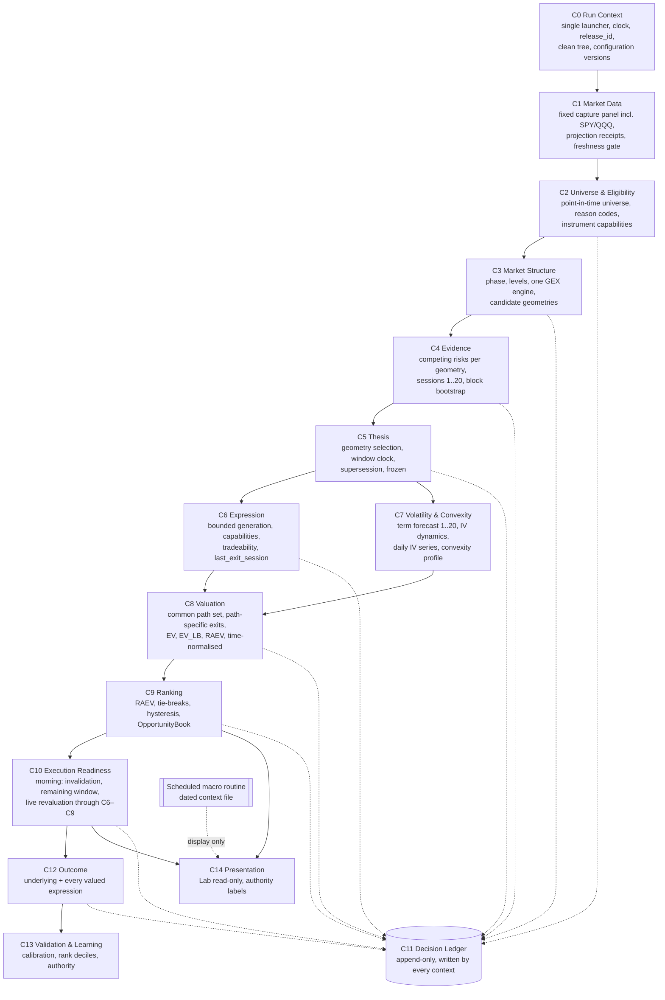

# AVSHUNTER — End-to-End Pipeline Map and Migration Design

| Item | Value |
|---|---|
| Version | **2.0 — reconciled to governing specification v1.1 and addendum v2.0** (16 Sep 2026) |
| Previous version | 1.0 draft "End-to-End Pipeline Map and Fix Design" (15 Sep 2026), preserved in git history |
| Status | **APPROVED by ACK (16 Sep 2026).** Design only, no pipeline code changed. |
| Governed by | `Enhancements/knowledge/AVSHUNTER_END_TO_END_DDD_BEHAVIOURAL_SPECIFICATION.md` v1.1 (signed off) → method notes 01–07 → `BUSINESS_DOMAIN_DESIGN_ADDENDUM.md` v2.0 |
| Role | **Implementation / migration design.** Maps every legacy stage (S0–S18) to what it really does today (evidence) and to the target bounded context(s) C0–C14 it migrates into (strangler steps). It may add implementation detail; it may not contradict the documents above. |
| Evidence run | `20260914_214012` (session 2026-09-14), cross-checked against earlier runs where stated |
| Companion evidence | `DECISION_PATH_MAP_20260914_214012.md` (breaks DM-01..DM-38), `Enhancements/signal_accuracy/runs/20260914_214012/`, `Enhancements/forensic_mapping/`, `Enhancements/gex/`, `Enhancements/iv_history/`, `Enhancements/data_freshness/` |

Evidence tags: **[V]** verified in code or run data · **[I]** inferred, to confirm during build.

Reading rule: every stage keeps its **Current state** (verified evidence of the legacy pipeline, still valid). The **Migration design** replaces the version 1.0 "Right fix". The legacy pipeline is an asset mine, not a design reference: reusable parts move behind context contracts; everything else is retired once the owning context gains authority.

### What changed from version 1.0 (superseded content)

| v1.0 content | Status | Governing source |
|---|---|---|
| Target pipeline with Contract selector → EV3 | **SUPERSEDED** — Expression generation (all eligible, bounded) → Tradeability → Volatility → Valuation of all → RAEV ranking | spec §2, §10–§13 |
| S7 evidence packet "per direction and horizon" (`p_up_h`, Wilson/beta CI); outliers "reject or cap at ±100%" | **SUPERSEDED** — per candidate geometry, competing-risks cumulative incidence over 1–20 sessions, block bootstrap; failing returns excluded with recorded reason, never capped | spec §8, Invariant E |
| S9 `thesis_hold_sessions ∈ {5,10,20}`; direction states CONFIRMED / UNCONFIRMED / CONFLICT; null hold → BLOCKED; optional REFERENCE target | **SUPERSEDED** — 1–20 window with clock and supersession; SUPPORTED / UNSUPPORTED / OPPOSED / INSUFFICIENT_EVIDENCE, descriptive; candidate geometry selection; `target_state = NONE` without any reference target | spec §9 (C1, C4, S1, S3, R-H) |
| S10 selector (liquidity first → `dte ≥ hold + buffer` → delta band → reachability → score) | **SUPERSEDED** — no selector; bounded generation, tradeability, immutable `last_exit_session`, capabilities | spec §6, §10 (C3, S2, S5, R-B) |
| S11 "EV3 is the single option-EV producer"; authority after ≥ 30 matched outcomes | **SUPERSEDED** — C8 valuation core rebuilt from EV3 mechanics and other assets; authority only via spec §24 gates | spec §12, §24 |
| S11 / §5 "`vanguard/ev_engine_v2.py` byte-identical dead copy" | **CORRECTED** — it is the copy the EIL and final decision engine load (v2.1.0) | forensic report §8 |
| S3 GEX "fix adapter, keep advisory or retire" (D10) | **SUPERSEDED** — one GEX engine in C3 for all tickers; feature/display until validated | spec §7; `gex/` report |
| S13 EOD status decision table (TRIGGER_READY / THESIS_READY / WATCH), "authorised rows only" | **SUPERSEDED** — OpportunityBook with every valued expression; spec terminal states; RAEV bands for display | spec §13, §21 |
| S15 actions BUY_NOW / BUY_SMALL / CONTRACT_REPAIR / MANUAL_REVIEW / BLOCK | **SUPERSEDED** — BUY_NOW / BUY_SMALL / MONITOR / NO_EDGE / INVALIDATED (+ recorded data states) | spec §14 |
| S17 recording contract keyed on `thesis_hold_sessions`; option leg for the selected contract only | **SUPERSEDED** — ledger written by every context, window fields, `last_exit_session`, `actioned`; outcomes for every thesis and every valued expression | spec §15, §16 (C5, C6) |
| §6 decisions D1–D10 | **RESOLVED / SUPERSEDED** — see §6 | spec, addendum §6.4 |
| Expression scope "short shares for PUT; long shares not selected" | **SUPERSEDED** — long shares (BULL) in scope | spec §10 (Q1) |
| §7 build sequence (fix legacy stages in place, EV3 authority by outcome count) | **SUPERSEDED** — strangler phases: build → shadow → replication → validation → authority → retire legacy | spec §24; addendum §8 |

---

## 1. Why the pipeline keeps breaking (summary)

The same failure patterns appear in every stage:

| Pattern | What it looks like | Examples |
|---|---|---|
| Missing → neutral | A missing input becomes a default number, a "neutral pass", 0, or a fallback value | 3R targets, spread 0.08, returns 0, VMS silently off, `planned_hold_sessions` null in the ledger, IV tailwind 0, GEX `regime_consensus` 0.5, short/borrow component 25/100 |
| Label over-claims | A name implies validation that never happened | `CONFIRMED`, `ACTUARIAL`, `SESSION_ALIGNED`, `MONETISABLE`, `win_probability`, `scanner_data_quality=CONFIRMED`, EIL `BLOCKED`, legacy EV "PASS", GEX refresh `COMPLETE` on 10-day-old data |
| Computed, not applied | A check or model runs and nothing uses it | selector spread limit, reachability cap, EVEngineV2 in Vanguard, WBS in EIL, mp size multiplier |
| Several producers | The same field/file written by several stages, often in place | direction ×5, exit plan ×2, `superbrain_enriched` rewritten ×5, macro context ×4, two monetisation policies, two GEX calculations |
| Unit / vocabulary drift | Same name, different meaning | DTE sessions vs calendar, spread % vs fraction, tier 0/1/2 vs A/B/C, GO_LIMIT, GEX gap percent vs fraction |
| Circular inputs | An output is used to justify itself | horizon from selected contract DTE, expected move includes target, R:R = 3 by construction |
| Non-reproducible | Wall clock, overwritten "latest" files, dirty tree, untracked code | `date.today()` decay, macro file overwritten, `worker3/lab_contract.py` untracked, external `vanguard/` data |
| Retired authority, surviving voice | An engine is switched off but an older one keeps speaking in its place | EV3 authority retired; legacy EV v2.1.0 still feeds final decision engine, EOD and Lab |
| Stale history reported as current | Manual or partial capture with no freshness gate | Phantom full-universe history last session 2026-09-04; candidate-only daily capture since 13 Sep |

Tests pass because every test uses synthetic, complete inputs; none runs on a real run or on missing inputs.

---

## 2. Design rules for the rebuild

These rules apply to every context. They are the implementation form of the specification invariants.

| # | Rule | Spec source | Enforced by |
|---|---|---|---|
| R1 | **Missing is never neutral.** Missing input → null + explicit state (`DATA_UNAVAILABLE`, `STALE_HISTORY`, `NOT_VALUED`, `INSUFFICIENT_EVIDENCE`, `GEX_UNAVAILABLE`, …) + reason code. | Invariant B | Real-run gate, missing-input tests, lint rule on `or 0` / neutral pass |
| R2 | **One owner per fact.** A fact is published once by its owning context as an immutable aggregate; downstream reads, never rewrites. | Invariants A, C | Contract registry, aggregate hashes, ledger lineage |
| R3 | **Units and vocabulary in the name.** `dte_sessions`, `dte_calendar_days`, `spread_fraction_mid`; one enum per concept end to end. | §3 rules | Schema check |
| R4 | **Decide before you depend.** Thesis frozen before expressions; tradeability before valuation; volatility before valuation; no read-backs (no horizon from contract DTE). | §2 | Context order, contract tests |
| R5 | **Authority is explicit.** Every model/rule carries an authority state; non-authoritative outputs are never read by valuation, ranking or execution. | Invariant G, §24 | Contract registry; test "book unchanged when shadow inputs change" |
| R6 | **Labels say what was measured.** A probability must be a calibrated probability; legacy or advisory figures are labelled as such. | §18 | Review + calibration check |
| R7 | **Reproducible inputs.** Dated, hashed datasets; injected decision clock; configuration versions recorded; same inputs → identical outputs. | §4, Appendix B | Replay runner |
| R8 | **Clean release.** Production runs only from a committed, tagged tree (`release_id`, `clean_tree`) with one launch path and a versioned configuration. | §4 | Pre-flight gate |
| R9 | **Fewer, owned components.** A legacy component with no context owner and no validated lift is retired, not kept "for context". | §1 | Retire list (§5) |
| R10 | **Measured against reality.** Every context's output is recorded, matured and validated before it gains authority. | §15–§17, §24 | Ledger, outcomes, validation reports |
| R11 | **Rank, don't gate.** Hard exclusions only for integrity, eligibility thresholds, missing invalidation and tradeability; direction state is descriptive. | §6, §9, §13 | Test "OPPOSED thesis is valued and ranked" |
| R12 | **Fresh or flagged.** Every consumer declares its required session; older data is `STALE`, never COMPLETE. | Invariant F | Freshness gate in C1; run-health report |

---

## 3. Target pipeline and legacy-to-context map

### 3.1 Target pipeline

### 3.2 Legacy stage → target context

| Legacy stage | Target context(s) | Migration verdict |
|---|---|---|
| S0 Operations, launch, run governance | C0 | REBUILD (foundation) |
| S1 Universe and scanner | C1 (capture), C2 (universe, eligibility) | REBUILD |
| S2 Canonical data (bars, chains, finality) | C1 | KEEP registry and stores; add capture panel, receipts, freshness |
| S3 Completed-session GEX | C3 (dealer positioning) | REBUILD as one engine for all tickers |
| S4 Macro | none (external routine → C14 display) | REMOVE from pipeline |
| S5 Discovery | C2 (eligibility), C3 (structure, candidate geometries) | SPLIT and REBUILD |
| S6 Packages | superseded by aggregates + dataset references | RETIRE |
| S7 Actuarial database and query | C4 (evidence), C2 (point-in-time universe) | REBUILD |
| S8 Vanguard edge assessment | C3/C4 features only (if lift is measured) | RETIRE verdicts; keep feature code only if validated |
| S9 Thesis builder | C5 | NEW context |
| S10 Options Intelligence | C1 (chain parsing, quotes, provider greeks), C6 (generation, tradeability) | SPLIT; retire selector |
| S11 EV3, DOI, legacy EV | C8 (valuation core from EV3 mechanics and pricing assets) | REBUILD; retire legacy EV and DOI utility |
| S12 Execution layer | C7 (forward variance), C10 (live microstructure); trigger → display feature | SPLIT; retire the rest |
| S13 EOD candidate engine | C9 (OpportunityBook) | REPLACE |
| S14 Lab book | C14 read model | SIMPLIFY |
| S15 Morning decision | C10 | MERGE into one context service |
| S16 Lab UI, Worker 3, interpreter | C14 | RENDER ONLY |
| S17 Outcome ledger, maturation, journal | C11, C12, C13 | REBUILD contract; keep append-only ledger asset |
| S18 Tests and quality gates | all | REBUILD test strategy |

---

## 4. Stage-by-stage map and migration design

Each stage: **Target context** · **Verdict** · Current state (legacy evidence) · Migration design · Invariants to test.

### S0 — Operations, launch and run governance

**Target context: C0 Run Context · Verdict: REBUILD** (foundation for everything else)

Current state [V]
- Four launch paths: `run_evening.bat` → `intelligent_orchestrator.py --evening`; `run.py` → `orchestrator/main.py` (older orchestrator); `orchestrator/run-avshunter.ps1`; `run_premarket.bat`.
- `canonical_data/feature_flags.py` defaults all flags OFF; only `run_evening.bat` sets them via env vars. Any other launch silently disables the canonical data store.
- `run_meta.json` for run 0914: `dirty: true`, `release_id: null`, `profile_hash: null`; 19 tracked files modified including the orchestrator.
- `worker3/lab_contract.py` is **untracked but imported** (`intelligent_orchestrator.py:2597`) — a clean checkout fails. `position_lifecycle_tracker.py` git-ignored yet run nightly.
- `--as-of-utc` only honoured on the dynamic path; many `datetime.now()` / `date.today()` calls ignore it. REPLAY operator mode always raises (`:7427`) — no replay runner exists.
- Health: file presence counts as PASS for macro/physics (`contracts/lab_control.py:1264-1271`); semantic score is `1 − max(missing)/population`.
- 95 hardcoded `C:\Users\ACKVerissimo` paths in 61 files; 136 files use `sys.path.insert` (the insertion order is why the EIL loads `vanguard/ev_engine_v2.py`); permission-locked pytest temp folders inside `audit/`.
- Production stores contain test data: ledger OUTCOME `run_001 / QA_CLOSE`; `run_registry` row `DDD_REGULAR_SESSION_TEST`.

Migration design
1. **One launcher**: `avshunter run --action BUILD|REVALUE --session-date --as-of-utc`; flags and parameters from the versioned configuration registry (spec Appendix B), hashes in `RunContext`. Delete `run.py`, `orchestrator/main.py`, PS1 entry points.
2. **RunContext** publishes `run_id`, `decision_clock`, `evidence_session`, `release_id`, `clean_tree`, configuration versions (spec §4).
3. **Pre-flight gate** refuses production when: tree dirty, untracked imports (import-graph check), no release tag, configuration missing. Dirty runs are forced to RESEARCH mode and excluded from the ledger's production records.
4. **Injected clock**: one clock passed to every context; `datetime.now()` / `date.today()` banned in domain code (lint).
5. **Replay runner**: input = run context + dataset registry snapshot ids + configuration versions; network-refusing providers; writes to a scratch run dir; diffs aggregates and ledger against the stored run.
6. **Run health**: per-context contract of required outputs; any missing decision-critical field = FAILED; file presence is never PASS; capture coverage and freshness states reported (R12).
7. **Repo hygiene**: config-driven paths (`AVSHUNTER_HOME`); package imports instead of `sys.path.insert`; run evidence out of git to an artefact store; quarantine test rows in ledger, registry and journal.

Invariants: replay of a stored run is identical for decision fields; production refuses to start on a dirty tree; no domain module imports `datetime.now`; every aggregate carries configuration versions.

---

### S1 — Universe and scanner

**Target contexts: C1 Market Data (capture), C2 Universe & Eligibility · Verdict: REBUILD**

Current state [V]
- The MarketData.app scanner is not launched by anything; its manifest is from **2026-08-20**, rejected as stale and treated as empty. `vms_decision=UNKNOWN` on all 1,578 rows; the +5/+2 VMS boost to `composite_adjusted` is silently off.
- `scanner_data_quality` hardcoded `"CONFIRMED"` (orchestrator `:5061`, discovery `:2420`). Three writers of scanner context.
- `polygon_liquid_universe.csv` last modified 2026-05-17 and overwritten in place — no point-in-time membership; delisted names disappear (survivorship).
- VMS short/borrow component assigned a neutral 25/100 when data is missing (`scripts/avshunter_universe_scanner.py:1037-1052, 1667-1668`).

Migration design
1. **C2 point-in-time universe**: dated membership table with add/remove dates including delisted names, used by eligibility, evidence building and replay.
2. **C2 eligibility** emits `EligibilityAssessment` per ticker with reason codes (`PRICE_RANGE`, `ADV`, `ATR`, `MIN_BARS`, `STALE_BARS`, `INCOMPLETE_BARS`, `DATA_UNAVAILABLE`) and **instrument capabilities** (`options_available`, `long_shares_available`, `short_shares_available` incl. `BORROW_DATA_UNAVAILABLE`). A missing chain is never an exclusion (spec S2).
3. The legacy VMS scanner score is not an input to any context unless it is rebuilt as a validated C3 feature; its neutral-25 default is retired.
4. Scanner and universe runs emit receipts `{run_id, session_date, universe_sha256, n_scanned, status}`.

Invariants: universe for any past session is reconstructable; eligibility reasons sum to the universe; no ticker excluded for lacking an option chain.

---

### S2 — Canonical data (bars, chains, finality)

**Target context: C1 Market Data · Verdict: KEEP registry and stores; REBUILD capture and freshness**

Current state [V]
- `historical_prices.sqlite` is point-in-time with a revisions table, but `read()` has no as-of-revision parameter; staleness uses calendar days against the wall clock; fallback order canonical → CSV cache → Polygon → `STALE_CACHE` (a stale frame is still scored and only labelled SUPPRESSED).
- Discovery runs with `--force-update`, bypassing the fresh-canonical short-circuit.
- Two option-chain fetchers (options stage vs GEX adapter); provider finality healthy (1,316/1,318 chains).
- Independent audit: closes, ATR, ADX, gap, range recompute exactly (0 failures on current tickers).
- **Freshness [V] (16 Sep):** Phantom full-universe `chain_snapshots`, `options_greeks_history`, `iv_surface_history` and `iv_history_cache.db` last updated for session 2026-09-04 by a **manual weekly backfill** (no scheduled task). The evening run projects canonical chains to Phantom only since 13 Sep (commit `a883c36`) and only for candidates (~1,300); chains for 28 Aug–10 Sep are on disk but were never projected. No freshness gate exists.

Migration design
1. **One bar reader**: `read_bars(ticker, session_date, as_of_revision_ts) → frame + {source, last_bar_date, sessions_stale (XNYS), status}`; stale → C2 `STALE_BARS`, never scored. Remove CSV-cache and stale fallback branches.
2. **One chain-acquisition adapter** for options, GEX and morning: `date=` only for past sessions; completed current session fetched without it; provider timestamps stored; each chain stored once with dataset id.
3. **Fixed capture panel** every evening: eligible universe + SPY/QQQ (not candidates only); canonical write and Phantom projection in the same run with a receipt per ticker/session.
4. **Freshness gate**: each consumer declares its required session; older datasets → `STALE_HISTORY`; capture coverage below `market_data.capture_coverage_threshold` is a visible run-health failure.
5. **Backfill** (first Phase 0 data task, before replications R1/R4): project the unprojected canonical chains (28 Aug–10 Sep); fetch full-universe session 11 Sep and later missed sessions via historical `date` queries (~1 credit per ticker per session); fill earlier missing weeks if credits allow.
6. Weekly maintenance jobs (greeks rehydration, IV surface) become C1/C7 steps inside the evening run.

Invariants: same session + as-of → identical bars; no scored row with `sessions_stale > 0`; every panel ticker has a receipt or an explicit `DATA_UNAVAILABLE`; no dataset older than its required session reported as current.

---

### S3 — Completed-session GEX

**Target context: C3 Market Structure (dealer positioning) · Verdict: REBUILD as one engine for all tickers**

Current state [V] (full evidence: `Enhancements/gex/GEX_INVESTIGATION_20260914_214012.md`)
- **Per-ticker GEX (drives decisions)**, `scripts/avshunter_options_intelligence.py` `compute_gex` (L2996), `compute_oi_walls` (L3155): flip = first per-strike sign change scanning from the lowest strike (published median 22.3% from spot vs 5.5% correct); units γ·OI·100·S (not S²·0.01); `gamma_flip_conf` ad-hoc; walls are OI walls with no side-of-spot constraint (139/921 CALL call walls below spot); gamma velocity measured to the bogus flip. Replica matched published values on 126/126 tickers → logic defect, not data.
- **EIL synthetic GEX**: `execution_intelligence.py` `_synthesise_gex_map` invents ±2.5M wall and ±750k flip exposures; 495 rows AT_FLIP, 436 with published flip > 3% away; size-cut threshold `< 0.3` applied to a fraction (706/1,449 rows).
- **SPY/QQQ refresh** (`orchestrator/completed_session_gex.py` → `scripts/build_local_gex.py` → `macro_domain/gamma_exposure.py`): formula correct, but acquisition fails — `canonical_data/marketdata_option_chain.py:88-89` always sends `date` (HTTP 400 on 14 Sep; HTTP 400 without detail on 13 Sep for session 11 Sep, unverified). `tests/test_completed_session_database_refresh.py:94` asserts the `date` parameter is sent. `build_local_gex --session latest-completed` has no freshness check: last manual run (14 Sep) produced session 2026-09-04 GEX labelled COMPLETE. A manual CLI run does not apply the macro overlay.
- Missing GEX → `regime_consensus.py:240-243` sets 0.50; `dealer_gamma_state` UNKNOWN and `gex_regime_score` null on 100% of rows.
- Consumers changing decisions: `execution_gate.py:371-398` (0.75× on 81.6% of rows), `wall_break_scorer.py` (F2/F3 → EOD 15%), `catastrophe_gate.py`, `avshunter_exit_engine.py:333-346` (EMERGENCY_EXIT on call wall below spot), McMillan `_gex_bucket`.

Migration design
1. **One engine**: `macro_domain/gamma_exposure.calculate_gamma_exposure` (γ·OI·100·S²·0.01; calls +, puts −; flip by re-pricing over a spot grid; GEX walls) run by C3 for every ticker with a chain and for SPY/QQQ, with explicit DTE scope; provider gamma, model greeks only where missing and disclosed.
2. **Published per ticker**: `net_gex_usd_1pct`, call/put GEX, GEX call wall above spot, GEX put wall below spot (OI walls under separate names), `gamma_flip` (null when no crossing), dealer gamma regime, coverage/quality, open-interest as-of date; `GEX_UNAVAILABLE` when insufficient — never 0.5.
3. **Freshness**: GEX requires the evidence session; older → `STALE`, never COMPLETE (`latest-completed` replaced by an explicit required session).
4. **Authority**: dealer positioning is a C3 observation/feature and display item; it may influence evidence state definitions, valuation or rank only after C13 validation (spec Invariant G).
5. Replace the request-shape test with a provider-contract test.
6. Retire `compute_gex` / `compute_oi_walls` flip logic, `_synthesise_gex_map`, the 0.5 default and every legacy consumer listed above as their contexts are replaced.

Invariants: flip within a sane band of spot or null; walls on the correct side of spot; SPY/QQQ sign and magnitude checked against a reference; replica-vs-published reconciliation every run.

---

### S4 — Macro

**Target: none (external routine; C14 display only) · Verdict: REMOVE from pipeline** (ACK decision)

Current state
- ACK decision: macro reviewed manually; owned by routine "AVSHUNTER daily quant macro thesis" (weekdays, freshness-gated, writes `dropbox/macro/thesis/`). Event guards stay manual.
- [V] Scores, direction, size and EOD/Lab verdicts carry no macro effect in run 0914.
- **Correction [V]:** macro still reaches one decision gate — Vanguard's edge detector picks EV / win-rate floors and trend-exhaustion proximity by `macro_regime` (`vanguard/layer2_statistical/edge_detector.py:355-389, 420`), defaulting to `TRANSITIONAL` when absent. 465 rows fail `REGIME_MINIMUM_EV`; 774 of 1,528 rows `has_edge=False`; `has_edge` feeds EOD rule "NO_EDGE → DATA_INSUFFICIENT/PROBE" (`eod_candidate_engine.py:1288`).
- Residue still executed nightly: macro enrichment of Discovery, normalisation, sector alignment, exposure resolver, regime screener (no output), horizon router macro read, ~60 macro columns, macro fields in handoff contract and run health, macro context built in four places (MG:1275, MHF:758, LC:3628-3644, Worker 3). `macro_intelligence_latest.json` re-saved overnight without rebuild (unknown local process).

Migration design
1. No context C0–C13 reads macro. The routine writes `macro_context_YYYY-MM-DD.json` (also on skips); C14 displays it for manual review; missing/stale → `MACRO_CONTEXT_UNAVAILABLE`.
2. Strip macro stages, columns, handoff/health requirements and the Vanguard regime floors as the legacy path is retired; until then, none of them may gain influence.
3. Find and stop the process that re-saves `macro_intelligence_latest.json`.
4. Event guards (earnings, releases) likewise display-only (spec §14).

Invariants: every aggregate identical when macro files change or are deleted; no domain module imports macro fields.

---

### S5 — Discovery

**Target contexts: C2 (eligibility), C3 (structure, candidate geometries) · Verdict: SPLIT and REBUILD**

Current state [V]
- Eligibility drops are mislabelled: 1,714 `NO_SIGNAL_AT_ANY_HORIZON` are almost all liquidity/bar filters (vol20 < 500k 872, price range 417, ATR < $0.40 298, < 30 bars 113, ATR% 14 — replay approximation [I]).
- Two Wyckoff engines (root 1,096 lines used; `orchestrator/` copy dead). Precor phase can override Wyckoff; swing_fusion fails closed on 1,576/1,578 rows so asymmetry geometry never applies (`asymmetry_pass` False on all rows); `structural_stop_source=ATR_FALLBACK` on 1,504.
- `composite_adjusted` decays 3%/calendar day from `date.today()` — a replay the next day changes tiers.
- `win_probability = clip(40 + 0.25·composite, 35, 75)` — a rescaled score, read downstream as a probability.
- Tier 0 "EARLY" = 38% of output; structural target PENDING_OI on 95%; direction table (Precor/Fusion/Wyckoff) with UNRESOLVED on conflict (correct).
- 40 stale tickers emitted (contained before options).

Migration design
1. **C2 eligibility**: pure function with reason codes; lifecycle reasons sum to the universe; nothing labelled "no signal".
2. **C3 structure**: one Wyckoff engine; one phase producer (Precor recorded as an alternative hypothesis, not an override).
3. **C3 candidate geometries**: for each candidate direction, structurally derived invalidation (required) and target (`LEVEL` or `NONE`), distances in σ, derivation rule. No ATR fallback stop presented as structural; no 3R or other synthetic target.
4. Composite scores, decay and tiers are not carried into the new contexts. If a structure score is kept, it is a named C3 feature, session-based (injected clock), with authority state `SHADOW` until validated.
5. `win_probability` retired; probabilities come only from C4.

Invariants: same inputs + session → same structure and geometries; every geometry has a structural invalidation on the correct side; no synthetic target; no row with stale bars.

---

### S6 — Packages

**Target: superseded by context aggregates and dataset references · Verdict: RETIRE**

Current state [V]
- 1,579 packages, ~3 MB each (~4.7 GB per run): macro copied 4×, OHLCV 4×, option fields null by construction.
- Data-contract flags computed before backfill and never recomputed: AAPL shows `data_failure=True`, `dcv_reason=NO_OHLCV` next to 1,270 bars and `eligible_for_trade=True`.

Migration design
- Contexts exchange immutable aggregates that reference dataset ids (C1) instead of copying data. Packages are retired when the legacy path is retired.
- Interim only if the legacy path must run meanwhile: validate flags after the last writer; `eligible_for_trade` false unless `dcv_valid`. No new features are added to packages.

Invariants (target): no aggregate duplicates market data; every reference resolves to a registered dataset.

---

### S7 — Actuarial database and query

**Target contexts: C4 Evidence (C2 for point-in-time universe) · Verdict: REBUILD (statistical validity first)**

Current state [V]
- `actuarial_database_v7.parquet` lives **outside the repo** (`C:\Users\ACKVerissimo\vanguard\data`, untracked; builder `actuarial_cache_builder.py` untracked; ~20 DB versions 0.4–0.87 GB).
- 3,816,857 rows, 3,608 tickers, 2021-10-28 → 2026-07-31; last 20d-mature label 2026-07-02 — **~10 weeks stale** although the cache was rebuilt 14 Sep.
- **Uncleaned outliers**: `outcome_20d_return` |x|>1 on 8,712 rows, >10 on 305, max 46,929,999, mean 72.3 vs median 0.0004 (5d and 10d similar). Mean-based fields corrupted (`outcome_20d_return_mean` max 1,970; `expected_move_10d`, `efficiency_10d`, Sharpe and Kelly averages). The winsorise patch targets only the legacy parquet.
- Overlapping daily windows and same-date rows treated as independent; `confidence = min(1, n/50)` → **1.0 on 1,528/1,528 rows**.
- Two state keys: cache 7 dims (508 states, 54 with n < 30) vs Vanguard query 9–10 dims.
- Cache `no_match` returns win rate 0.52 (neutral default); intraday multipliers 0.4–2.5× hand-set; calibration weights hand-set.
- Look-ahead: trailing ranks (no leak found). Survivorship of delisted names unproven [I]. `iv_regime` derived from price bars, not implied vol.
- Labels are fixed 5/10/20-day horizons; no first-passage by session, no geometry.
- Dead: `actuarial_live_updater.py`, `data/actuarial_db.sqlite` (0 bytes), `*old*` query copies.

Migration design
1. **One governed, in-repo, versioned builder** (data by sha256 manifest in repo): point-in-time universe incl. delisted (C2) → adjusted bars → corporate-action and outlier validation (**failing returns excluded with recorded reason; never capped, never kept** — spec Invariant E) → point-in-time labels with `label_asof_date` (resolved events at touch session, unresolved recent paths right-censored — spec AM-1). **Single price source:** the builder reads the canonical price store (`data/canonical/historical_prices.sqlite`, current every evening) — not a separate CSV snapshot. Today's `data/daily_history_v7/*.csv` copy (built 3 Aug, before the canonical store existed on 22 Aug) is retired with the legacy builder; the actuarial/evidence build runs inside the evening run behind a staleness gate.
2. **Path store** of daily high/low/open/close sequences for sessions 1..20 after each state date, so first passage can be evaluated for any geometry's exact distances (no fixed-horizon labels, no grid snapping).
3. **Evidence packet per candidate geometry** (spec §8): competing-risks cumulative incidence of target-first and stop-first by session 1..20; shrinkage to pooled hazards; `n_eff` by independent time blocks; block bootstrap; same-session double touch = `AMBIGUOUS` counted as stop-first; BEAR mirrored; `INSUFFICIENT_EVIDENCE` when not estimable — never 0.52.
4. One state definition and one query library for all consumers; state dimensions only added when they show measured lift.
5. **Staleness gate**: fail if the most recent matured label is older than the configured tolerance for the evidence session.
6. Remove intraday multipliers and hand-set calibration; calibration comes only from C13.
7. Retire live updater, sqlite file, old copies.
8. Replication R4 (structural state and geometry vs base rate, cumulative incidence over 1–20 sessions) runs through this service in shadow before C4 gains authority.

Invariants: no return beyond validation bounds is present; incidence(target) + incidence(stop) + survival = 1 at every session; CALL/PUT statistics mirror; intervals widen when `n_eff` is small; staleness gate enforced.

---

### S8 — Vanguard edge assessment and direction evidence

**Target: C3/C4 features only, if validated · Verdict: RETIRE verdicts and gates**

Current state [V]
- Gates: intraday, auction conflict, confidence (never fires), trend exhaustion (macro-dependent threshold), options viability, EV (macro-regime floors), then verdict tiers. 754 TRADE / 465 REGIME_MINIMUM_EV / 168 TREND_EXHAUSTED / 141 SETUP_FORMING.
- `EVEngineV2.evaluate` result discarded (`edge_detector.py:284-288`); `net_ev = expected_value_20d` (corrupted mean inputs, S7).
- PUT signals judged on long-underlying EV and P(ret>0) — direction-asymmetric.
- `_determine_direction` auction-driven, neutral → CALL (`:534`); 480/569 PUT edges have P(up) > P(down) (DM-02).
- `actuarial_source` says V6_DB on all rows (it is v7).
- `directional_force` built on defaulted returns; physics fields defaulted on 100% of rows (display-only).

Migration design
- No context produces TRADE / NO_EDGE verdicts or direction guesses from Vanguard. Direction comes from C3 candidate geometries and is assessed by C4/C5.
- Price-flow features (real 5/10-day returns, trend) may become C3 state dimensions only if they show measured lift in C4 evidence; catalyst direction evidence and `relative_strength_20d` are retired (ACK).
- Retire: `_determine_direction` CALL default, discarded EVEngineV2 call, macro regime floors, physics engine.

Invariants: no domain code reads `macro_*`; mirrored inputs give mirrored outputs.

---

### S9 — Thesis builder

**Target context: C5 Thesis · Verdict: NEW** — replaces scattered logic in direction governance, Options Intelligence, horizon router and EOD

Current state [V]
- Direction: governance keeps Discovery direction and labels it CONFIRMED; evidence never adjudicates (DM-01); 65% of rows oppose their evidence; written by five producers.
- Hold horizon: no producer; router derives it from the **selected contract's DTE** on 100% of rows (DM-38); three horizon producers (router, `layer2__preferred_horizon` argmax, macro preferred horizon).
- Invalidation: governed Wyckoff validation level (good), null on 169 directional rows; Lab can re-admit `stop_loss`.
- Target: PENDING_OI 95% → Options 3R fallback (unbounded, negative PUT targets, R:R = 3 by construction); expected move includes the target; no cap by expected move or ATR.

Migration design (spec §9)
1. **Inputs**: C3 `StructureAssessment` with candidate geometries, C4 packets per geometry, existing live theses for supersession.
2. **Direction state per geometry** (descriptive): lower-bound underlying expectancy in σ > 0 → `SUPPORTED`; upper bound < 0 → `OPPOSED`; otherwise `UNSUPPORTED`; packet null → `INSUFFICIENT_EVIDENCE`. Never auto-flip. **No state gates routing** (spec S1).
3. **Geometry selection** (R-H, authority `IMPLEMENTED_FOR_REPLICATION`): highest lower-bound expectancy among geometries with usable evidence (target and no-target formulas, spec §9); tie-break structural priority, id. All geometries insufficient → thesis `NOT_VALUED` (recorded, matures).
4. **Invalidation**: structural level required; missing → `INCOMPLETE_THESIS`, never a fallback stop.
5. **Target**: `LEVEL` from structure or `NONE`. No 3R, no reference target, no expected-move target. (A volatility reference level may be displayed under a different name, never as a target.)
6. **Window**: sessions 1–20 from `window_start_session`; expected, median and quantile resolution sessions from the packet. No hold bucket; no horizon from any contract.
7. **Supersession**: same-thesis tolerances from configuration; a genuine change creates a new version inheriting `window_start_session` with `supersedes_thesis_id`; a new clock only after resolution; unchanged re-publication creates no version.
8. **Frozen** with `thesis_id`, version, geometry, packet ids, formula and configuration versions; published to C11.

Invariants: BULL invalidation < reference < target (mirrored BEAR), target > 0 when LEVEL; no field derived from a contract; OPPOSED theses reach valuation; superseding versions never restart the clock; thesis fields identical in every downstream aggregate.

---

### S10 — Options Intelligence

**Target contexts: C1 (chain parsing, quotes, provider greeks), C6 Expression (generation, tradeability) · Verdict: SPLIT; RETIRE the selector**

Current state [V]
- 9,578-line module. Selector: DTE window (unknown horizon → 1_5d), ±15-day widening can undercut minimum DTE, hard delta 0.20–0.75, invalid quotes removed, delta band, reachability vs target (negative PUT target keeps every strike), weighted score with missing theta/vega/spread defaults; **`spread_limit` computed but never applied** (`:4562`).
- Liquidity is judged after selection: EV3 later rejects 525 contracts for liquidity, 213 with no evaluable contract, 85 spread, 46 zero bid.
- Delta: provider delta overwritten by a flat-vol "Heston" delta (`:3487-3494`); Heston calibration unreachable on Windows (`signal.SIGALRM`, `:2136`) → proxy always; 58 contracts off > 0.10 vs Black-Scholes.
- `contract_iv` not refreshed with the quote; `iv_rank` synthesised from buckets/defaults while provider `ivRank` is discarded; `ivp_252d` compares IV with a realised-vol range (`:3929-3947`); `quote_freshness=SESSION_ALIGNED` without an age check.
- DTE unit drift (sessions minimum vs calendar DTE; `contract_dte` flips calendar → sessions → calendar); EOD guesses spread units.
- Zero published for missing contract fields in morning file (137 rows).
- Per-ticker GEX computed here (see S3).
- Independent audit: bid/ask/IV match the raw chain exactly; strike/expiry/side/DTE/mid/spread recompute exactly.

Migration design
1. **C1 keeps chain parsing** (verified exact) behind the shared chain adapter; quotes carry `quote_provider_timestamp_utc`, `quote_age_seconds`, `quote_freshness ∈ {FRESH, STALE, UNKNOWN}`; IV refreshed with the quote; provider greeks published; model greeks only in `model_*` fields with fit error; synthetic `iv_rank` and `ivp_252d` retired (IV percentile comes from C7's daily IV series).
2. **C6 generation replaces the selector** (spec §10): bounded set from the frozen thesis and capabilities — expiries with `last_exit_session` inside the useful window up to maximum DTE; long-option strikes in a band around reference and target (or invalidation when `NONE`); verticals with short leg at/beyond target, or approved fixed widths when `NONE`, else `VERTICALS_NOT_APPLICABLE_NO_TARGET`; one share expression; base and approved time-stop exit policies. **No delta band, reachability filter or weighted score before valuation.**
3. **`last_exit_session`** = min(window Day 20, expiry − exit buffer) as an absolute session, immutable; later changes create a new `expression_id`.
4. **C6 tradeability** before valuation: two-sided fresh quote, spread ≤ limit, size/OI ≥ minimum, expiry ≥ minimum usable session, borrow for short shares; each exclusion recorded with reason.
5. **Units**: `dte_sessions` and `dte_calendar_days` explicit; `spread_fraction_mid` only.
6. Missing contract data → the expression is excluded or `NOT_VALUED` with reason; never zero prices.

Invariants: every generated expression is either tradeable or excluded with a reason; no pre-valuation ranking of contracts; `last_exit_session` never changes after publication; published delta within tolerance of BS on provider IV; no zero prices.

---

### S11 — EV3, DOI and legacy EV

**Target context: C8 Valuation · Verdict: REBUILD valuation core; RETIRE legacy EV and DOI utility**

Current state [V]
- **Legacy EV (the de facto EV voice)**: EV3 authority deliberately retired on 4 Sep (commit `667620e`; `scripts/apply_ev3_authority.py:151-153`; `EV3_AUTHORITY_ENABLED = False`). The EIL and `final_decision_engine` load **`vanguard/ev_engine_v2.py` v2.1.0** (sys.path order in `execution_intelligence_runner.py:157-168`); root `ev_engine_v2.py` v2.2.0 is not loaded (121 differing lines). Run 0914: v2 PASS_SMALL 1,280 / WEAK_PASS 169 / no FAIL; feeds `final_decision_engine.py:399`, EIL `ev2_ev_conf_adj`, EOD `ev_conf_adj`/`ev_status`, Lab EV warning, Lab priority (10%) and Lab EV display. Lab display and flags relabelled "Legacy EV (not real EV)" / `LEGACY_EV_*` on 16 Sep (uncommitted).
- **EV3**: barrier model evaluated 245/1,449 rows — all 245 `NEGATIVE_EV` (conservative return median −0.471, max −0.164); rejections mostly upstream (liquidity, missing target). Known defects: timeout at unchanged spot, grid snapping, proportional exit spread, no commissions, mean exit day, constant IV. Calibration readiness INSUFFICIENT_OUTCOMES.
- Barrier cache outside the repo, built from the stale v7 DB; `n_effective` min 1, median 84.
- EV3 hold comes from DTE-derived horizon — circular despite a unit test forbidding it.
- DOI: 703 families ranked, all probability fields blank on 1,449 rows (no models, no outcome labels); preferred contract ≠ governed contract on 703/703; Lab v4 contract state depends on a DOI join that misses 746 rows.

Migration design (spec §12; addendum §4, §7.2)
1. **C8 valuation core** built from: `domain/contract_economics_v2.py` scenarios, `dividend_adjusted_black_scholes` pricer, EV3 first-passage and vertical-valuation mechanics, C7 volatility. One implementation used at EOD and in the morning.
2. **Common path set per thesis** from the C4 path store at exact geometry distances, reconciled with the evidence packet; exits at the first of resolution, `last_exit_session`, time stop, Day 20; unresolved paths at their actual spot; gap at stop.
3. **Costs**: ask entry, bid exit with absolute spread floor, commissions, borrow for short shares.
4. **Outputs**: EV, R, EV_LB (single definition, addendum §4.3), RAEV, expected sessions held, time-normalised return, forced-exit share, `NOT_VALUED` with reason.
5. **Authority**: shadow until spec §24 gates pass (replication, walk-forward, forward shadow). No legacy engine output (v2 or EV3) is ever shown as or combined with C8 EV.
6. **Retire**: `vanguard/ev_engine_v2.py`, root `ev_engine_v2.py`, `vanguard/ev_engine.py`, EV3 production wiring and its model-limit rejections, `empirical_option_ev.py`, `scripts/compute_greeks_bs.py` (repoint GEX greek derivation), DOI utility and probability fields, `apply_ev3_authority` plumbing — each when C8 replaces its consumers.

Invariants: q_U + q_L + survival = 1 for every expression; every expression of a thesis valued on the same path set; RAEV unchanged when legacy EV inputs change; `NOT_VALUED` never carries a numeric EV.

---

### S12 — Execution layer

**Target contexts: C7 (forward variance), C10 (live microstructure); trigger as display feature · Verdict: SPLIT, RETIRE the rest**

Current state [V]
- Order: core intel → trigger layer → SuperBrain passthrough → catastrophe gate → WBS → actuarial injection → EIL → actuarial injection → GARCH → merge. `superbrain_enriched` (27 MB) rewritten in place ≥ 5 times.
- **Trigger layer**: `trigger_go_eligible` True on 896 rows (62%); `trigger_freshness_state` UNKNOWN on all rows and a missing timestamp resolves to not-stale; RANGE_BREAK_EARLY alone (quality SINGLE) is GO; package pass and spine pass disagree (903 vs 896).
- **EIL**: mode from wall-clock market hours → EOD_SYNTHETIC on all rows; 73% BLOCKED = rows failing the liquidity gate on end-of-day quotes (verdicts 1,062 BLOCKED / 255 NOT_EVALUATED / 75 EXECUTE_WITH_CAUTION / 41 EXECUTE / 16 WATCHLIST); evaluation failures written as BLOCKED; synthetic GEX map (S3); legacy EV v2 composite (S11); `eil_size_multiplier` median 0.0, advisory.
- **WBS**: advisory in name but feeds EOD (15%); EIL looks for its file in the wrong folder; walls are an OI proxy labelled "gamma wall"; F2/F3 use the defective flip and `gamma_flip_conf`.
- **GARCH/Layer 3**: HAR_RV on all rows (named GARCH); runs after EIL; merge rewrites four other stages' files; IV tailwind 0 when IV missing.
- **Monetisation policy**: production imports `scripts/` copy; root copy differs (hard spread 0.20 vs 0.15); `SOFT_GAMMA_TIGHT` units ambiguous.
- Dead: core intel exporter (display-only), SuperBrain 2,771-line script (never run), catastrophe gate (no-op for decisions but uses GEX gap), EDE (commented out), PSE fields.

Migration design
1. **Forward variance → C7**: HAR-type term forecast for sessions 1..20 (checkpoints 5/10/20), IV dynamics, daily constant-maturity IV series; null with status on failure; no writes into other aggregates. Replication R1 runs through this service.
2. **Live microstructure → C10**: quote freshness, live spread and size checks through C6 tradeability in the morning revaluation only; no EOD synthetic verdicts.
3. **Trigger → display feature**: a trigger/timing observation shown with the rank (addendum D8), freshness required, never a gate; retained as a C3 feature candidate only if validated.
4. **Retire**: EIL end-of-day verdicts and composite, `_synthesise_gex_map`, WBS as a scoring input (rebuild only as a C3 feature on correct GEX walls if validated), both monetisation policies (replaced by C8), SuperBrain passthrough and script, catastrophe gate, EDE, PSE fields, core intel exporter, in-place merges.

Invariants: no execution verdict produced at end of day; no aggregate rewritten in place; trigger state never changes a rank or action.

---

### S13 — EOD candidate engine

**Target context: C9 Ranking (OpportunityBook) · Verdict: REPLACE**

Current state [V]
- Status rule order (first match): invalidation → options block → fatal → direction conflict (MITIGATED → **TRIGGER_READY**) → contract repair → liquidity → trigger GO → catalyst → EIL → trigger STRONG (unreachable `or trigger_go`) → NO_EDGE/flat → watchlist. No economics, target plausibility or spread input; 18 TRIGGER_READY rows also CONTRACT_REPAIR_REQUIRED.
- `classify_tier`: WATCH if options_score < 15 or composite < 40; campaign clue satisfied by constant convexity 2.
- Slate = all 1,449 rows (no cap); only 347 capital-authorised; unstable sort with duplicate ordinals; `monetisation_fit_score` additive with missing → 0; copied into `confidence_score`.
- Monetisability drives tier and BLOCK routing (`opportunity_tier.py:162-166, 242-247`) despite an "advisory" comment.
- Exit plan produced twice (EOD `_exit_intelligence_plan` with magic 1.03/0.97 t3 and invented target; `exit_rules_engine` rewrites the CSV in place); catalyst layer also mutates the CSV.
- Zero/−1 for missing (`exit_invalidation_price` 300 rows, `rr_underlying`, `planned_hold_sessions` −1); `EOD_DATA_INSUFFICIENT_REVIEW` mapped to `VALID_THESIS_DATA_REVIEW`.

Migration design (spec §13, §21)
1. **OpportunityBook** replaces candidate statuses: every valued expression with RAEV, time-normalised return, liquidity cost and rank; strongest expression per thesis; money location; `NO_POSITIVE_EDGE` and `NOT_VALUED` visible; hysteresis applications recorded; published immutable to C11 and C14.
2. **States** are the spec states (`NOT_ELIGIBLE`, `INSUFFICIENT_EVIDENCE`, `INCOMPLETE_THESIS`, `NO_TRADEABLE_EXPRESSION`, `NOT_VALUED`, `NO_POSITIVE_EDGE`, ranked), not TRIGGER_READY / THESIS_READY / WATCH.
3. **Tier** retired; RAEV bands may be displayed (one definition).
4. **Exit plan**: exits are defined by the thesis levels and the expression's exit policy and `last_exit_session`; no separate exit-plan producer, no invented targets.
5. **Morning scope** (implementation, not a decision rule): the morning run revalues the strongest expression of every thesis with RAEV > 0 plus open positions (`execution.revalue_scope` configuration); every other book entry stays recorded and matures. RAEV ≤ 0 cannot become BUY, so this limits provider calls without gating decisions.
6. Retire the status ladder, `classify_tier`, monetisation fit score, `confidence_score` copy, duplicate exit-plan producers and in-place CSV mutations.

Invariants: book reproducible from stored valuations and ranking policy version; every valued expression present; no status derived from trigger, EIL, catalyst or monetisability.

---

### S14 — Lab book

**Target context: C14 Presentation (read model) · Verdict: SIMPLIFY**

Current state [V]
- Three schema versions stamped on one row (v2 builder, v4 overwrite, server serves v4 projection); JSON authoritative, CSVs derived.
- `thesis_state` "VALID_THESIS_*" on all rows including insufficient data; `lab_v4_quote_freshness=SESSION_ALIGNED` on 1,063 prior-session quotes.
- EOD `final_action` comes from the OLM guard, not the Execution Gate; authority-contract check bypassed when `execution_authority_policy_version` is blank (blank on all EOD rows); `sync_interpreter` swallows exceptions.
- `invalidation_price` via `first()` can re-admit legacy `stop_loss`; `target_price` can be a WBS wall price.
- Lab EV fields come from legacy EV v2 (relabelled as legacy on 16 Sep).

Migration design (spec §18)
- One read-model schema built only from published aggregates (Thesis, OpportunityBook, ExecutionDecision, outcomes); CSV/triage views generated from it.
- Every economic figure labelled with source and authority state; shadow C8 values shown as `SHADOW` until authoritative; legacy fields removed when the legacy path is retired.
- `final_action` only from C10; at EOD null.
- No alias fallbacks for prices; freshness shown as measured (`PRIOR_SESSION` at EOD).

Invariants: every Lab field traceable to one published aggregate; no alias fallback; the Lab never computes a rank, score or EV.

---

### S15 — Morning decision (manual run ~15 min after US open)

**Target context: C10 Execution Readiness · Verdict: MERGE Morning Gate and Execution Gate into one context service**

Current state [V]
- Live fetch for all 1,449 rows although only 347 can pass; ~3–4 provider calls per row.
- Decision ladder (first match) includes an ordering bug: "economics not viable" (FLAG) precedes "invalidation failed" (BLOCK), so a broken thesis with a bad quote becomes FLAG; a missing stop is reported as "thesis invalidated by price action".
- Execution Gate invents `READY_EXECUTE/BUY_NOW` from a morning GO because `campaign_verdict` is absent from morning candidates; delta max 0.75 (MG) vs 0.85 (EG); two spread rules; spread units flip; `iv_rank` defaults 50; runway uses `put_wall` regardless of direction.
- GO_LIMIT means human-approved GO in the Morning Gate but BUY_SMALL in the Lab.
- At least seven later steps can downgrade or relabel the decision (authority contract, OLM guard, execution authority guard, direction re-check, macro mutation check, Lab server EOD_PREP override, Lab server re-ranking).
- Morning gate replaces thesis `entry_spot` with the live price; macro read from the mutable latest file.

Migration design (spec §14)
1. **Scope**: `execution.revalue_scope` from the book (S13 item 5).
2. **Order**: frozen thesis → live spot → invalidated or resolved since the evidence session? (→ `INVALIDATED` / resolved outcome) → remaining window sessions and each expression's `remaining_sessions_to_last_exit` (immutable `last_exit_session`) → refresh quotes → C6 tradeability → C8 valuation over the remaining window → C9 ranking (hysteresis) → execution policy.
3. **Actions**: `BUY_NOW`, `BUY_SMALL`, `MONITOR`, `NO_EDGE`, `INVALIDATED`; data problems recorded as `DATA_UNAVAILABLE` / `NOT_VALUED` states, never invented verdicts.
4. A better contract found in the morning is a **new expression** with a new `expression_id`, valued and ranked like any other.
5. Thesis reference price preserved; live price stored separately. Window clock never restarted.
6. After C10 publishes the decision, only presentation; no later overrides.
7. Macro and event context displayed for manual review only.

Invariants: an invalidated thesis is always `INVALIDATED`; decision unchanged when macro/advisory/shadow fields change; `last_exit_session` identical before and after the morning run; one vocabulary end to end.

---

### S16 — Lab UI, Worker 3 and pipeline interpreter

**Target context: C14 Presentation · Verdict: RENDER ONLY**

Current state [V]
- UI server recomputes priority with superbrain-era weights (legacy EV v2 10%) and fields stripped from the book, then overwrites `lab_rank`.
- "Trigger" column shows a WBS wall level; it lies beyond the structural target on 430/1,143 directional rows (e.g. NE PUT 43.88 → target 29.99 → trigger 24.88).
- `getEv` previously showed legacy v2 values under an "EV3 Conservative EV" label (fixed 16 Sep: source-labelled, uncommitted).
- Dead copies: 3 old `intelligence_lab*.py`, 5 old `index*.html`, 13 `.bak`, more under `backups/`.
- Worker 3: advisory enforced in dataclasses; one of four macro context producers.
- Interpreter automation_v2: no order path, but writes the API key into global env, can deploy packages over production targets, hardcoded paths, deployment folders inside the source tree; LLM brief is the trader's main readable narrative (influence without measurement).

Migration design
- UI renders the C14 read model; rank = OpportunityBook rank; no server-side priority.
- Worker 3 is the only macro-context reader (display).
- Interpreter: provider injected (no global env writes), deployment only from a clean-tree release with output outside the repo, brief generated from published aggregates only, each brief logged to C11 against `thesis_id`.
- Delete old UI and interpreter copies.

Invariants: UI output identical given the same read model; no rank or EV computed in the UI or server.

---

### S17 — Outcome ledger, maturation and trade journal

**Target contexts: C11 Decision Ledger, C12 Outcome, C13 Validation & Learning · Verdict: REBUILD contract; KEEP append-only ledger asset**

Current state [V]
- Ledger: 7,531 CANDIDATE_DECISION rows over 7 runs; **`planned_hold_sessions` null on all 7,531**; `completed_session` null for the five oldest runs (4,931 rows); target missing 1,332, invalidation 1,126; `evidence_dataset_ids` and `formula_version` null.
- Latest state: 21,990 of 35,112 candidate-horizons DATA_EXCEPTION; 1,078 complete (all from one run); **0 fit-eligible** (PLANNED_HOLD_UNAVAILABLE); option leg absent (`doi_outcome_labels` 0 rows).
- Maturation uses wall-clock `as_of`; observations re-appended every run (61,250 stored vs 35,112 unique); summary reports `data_exceptions: 0` beside 21,990 exception horizons.
- Journal: 14 closed trades (Mar–Jun), none with `thesis_id`; smoke and duplicate trades included; 10 calibration reports on them; no TRADE_ENTRY/FILL_RECORDED in the ledger.

Migration design (spec §15–§17)
1. **Ledger record types** written by each context as published: eligibility, structure/geometries, evidence packets, thesis versions (incl. `NOT_VALUED`, superseded), generated expressions (incl. exclusions), valuations (incl. `NOT_VALUED`, `NO_POSITIVE_EDGE`), books with every rank, execution decisions. Required lineage per spec §15 (run, release, clock, thesis/version, geometry, packet, expression, valuation, path set, book, rank, action, `actioned`, window fields, `last_exit_session`, dataset/formula/configuration versions). Records lacking required lineage are refused and counted.
2. **Underlying outcomes** for every thesis version: origin = evidence session; first touch by session within the 1–20 window; `TARGET_FIRST` / `STOP_FIRST` / `TIMEOUT` / `AMBIGUOUS`; `first_touch_session`, `days_to_resolution`.
3. **Expression outcomes** for every valued expression (selected or not, actioned or not): origin = decision time; maturity at the earliest of underlying resolution, `last_exit_session`, time stop; bid-side marks, realised P&L per $ at risk, MFE/MAE, IV change, spread cost, sessions held, predicted EV/RAEV and error. Built from C1 captured chains (fixed panel ensures non-selected contracts are observable).
4. **Deterministic maturation** keyed on (record id) with the injected clock; each outcome written once when terminal; idempotent.
5. **History**: legacy CANDIDATE_DECISION rows are retained as legacy evidence and not mixed with new-contract records; CORRECTION events only where facts are recoverable.
6. **Journal = fill ledger**: entries require `thesis_id` + `expression_id`; exits from broker confirmations; `actioned` flag set from fills; smoke/duplicates quarantined.
7. **C13 validation**: timing calibration (cumulative incidence), EV calibration vs realised expression P&L, rank-decile and selected-vs-non-selected comparisons, exclusion and `NO_POSITIVE_EDGE` outcome checks, incremental value tests for convexity and GEX; authority state changes recorded.

Invariants: 0 records missing required lineage; maturation idempotent; every valued expression has an outcome or a pending state; validation counts reconcile to the ledger.

---

### S18 — Tests and quality gates

**Target: all contexts · Verdict: REBUILD test strategy**

Current state [V]
- 226 test files; last clean full run in this session: 1,896 passed / 65 failed / 4 skipped with a long Windows basetemp (failures largely environmental; re-run of affected files with short basetemp passed); one pre-existing Lab test failure ("Quote Freshness").
- No `conftest.py`; imports via `sys.path.insert`; no injected clock; tests read live `data/`.
- Failure causes [V/I]: real-data dependence, untracked import, dirty-tree work in progress, wall clock, tests asserting defects still exist (MSI flow; GEX request `date` parameter), brittle source-string tests, config-hash drift, obsolete macro tests.
- Only real-run checks: the read-only audit scripts (`Enhancements/signal_accuracy/`, `Enhancements/decision_map/decision_map_coverage.py`).

Migration design — five tiers
1. **Contract and invariant tests per context** (spec-first), including missing-input cases: eligibility capabilities (no chain → share expressions), geometry invariants (no synthetic target), evidence packet sums, **OPPOSED thesis valued and ranked**, supersession inherits clock, bounded generation with no pre-selection, `last_exit_session` immutability, path-set reconciliation, single EV_LB definition, book completeness, morning order.
2. **Reference algorithm tests**: BS/CRR pricing, spread fraction, session counting, GEX (S²·0.01, grid flip, walls side), cumulative incidence (Aalen-Johansen on known data), block bootstrap; metamorphic mirror test (flip price series → BULL↔BEAR, levels mirror, none negative).
3. **Golden replay**: 2–3 frozen runs through the replay runner; diff aggregates against an approved expected-change manifest.
4. **Real-run gate** after every run, extending `decision_map_coverage.py` to monitor: `thesis_id`, `evidence_packet_id`, `direction_state`, `target_state`, resolution distribution, `last_exit_session`, EV, EV/R, RAEV, time-normalised return, rank, `actioned`, outcome states, realised expression return; plus constant fields, defaults without flags, zero/−1 for missing, freshness states, capture coverage, macro independence.
5. **Shadow comparison reports** during migration: new context outputs vs legacy outputs on the same runs, with differences explained, before any cutover.

Also: `conftest.py` with injected clock, temp data root, governed configuration, network and real-DB access blocked; delete source-string tests, "defect still exists" tests and obsolete macro tests.

---

## 5. Retire list

Each item is retired when the owning context has replaced its consumers (strangler), not before.

| Item | Reason | Replaced by |
|---|---|---|
| `run.py`, `orchestrator/main.py`, `orchestrator/run-avshunter.ps1` as entry points | Competing launch paths (S0) | C0 single launcher |
| Macro enrichment, normalisation, sector alignment, exposure resolver, regime screener, horizon-router macro read, ~60 macro columns, macro health/handoff requirements, Vanguard macro floors | Macro owned by scheduled routine (S4) | C14 display only |
| Packages | Duplicated data, stale flags (S6) | Aggregates + dataset references |
| Discovery composite decay, tiers, `win_probability` | Wall-clock decay; rescaled score presented as probability (S5) | C3 features (shadow), C4 probabilities |
| Vanguard verdicts, `_determine_direction` CALL default, discarded EVEngineV2 call | Direction-asymmetric, macro-dependent, defaulted (S8) | C3 geometries, C4/C5 |
| Physics state engine | 100% defaulted inputs (S8) | — |
| Fixed 5/10/20 holding buckets, horizon router, horizon from contract DTE | Circular; superseded by window (S9) | C5 window and resolution distribution |
| 3R fallback targets, expected-move targets | Synthetic targets (S9) | `target_state = NONE` |
| Weighted contract selector, delta-band pre-selection, reachability filter | Selection before valuation (S10) | C6 generation + C8 + C9 |
| Heston greek overwrite, synthetic `iv_rank`, `ivp_252d` vs realised-vol range | Unreachable calibration; mislabelled IV measures (S10) | Provider greeks; C7 daily IV series |
| Per-ticker `compute_gex` flip / OI walls, EIL `_synthesise_gex_map`, `regime_consensus` 0.5 GEX default, WBS scoring on defective flip | Invalid GEX (S3, S12) | C3 one GEX engine |
| `vanguard/ev_engine_v2.py` (**loaded copy**), root `ev_engine_v2.py`, `vanguard/ev_engine.py` | Invalid EV voice after EV3 retirement (S11) | C8 |
| EV3 production wiring, model-limit rejections, `apply_ev3_authority` plumbing | Known defects; authority retired (S11) | C8 (mechanics reused) |
| DOI utility and probability fields; `empirical_option_ev.py`; `scripts/compute_greeks_bs.py` | No models; duplicate pricers (S11) | C8 pricer |
| Monetisability tier/BLOCK routing; both `avshunter_monetisation_policy.py` copies | Gate on non-EV economics (S12, S13) | C8 RAEV |
| EIL end-of-day verdicts and composite; EDE; PSE fields; catastrophe gate; core intel exporter; SuperBrain passthrough and 2,771-line script; in-place merges | Wall-clock verdicts, dead or duplicate (S12) | C7, C10 |
| Trigger GO as a gate | 62% GO with unfireable freshness (S12) | Display feature (freshness required) |
| EOD status ladder, `classify_tier`, monetisation fit score, `confidence_score` copy, duplicate exit-plan producers | Gating ladder without economics (S13) | C9 OpportunityBook |
| Lab server priority recomputation | Re-ranking in presentation (S16) | C9 rank in C14 |
| Legacy convexity score (constant 2) and campaign clue | Missing → neutral pass (S13) | C7 convexity profile (display/shadow) |
| `orchestrator/WyckoffEngine_3101_v2.py` | Dead competing engine (S5) | — |
| `actuarial_live_updater.py`, `data/actuarial_db.sqlite`, `*old*` query copies, intraday multipliers, hand-set calibration weights | Dead or not estimated (S7) | C4, C13 |
| `relative_strength_20d` and catalyst direction evidence families | ACK decision | — |
| Old UI and interpreter copies (`*old*`, `*dnu*`, `.bak`, `0505`) | Dead (S16) | — |
| Source-string tests, "defect still exists" tests, obsolete macro tests, GEX request-shape test | Test design (S18) | Contract, reference, replay tests |

---

## 6. Decisions — resolution status

All version 1.0 decisions are resolved by the governing documents. No open trading-semantics decision remains in this document.

| # | Decision (v1.0) | Status | Resolution | Source |
|---|---|---|---|---|
| D1 | Direction when evidence opposes | **SUPERSEDED** | Direction state descriptive; OPPOSED theses valued and ranked; weak evidence lowers RAEV; only insufficient evidence → `NOT_VALUED` | spec §9 (S1) |
| D2 | Direction evidence families | **SUPERSEDED** | Evidence per candidate geometry (competing risks); features kept only with measured lift; catalyst and RS20 retired | spec §8; addendum §6.4 |
| D3 | No structural target | **SUPERSEDED** | `target_state = NONE`; no reference or synthetic target in economics; verticals fixed-width or N/A | spec §9, §10 (S3) |
| D4 | Convexity, physics, Heston | **RESOLVED** | Convexity rebuilt in C7 (display/shadow until validated); physics and Heston overwrite retired; provider greeks | spec §11; addendum §5 |
| D5 | `win_prob_predicted` | **RESOLVED** | Retired; probabilities only from C4 with intervals | spec §8 |
| D6 | Tier | **SUPERSEDED** | Tier retired; RAEV bands for display | spec §13 |
| D7 | Hold horizon owner | **SUPERSEDED** | No hold; C5 owns the 1–20 window and clock; C6 owns `last_exit_session`; time stops are exit-policy variants | spec §9, §10 (C3, C13) |
| D8 | Trigger GO rule | **SUPERSEDED** | Trigger is a display feature, not a gate | addendum §6.4 |
| D9 | EIL at end of day | **RESOLVED** | No EOD verdicts; live microstructure only in C10 | spec §14 |
| D10 | GEX | **SUPERSEDED** | One GEX engine in C3 for all tickers; feature/display until validated | spec §7; `gex/` report |
| D11 | External `vanguard/` data and builder | **RESOLVED (implementation)** | Builder into repo; data by sha256 manifest in repo (S7) | this document |

ACK decisions in force (15–16 Sep 2026): catalyst and relative-strength evidence retired; macro out of pipeline decisions and owned by the scheduled routine; event guards manual; rank not gate with hard exclusions for integrity and tradeability; expressions long calls/puts, debit verticals, long shares (BULL), short shares (BEAR, borrow); RAEV ranking with time-normalised tie-break; shorter-dated expressions with own `last_exit_session`; superseding thesis inherits clock; EV3 authority stays retired until C8 passes validation; no pipeline code changes without approval.

Configuration values (exit buffer, generation bands, limits, tolerances, thresholds) are set under spec Appendix B, not here.

---

## 7. Build sequence (strangler migration)

Principles (spec §24):

- New contexts are built as production-grade services **beside** the legacy pipeline, run in **shadow** on the same sessions, compared with legacy outputs, replicated and validated, and only then granted authority. Legacy producers are retired context by context after cutover.
- The legacy pipeline receives no new features during migration; only fixes needed to keep it running and honest (for example labelling legacy EV) are allowed, with approval.
- Phases 0–1 change no trading logic in the legacy pipeline.

| Phase | Scope | Exit criterion (measured on real runs) |
|---|---|---|
| **0 — Foundation / Data Truth** | C0: single launcher, release profile, pre-flight gate, injected clock, `conftest.py`, configuration registry (Appendix B). Commit or remove untracked production code. C1: shared chain adapter (`date` only for past sessions), fixed capture panel incl. SPY/QQQ, projection receipts, freshness gate, run health. **Backfill** missing sessions (28 Aug–10 Sep projection; full-universe 11 Sep onward; earlier missing weeks if credits allow). C2: point-in-time universe with delisted names, eligibility reasons, capabilities. C11: ledger record contract for all record types. Quarantine test data. Capture 3 golden run snapshots; nightly real-run gate. Stop the overnight macro-file overwrite. | Clean-tree runs only; capture coverage and freshness reported and above threshold for 5 consecutive sessions; replay reproduces golden runs; eligibility reasons sum to universe |
| **1 — Evidence and Volatility (shadow)** | C4: in-repo actuarial builder, path store, outlier exclusion, competing-risks packets per geometry, block bootstrap, staleness gate. C3: one Wyckoff engine, candidate geometries, one GEX engine. C7: term forecast 1..20, IV dynamics, daily constant-maturity IV series. **Replications R1 and R4** through these services. | Evidence validation report passes (sums, mirrors, `n_eff`, no outliers); GEX reconciliation passes; R1 and R4 reports reviewed by ACK |
| **2 — Thesis (shadow)** | C5: direction states, geometry selection (R-H, `IMPLEMENTED_FOR_REPLICATION`), supersession, window clock, frozen publication to C11 | Contract tests pass; shadow report shows 0 synthetic targets, 0 contract-derived fields, OPPOSED theses routed, clocks never restarted |
| **3 — Expression and Valuation (shadow)** | C6: bounded generation with capabilities, tradeability, immutable `last_exit_session`, exit policies. C8: valuation core (path set reconciliation, path-specific exits, costs, single EV_LB, RAEV, time-normalised return). | Reference and invariant tests pass; path sets reconcile; shadow valuations produced for every tradeable expression; comparison report vs legacy EV and EV3 explained |
| **4 — Ranking, Readiness and Presentation (shadow → cutover prep)** | C9: OpportunityBook, tie-breaks, hysteresis, money location. C10: morning revaluation through C6–C9, actions, no post-decision overrides. C14: read model with authority labels; Lab renders only. | Golden replay diff approved; morning decisions reproducible from stored inputs; shadow book published nightly alongside legacy |
| **5 — Outcomes, Validation and Authority** | C12: underlying and expression outcomes for every recorded item (starts accumulating from Phase 2). C13: timing and EV calibration, rank-decile and non-selected comparisons, incremental-value tests (convexity, GEX); walk-forward and forward shadow validation. **Authority granted per context** by ACK on the validation reports; legacy producers for that context retired (§5). | Validation reports meet the criteria in note 06 and the Objective Assurance Assessment; ACK approval recorded per context; retire list executed for cut-over contexts |

Ordering rationale: without Phase 0 (clean releases, clock, fresh and complete data, ledger contract) later contexts cannot be verified or replicated, and the patch cycle repeats. Ledger recording (C11) and outcome maturation (C12) start as early as Phase 2 so outcomes accumulate while later contexts are built.

---

## 8. Verification notes

- Verified 15 Sep: macro regime floors in Vanguard gates (`edge_detector.py:355-389, 420`); `worker3/lab_contract.py` untracked yet imported (`intelligent_orchestrator.py:2597`); ledger `planned_hold_sessions` null on all 7,531 candidates and `completed_session` null on runs 0905–0911 (4,931 rows); actuarial DB return outliers (5d/10d/20d max 45.1M/48.7M/46.9M, |x|>1 on 1,503/3,522/8,712 rows); Heston `signal.SIGALRM` path; selector `spread_limit` unused in `select_best_contract`.
- Verified 16 Sep: EIL and final decision engine load `vanguard/ev_engine_v2.py` v2.1.0 (not root v2.2.0); EV3 authority retired by commit `667620e`; EV3 all 245 evaluated contracts `NEGATIVE_EV` vs v2 no FAIL; per-ticker GEX flip/walls defects reproduced on 126 tickers; SPY/QQQ GEX acquisition HTTP 400 on the `date` parameter; `build_local_gex` latest session 2026-09-04 reported COMPLETE; Phantom full-universe history last session 2026-09-04 via manual weekly backfill, candidate-only projection since 13 Sep; weekly IV history exists in Phantom since ~May 2024.
- Correction to the decision map: macro is not fully out of decisions — it still sets Vanguard gate floors (S4).
- Correction to version 1.0 of this document: `vanguard/ev_engine_v2.py` is the loaded copy, not a dead copy (S11, §5).
- To confirm during build [I]: survivorship of delisted names in the actuarial universe; whether tests import the root monetisation policy; source of constant `sb_final_verdict=WATCHLIST`; whether the trap engine consumes GEX for decisions; morning live-path behaviours; final-status impact of Vanguard macro floors; cause of the 13 Sep HTTP 400 for session 11 Sep; open-interest as-of date in chains; whether root `zero_dte_screener` / `obi_predictor` GEX code runs in any scheduled job.
