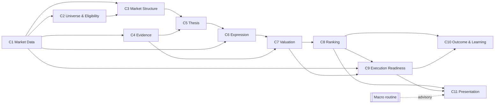
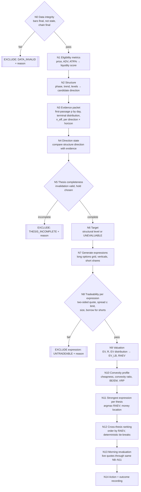

# AVSHUNTER — Business Domain Design Addendum

Status: **DRAFT FOR APPROVAL — design only, no code changed.** Prepared 15 Sep 2026.
Extends `END_TO_END_PIPELINE_MAP_AND_FIX_DESIGN.md`. Where this addendum conflicts with earlier recommendations, this addendum wins.

Sections marked **[pending audit]** will be completed from the EV / valuation / convexity-data audits running now.

---

## 1. Business problem

For every ticker in the universe, answer three questions every session:

1. **Is there a thesis?** A directional view with a defined invalidation and hold period, supported by measured evidence.
2. **Is there money in it, and where?** Expected profit, after costs and uncertainty, for each way of expressing the thesis — options (long single-leg, debit verticals) and the ticker itself (short shares for bearish theses).
3. **What is the strongest expression, and how does it rank against every other opportunity?** Rank, don't gate.

### Business requirements (user, 15 Sep 2026)

| Requirement | Design response |
|---|---|
| DDD design principles | Bounded contexts, one aggregate owner per concept, ubiquitous language, domain events (§2) |
| Decision-tree calculation logic using the data and correct algorithms | Explicit decision tree with the calculation at each node (§3) |
| Identify cheap convexity | Convexity profile computed for every option expression; cheapness measured against forecast volatility (§5) |
| EV engine working correctly | One valuation core, first-passage probabilities, exit-day pricing, bid/ask costs, uncertainty discount (§4) |
| Rank instead of gate | Hard exclusions limited to integrity and tradeability; everything else enters the score (§6) |
| Strongest expression; is there money in the option or the ticker | Per-thesis argmax of risk-adjusted EV across expressions; money-location label (§6.3) |
| Expressions | Long calls, long puts, debit verticals (bull call / bear put), short shares for PUT theses |
| Ranking objective | Risk-adjusted EV |
| Hard stops | Integrity and tradeability only |

Open business questions:
- **Q1 — Long shares for CALL theses** were not selected. Without them "money in the ticker" is only assessed for bearish theses. Confirm intentional.
- **Q2 — Short-share data** (investigated 15 Sep 2026):
  - MarketData.app has no short-interest, short-volume or borrow endpoint (confirmed). The scanner stub `fetch_short_borrow_data` returns nothing and the VMS scorer then assigns a **neutral 25/100** to the 15% short/borrow component (`scripts/avshunter_universe_scanner.py:1037-1052, 1667-1668`) — missing → neutral.
  - **Existing Polygon/Massive key ("Stock Screener Standard") already returns** FINRA short interest (`/stocks/v1/short-interest`, bi-weekly; AAPL settlement 2026-08-31, days to cover 3.53) and daily short volume (`/stocks/v1/short-volume`, to 2026-09-14) — verified with one live call each. Unused by the pipeline.
  - **Borrow fee / availability / hard-to-borrow** are not available from MarketData or Polygon. Options: Tastytrade Open API `GET /market-metrics` (`borrow_rate`, plus IV rank, IV percentile, IV per expiration, HV 30/60/90, next earnings date with `estimated` flag, liquidity rating) — requires an OAuth application (session login discontinued 1 Dec 2025; no Tastytrade credentials in `.env`; the existing `outcome_capture.py` Tastytrade client uses the discontinued `/sessions` login); IBKR SLB (account-based); ORTEX (paid); iBorrowDesk (unofficial).
  - Until borrow data is integrated, short-share expressions carry `BORROW_DATA_UNAVAILABLE` and are not valued; short interest and short volume may be used as evidence/context features only.
- **Earnings data** (investigated 15 Sep 2026): the morning gate reads `earningsAnnouncement` from the Polygon ticker snapshot (`morning_gate.py:827, 2411-2417`; `earnings_calendar_enricher.py`), but **that field does not exist** in the snapshot (verified live and in Massive docs) → earnings are silently `UNKNOWN` for every ticker. MarketData.app `GET /v1/stocks/earnings/{symbol}/` works with the existing key (verified: AAPL next report date, report time, EPS estimate; future dates are estimates) and can supply the event calendar for §5 event load.

---

## 2. Domain model (DDD)

### 2.1 Bounded contexts

| # | Context | Owns (aggregate / value objects) | Question it answers | Existing code to build on |
|---|---|---|---|---|
| C1 | **Market Data** | `BarSeries`, `OptionChainSnapshot`, `Quote`, `ProviderFinality` | What was observed, when, and is it final? | `domain/market_evidence.py`, `domain/provider_finality.py`, `domain/quote_units.py`, `canonical_data/*` |
| C2 | **Universe & Eligibility** | `UniverseSnapshot`, `EligibilityAssessment` | May this ticker be analysed today, and if not, why? | Discovery filters (to extract) |
| C3 | **Market Structure** | `StructureAssessment` (phase, trend, levels) | What is the structural state and candidate direction? | Wyckoff engine, `domain/market_structure_evidence.py` |
| C4 | **Evidence** | `EvidencePacket` (per state × direction × horizon) | Historically, what happened from states like this? | Actuarial v7 (to rebuild), `domain/actuarial_observation.py` |
| C5 | **Thesis** | **`Thesis` aggregate root** (direction, direction state, invalidation, target, hold) | What exactly do we believe, and when is it wrong? | `domain/thesis_direction.py`, `contracts/thesis_geometry.py` |
| C6 | **Expression** | **`ExpressionSet` aggregate** of `LongOption`, `DebitVertical`, `ShortShares` | What are all tradeable ways to express this thesis? | `domain/contract_family_generation.py`, `domain/dynamic_options_intelligence.py`, `domain/option_contract_liquidity.py` |
| C7 | **Valuation** | `ValuationResult` (EV, capital at risk, EV lower bound), `ConvexityProfile` | How much money is in each expression, and is its convexity cheap? | EV3, `empirical_option_ev.py`, `domain/deterministic_option_valuation.py`, `domain/contract_economics_v2.py` **[pending audit: pick one core]** |
| C8 | **Ranking** | `OpportunityRank`, `RankingPolicy` | Which expression is strongest per thesis, and how do all opportunities order? | `domain/dynamic_options_ranking.py` |
| C9 | **Execution Readiness** | `MorningRevaluation`, `ActionDecision` | With live quotes now, is the ranked expression still valuable and executable? | `domain/execution_authority.py`, `domain/long_option_execution.py`, morning gate (to merge) |
| C10 | **Outcome & Learning** | `OutcomeRecord`, `Scorecard` | Did it make money, and which evidence/valuation was right? | `domain/decision_outcome.py`, `domain/outcome_learning.py`, `domain/dynamic_options_outcomes.py` |
| C11 | **Presentation** | `LabReadModel` | What does the trader see? (read-only) | `domain/lab_signal_book_v4.py`, `domain/presentation.py` |
| — | **Macro context** (external) | Scheduled routine's dated context file | Advisory context for manual review | Worker 3 only; no domain authority |

### 2.2 Context map



Rules:
- **Upstream owns, downstream reads.** A downstream context never rewrites an upstream aggregate (e.g. Expression cannot change the Thesis target; Presentation cannot change a rank).
- **Anti-corruption layers** translate providers (MarketData, Polygon, broker) and legacy CSV schemas into domain objects at the boundary; domain modules stay free of pandas, files, SQLite and HTTP (the existing `domain/` convention).
- **C7 Valuation is the single place money is computed.** Morning (C9) calls the same valuation service with live quotes; there is no second economics implementation.

### 2.3 Aggregates and invariants

| Aggregate | Invariants |
|---|---|
| `Thesis` | Direction ∈ {BULL, BEAR}; `direction_state` ∈ {SUPPORTED, UNSUPPORTED, OPPOSED, INSUFFICIENT_EVIDENCE}; invalidation required and on the correct side of reference spot; target either a valid structural level on the correct side (> 0) or `UNEVALUABLE`; `hold_sessions` ∈ {5, 10, 20} or thesis not valuable; frozen once published (`thesis_id`, evidence ids, formula version). |
| `ExpressionSet` | Every expression references one `thesis_id`; expression direction matches thesis direction; each expression carries its own tradeability state; option expressions satisfy `dte_sessions ≥ hold_sessions + exit_buffer`. |
| `ValuationResult` | Probabilities sum to 1; EV, capital at risk and EV lower bound in dollars per unit and per $ at risk; every input dataset id recorded; `NOT_VALUED` with reason when any input missing — never a default. |
| `OpportunityRank` | Rank derived only from `ValuationResult` + ranking policy version; deterministic tie-breaks; reproducible from stored inputs. |

### 2.4 Ubiquitous language

| Term | Meaning |
|---|---|
| Thesis | A frozen directional view: direction, invalidation, optional target, hold period |
| Invalidation | The underlying price at which the thesis is wrong and the position is exited |
| Target | A structural level where the thesis expects to take profit; may be `UNEVALUABLE` |
| Hold | Maximum holding period in XNYS trading sessions (5, 10, 20) |
| Evidence packet | Historical first-passage and terminal return statistics for the thesis state, per direction and horizon, with effective sample size |
| Expression | One tradeable instrument structure expressing the thesis (long option, debit vertical, short shares) |
| Capital at risk (R) | Maximum loss per unit: debit paid for long options and verticals; stop distance × gap factor + costs for short shares |
| EV | Expected profit per unit after entry/exit costs, from evidence probabilities and exit-day pricing |
| EV lower bound (EV_LB) | EV at the chosen lower quantile of its uncertainty distribution |
| RAEV | Risk-adjusted EV = EV_LB ÷ R — the ranking objective |
| Cheapness | How much the model value of an option under forecast volatility exceeds its ask |
| Convexity ratio | Option return at target ÷ underlying return at target |
| Tradeable | Two-sided quote, spread within execution limit, size available (hard condition) |
| Strongest expression | The expression with the highest RAEV for a thesis |
| Money location | Where positive RAEV exists: OPTION, TICKER, BOTH or NONE |

### 2.5 Domain events

`UniverseSnapshotTaken` → `EligibilityAssessed` → `StructureAssessed` → `EvidenceAttached` → `ThesisFrozen` → `ExpressionsGenerated` → `ExpressionValued` → `StrongestExpressionSelected` → `OpportunityRanked` → `MorningRevalued` → `ActionDecided` → `OutcomeObserved` → `ScorecardUpdated`.
Every event is appended to the decision-outcome ledger with ids of the inputs it used, so any rank can be replayed and every outcome traced back to the evidence and valuation that produced it.

---

## 3. Decision tree (calculation logic)

Each node computes something from data. **Only three node types can exclude**: data integrity, thesis completeness, expression tradeability. Everything else produces a number that flows into valuation or ranking.



### Node specifications

| Node | Inputs | Calculation | Output | Excludes? |
|---|---|---|---|---|
| N0 | Bars, chain, finality | Bars complete to evidence session; `sessions_stale = 0`; chain provider-final for session | pass / `DATA_INVALID` reason | **Yes** |
| N1 | Bars | Price, 20-day ADV, ATR(14), ATR%, bar count | Liquidity & volatility features (numbers, not filters) | No |
| N2 | Bars | Wyckoff phase, trend, support/resistance, structural levels | `StructureAssessment`, candidate direction | No |
| N3 | Cleaned actuarial DB, state key | For direction d and horizon h: first-passage probabilities to invalidation and target by day k; terminal return distribution conditional on no touch; `n_eff` by date blocks; Beta/bootstrap uncertainty | `EvidencePacket` | No (missing → packet null → EV not computable → rank last with reason) |
| N4 | Structure direction, evidence | `edge_d = P(target first) − P(invalidation first)` (or expected terminal return sign when target unevaluable) with CI; state SUPPORTED if CI lower bound > 0, OPPOSED if CI upper bound < 0, else UNSUPPORTED / INSUFFICIENT_EVIDENCE | `direction_state` | No — opposed evidence lowers EV naturally (§6.4) |
| N5 | Invalidation, evidence per horizon | Invalidation present and correct side; hold h* = horizon maximising `EV_LB` of the underlying first-passage payoff (ties → shorter) | `hold_sessions` | **Yes** if no valid invalidation or no horizon has an evidence packet |
| N6 | Structure levels | Structural target on correct side and > 0, else `UNEVALUABLE`; reference level for display = spot ± k × expected move (never used in valuation) | Target state | No |
| N7 | Thesis, chain, borrow data | Long options: strikes within delta 0.15–0.85 and expiries with `dte_sessions ≥ h + buffer`; verticals: long leg from long set, short leg at or beyond target (or at fixed widths when target unevaluable); short shares for BEAR theses | `ExpressionSet` | No |
| N8 | Quotes, size, borrow | Two-sided quote; spread fraction ≤ execution limit; size ≥ minimum; for short shares borrow available | Tradeable / `UNTRADEABLE` reason | **Yes** (per expression) |
| N9 | Evidence packet, expression, quotes | §4 | `ValuationResult` | No |
| N10 | Chain, forecast vol, IV history | §5 | `ConvexityProfile` | No |
| N11 | Valuation results per thesis | argmax RAEV; money location | Strongest expression | No |
| N12 | All strongest expressions | §6 | `OpportunityRank` | No |
| N13 | Live quotes (morning, manual run) | Re-run N8–N11 with live bid/ask and current spot; thesis invalidated if live spot beyond invalidation (becomes an outcome, not a rank) | Revalued rank | Only via N8 or thesis already invalidated |
| N14 | Morning revaluation | Action = trader workflow recommendation from rank position and RAEV; record events | `ActionDecision`, ledger events | No |

---

## 4. Valuation — the EV engine

One valuation service, one set of formulas, used at EOD and in the morning. Existing-code mapping and the refined path-replay algorithm are in §7.1–7.2; §7.2 supersedes §4.3 where they differ (exact distances, gap at stop, timeout at path return, IV from mid with spot-vol slope, absolute spread floor, commissions, block bootstrap).

### 4.1 Common notation

- d = +1 for BULL, −1 for BEAR; S₀ reference spot; L invalidation; U target (or none); h hold sessions.
- From the evidence packet, for k = 1..h:
  - q_U(k) = probability the underlying first reaches U on session k (before L),
  - q_L(k) = probability it first reaches L on session k (before U),
  - q_H = 1 − Σ q_U − Σ q_L = probability neither is touched by session h, with conditional terminal return distribution F_H(r).
  - When U is `UNEVALUABLE`: q_U ≡ 0 and exits occur at L or at h.
- Exit price of the underlying: S_U = U, S_L = L (plus a gap allowance g_L for stops), S_H = S₀(1 + r), r ~ F_H.
- τ(k) = remaining time to expiry at exit (calendar years from sessions), σ_exit(k) = implied volatility assumed at exit (base: entry IV of that strike; stress: IV shift scenario).

### 4.2 Expression payoff per unit

| Expression | Entry cost (per unit) | Exit value at underlying price S on session k | Capital at risk R |
|---|---|---|---|
| Long option (strike K, right c/p) | ask₀ + commission | `bid_exit = BS(S, K, τ(k), σ_exit(k)) × (1 − ½·spread_fraction)` − commission | ask₀ + commissions |
| Debit vertical (long K₁, short K₂) | ask₀(K₁) − bid₀(K₂) + commissions | `BS(K₁) × (1−½s₁) − BS(K₂) × (1+½s₂)`, capped to [0, width] − commissions | net debit + commissions |
| Short shares (BEAR) | bid₀ (proceeds) − commission | − (ask at exit) − borrow_fee × S₀ × days/360 − commission | (L − S₀) × (1 + g_L) + costs |

Profit per unit: π(S, k) = exit value − entry cost (for short shares: proceeds − buy-back − fees).

### 4.3 Expected value and uncertainty

```
EV = Σ_k q_U(k) · π(U, k) + Σ_k q_L(k) · π(L·(1+d·g_L), k) + q_H · E_{r~F_H}[ π(S₀(1+r), h) ]
```

- Probabilities come from the cleaned evidence packet (outliers removed, point-in-time, `n_eff` by date blocks).
- Uncertainty: draw probabilities from their posterior (Dirichlet over {U-by-day, L-by-day, H} with `n_eff`) and resample F_H; recompute EV per draw; **EV_LB = 20th percentile** of the EV distribution (policy parameter).
- Stress variants (reported, not ranked): IV crush −20% at exit, spread doubled at exit, gap on stop.
- `NOT_VALUED` with reason when any input is missing (no default probability, IV or spread).

### 4.4 Correctness requirements for the engine

1. First-passage probabilities, not terminal-only, for target/stop exits; indexed by exit session.
2. Option value at exit uses remaining time and an explicit IV assumption; never expiry intrinsic when exiting before expiry.
3. Entry at ask (or natural debit), exit at bid (or natural credit); commissions and borrow fees included.
4. Units: dollars per share-equivalent and per contract (× multiplier) both carried; ratios unitless.
5. Direction symmetry: the BEAR computation is the mirror of BULL on mirrored evidence.
6. Probabilities sum to 1; EV reproducible from stored inputs.
7. No fallback target: without a structural target the model values stop/hold exits only.

---

## 5. Cheap convexity

Cheap convexity = an option expression whose payoff is strongly convex in the thesis direction **and** whose price is low relative to the volatility the evidence and forecast expect. It is a **profile attached to every option expression** and a secondary ranking signal — never a gate. Data coverage per metric and required new data: §7.3. Additional money-location check: an option's RAEV above the short-shares RAEV on the same path set, with IV below forecast and a positive upper-tail share `E[π·1{top decile}]/R`, flags cheap convexity.

| Metric | Formula | Reading |
|---|---|---|
| Model cheapness | `(BS(S₀, K, τ₀, σ_forecast) − ask₀) / ask₀` with σ_forecast from forward-variance model (HAR-RV) | > 0: option priced below forecast-vol value |
| Variance risk premium | `σ_IV(ATM, h) − σ_forecast(h)` | < 0: implied cheap vs expected realised |
| IV percentile | Rank of current ATM IV within its own trailing 252 sessions (point-in-time IV history) | Low: cheap relative to own history |
| Breakeven-to-expected-move | `|K_breakeven − S₀| / (S₀ · EM_h)`, EM_h = σ_forecast·√(h/252) | < 1: breakeven inside the expected move |
| Convexity ratio at target | `(π_option(U) / R) ÷ (|U − S₀| / S₀)` | High: option magnifies the thesis move |
| Gamma per premium | `Γ · S₀² · 0.01 / ask₀` (P&L per 1% move squared, per $) | High: more convexity per dollar |
| Theta burden | `|Θ| · h / (EV_gross + ε)` or `|Θ| / (Vega · ΔIV_expected)` | Low: time decay small vs expected payoff |
| Term structure slope | `σ_IV(next expiry) − σ_IV(front expiry)` | Upward slope: front options relatively cheap |
| Skew in thesis direction | BEAR: `σ_IV(25Δ put) − σ_IV(25Δ call)`; BULL: reverse | Low: thesis-direction wing not overpriced |
| Event load | Earnings/event inside DTE flag and event IV premium | Explains elevated IV; separates event from structural cheapness |

`cheap_convexity_score` = equal-weight average of cross-sectional percentile ranks of model cheapness, −VRP, −IV percentile, −BE/EM, convexity ratio, gamma per premium, −theta burden (weights to be fitted from outcomes in C10; equal until then). A metric with missing inputs is excluded from the average and the count of metrics used is published — never replaced by a neutral value.

---

## 6. Ranking instead of gating

### 6.1 Hard exclusions (only these)

| Class | Condition | Where |
|---|---|---|
| Integrity | Bars not final / stale; chain not final; required inputs corrupt | N0 |
| Thesis completeness | No valid invalidation; no horizon with an evidence packet | N5 |
| Tradeability | No two-sided quote; spread fraction above execution limit; size below minimum; short shares without borrow | N8 (per expression) |

Excluded items are **still recorded** with reason codes (for outcome learning and audit) but not ranked.

### 6.2 Ranking score

```
RAEV = EV_LB / R
Rank key = (RAEV descending, cheap_convexity_score descending, liquidity score descending, thesis_id)
```

- Everything that today acts as a gate — direction conflict, weak evidence, poor liquidity within limits, IV richness, missing structural target, low composite score — acts through EV, EV_LB (uncertainty) or the tie-breaks.
- `RAEV ≤ 0` items remain in the ranking and are labelled `NO_POSITIVE_EDGE`.
- No hand-tuned weights inside RAEV; all penalties are costs or uncertainty.

### 6.3 Strongest expression and money location

For each thesis: `strongest = argmax RAEV over tradeable, valued expressions`.

| Money location | Condition |
|---|---|
| OPTION | best option-type RAEV > 0 and (no ticker expression or ticker RAEV ≤ 0 or option RAEV higher) |
| TICKER | short-shares RAEV > 0 and higher than best option RAEV (BEAR theses only unless long shares approved — Q1) |
| BOTH | both > 0; record the ratio |
| NONE | no expression with RAEV > 0 |
| NOT_VALUED | evidence or quotes unavailable (with reason) |

### 6.4 How earlier open decisions resolve under ranking

| Earlier decision | Resolution under rank-not-gate |
|---|---|
| D1 Direction conflict | Not a gate. Opposing evidence lowers q_U and raises q_L, so EV and RAEV fall; `direction_state=OPPOSED` is shown. |
| D2 Evidence families | Evidence enters through the first-passage packet (C4). Price-flow features become state dimensions or are dropped if they add no measured lift. |
| D3 Missing target | Valued with stop/hold exits only; no fallback target. |
| D4 Convexity / physics / Heston | Convexity rebuilt as §5 profile (not retired). Physics retired. Heston overwrite retired; provider greeks for display, BS with explicit IV inside valuation. |
| D5 Win probability | Replaced by evidence probabilities with CI. |
| D6 Tier | Replaced by rank and RAEV bands for display (e.g. top decile), one definition. |
| D7 Hold owner | Thesis context from evidence (N5). |
| D8 Trigger GO | Trigger becomes a timing feature shown with the rank; not a gate. |
| D9 EIL end of day | Removed from ranking; live microstructure only in N13 tradeability. |

---

## 7. Existing code mapping and defects to fix

Source: three read-only audits completed 15 Sep 2026 (EV3 engine; other valuation modules; cheap-convexity data coverage). [V] verified in code/data, [I] inferred.

### 7.1 What values money today, and what actually decides

| Module | What it computes | Decides anything? | Verdict |
|---|---|---|---|
| `ev_engine_v2.py` (root) | Heuristic "p" blend × delta-gamma option return × multipliers | **Yes** — `ev_conf_adj` is main input to `final_decision_engine.py:399`; used by EIL (`execution_intelligence_runner.py:933`), Lab EV warning (`lab_control.py:2104`), EOD (`eod_candidate_engine.py:2642`), Lab priority 10% | **DELETE** after migration. [V] PUT not direction-aware (upside move stats, stop below entry for PUT, :95-112); multipliers < 1 multiply negative EV toward 0 (:371) so worse spreads/data *improve* EV; move double-counted (:337); "p" not a probability; mid entry, premium default 1.0, DTE horizon, fixed 10%/5% target/stop |
| `vanguard/ev_engine_v3.py` + `ev3_stage0.py` | First-passage barrier probabilities (target/stop/timeout) from actuarial paths; CRR option exit pricing; LB ranking; long options and debit verticals | Advisory (authority off); rejections shown | **REBUILD into the valuation core** (keep first-passage + vertical valuation + LB ranking). [V] HIGH: timeout valued at unchanged spot (discards drift and convexity; :647, :450); grid snapping — target snapped up, stop down, payoff priced at exact levels (:175-176) → biased, candidate-varying; exit spread applied as today's fraction (overstates OTM exit bid) and no commissions (:350). MED: mean exit day only; constant IV with −15% stress only, fixed dollar anchor offset (:319); n_eff summed across correlated fallback states (:218); no gap at stop. Model-limit rejections: hold ≠ 5/10/20, off-grid distance, theta > 20% of mid, DTE > 180 |
| `domain/contract_economics_v2.py` | Scenario grid (flat, ±1σ, ±2σ, reachable, invalidation) × timing × IV shock; ask entry, bid-like exit; convexity second difference | **Yes** — contract choice within family via `ranking_score_v2` | **BASE for core pricing/scenarios**; add probability measure. [V] no probabilities (1.5σ treated as certain → favours low-delta lottery contracts [I]); thesis target absent from utility; PUT arithmetic moves S(1−kσ) can go ≤ 0 → ValueError |
| `domain/deterministic_option_valuation.py` (DOI-5) | Target/invalidation × timing × IV shocks; utility median(favourable)+min(adverse) | Disclosure only | **KEEP pricer** (`dividend_adjusted_black_scholes`, American check); **DELETE utility**. [V] 25 bp exit cost vs ~32% median spreads; target/invalidation treated as certain |
| `contracts/selected_contract_economics.py` | Vertical hydration (correct); intrinsic-at-target monetisability; r=0 time-value monetisability | **Yes** — `opportunity_tier.py:162-166, 242-247` (tier and BLOCK routing) despite "advisory" comment at `eod_candidate_engine.py:997` | **KEEP hydration; replace monetisability with read-only view of core EV**. [V] target treated as certain (3R fallback can pass as structural [I]); `rr_premium_expected` is a conditional payoff mislabelled as expected; exit at mid; verticals never valued (CONTRACT_REPAIR); IV > 5 silently ÷100; `recompute_premium_rr` dead |
| `empirical_option_ev.py` | BS payoff over 13 actuarial return percentiles | No (tests only) | **FOLD idea into core, DELETE module**. [V] BS crash when return ≤ −100%; exit at mid; calendar-minus-sessions DTE. [I] percentiles corrupted by outliers |
| `domain/dynamic_options_ranking.py` | Weighted score (det + probabilities − uncertainty) with hysteresis; chronological weight tuning | **Yes** — contract selection | **REPLACE by C8 RAEV ranking** (keep hysteresis concept). [V] unbounded return added to probabilities; tuning maximises mean reward (no risk adjustment); replay vs live margin mismatch |
| `domain/volatility_budget.py` | σ·√(h/252) move fraction | Inputs only | **KEEP** (correct). |
| `domain/reachability.py` | spot·(1 ± 1.5·move) "reachable target" | Inputs only | **RENAME** (`vol_reference_level`); PUT ≤ 0 crash path |
| `scripts/compute_greeks_bs.py` | Third BS pricer | Used by empirical EV and time-value monetisability | **DELETE** in favour of domain pricer |
| `vanguard/ev_engine.py`, `vanguard/ev_engine_v2.py` | Byte-identical dead copies | No | **DELETE** |
| `edge_detector.py:285` EVEngineV2 call | Result discarded; gate uses uncleaned `expected_value_20d` | Gate (with macro floors) | **DELETE** (Vanguard becomes evidence producer) |

Duplication today: three BS pricers; six definitions of "value at target"; four exit-cost conventions (mid, ask→mid, 25 bp, spread/2); three horizon conventions (DTE buckets, nearest 5/10/20, XNYS sessions).

### 7.2 Valuation core target (C7)

Built on `contract_economics_v2.py` + `dividend_adjusted_black_scholes` + `volatility_budget.py`, with EV3's first-passage path logic and vertical valuation. Algorithm (refines §4):

1. **Path replay per thesis state** (preferred over three-outcome cache): for each historical path j (cleaned, point-in-time, direction d, horizon h) using the **exact** thesis distances:
   - exit session k_j = first touch of target or invalidation, else h;
   - exit spot: target level; **worse of stop level and that session's open** (gap); on timeout the path's actual close-to-close return S₀·C_{t+h}/C_t.
   - If a three-outcome cache is kept: store per-day q_U(k), q_L(k) and the timeout return distribution; interpolate distances between grid points, never snap.
2. **Option value at exit**: σ₀ backed out from entry mid per leg; exit IV σ_j = σ₀ + β_d·ln(S_j/S₀) + δ (β_d fitted spot-vol slope; δ = 0 base, ±Δ stress); τ_j = remaining calendar time; CRR/American for puts and dividend names, BS otherwise.
3. **Fills and costs**: entry at ask (+ slippage); exit bid_j = max(V_j − max(h_min, c·V_j), 0) with an absolute half-spread floor h_min; commissions per leg per side (per share = commission ÷ multiplier); short shares: bid entry, ask exit, borrow fee × S₀ × days/360, gap buffer at stop.
4. **Capital at risk R**: long option = entry debit; vertical = net debit (0 < D < width); short shares = (stop − entry) × (1 + half-spread) + expected gap + borrow cost over hold.
5. **EV and uncertainty**: EV = weighted mean of π_j/R over paths, shrunk toward pooled prior with λ = n_eff/(n_eff + k); n_eff = distinct week blocks across the union of pooled states (no double counting); **EV_LB = min over stress scenarios (IV ±Δ, spread ×1.5, gap) of EV − z·SE** with SE from a week-block bootstrap. Horizons compared on LB per session or E[ln(1+R)].
6. **Same path set for all expressions** of a thesis (long options, verticals, short shares) so RAEV values are directly comparable and money location (§6.3) is meaningful.
7. **Remove model-limit rejections**: off-grid distances, theta > 20% of mid, non-5/10/20 holds become valued or `NOT_VALUED` with a reason, not rejections.

### 7.3 Cheap-convexity data coverage (run 20260914_214012)

1,449 tickers; 1,316 (91%) have a chain for the session; 133 have none.

| §5 metric | Computable today | Coverage | Action |
|---|---|---|---|
| IV / realised vol (RV20, RV60) | YES | 91% (RV 99.7%) | `iv_vs_hv` verified; add RV20/RV60 from `ohlcv_daily` |
| Variance risk premium (IV − forecast RV over hold/DTE) | PARTIAL | 91% | Refit HAR/GARCH on bars for the exact horizon; current `l3` horizon not tied to DTE, parameters not saved (`l3_garch_alpha`, `vol_of_vol` 0% non-null) |
| Model cheapness (BS at forecast vol vs ask) | PARTIAL | 91% | Depends on horizon-matched forecast vol (above) |
| Term-structure slope | YES (recompute) | ~91% (stored `term_ratio` 27%) | Stored logic looks for 10–25 and 40–60 day expiries; chains list ~4/18/32/67/95 days — compute from actual front vs next expiry (≥ 7 DTE) |
| Skew in thesis direction (25Δ put − 25Δ call) | PARTIAL | 74% stored, ~85–91% recomputed | Stored columns are ×100 (unit drift); interpolate at \|Δ\| = 0.25 per expiry |
| Gamma per premium $, vega per premium $ | YES | 91% | Use ask consistently |
| Breakeven ÷ expected move | YES (recompute) | 91% | Do not use stored `expected_move_pct` (1.64× IV·√(DTE/365) at median, 49 rows > 100%) |
| Theta burden vs expected daily move | YES | 91% | Replace undocumented `move_theta_ratio` |
| Convexity ratio at target | PARTIAL | ≤ 91% | Needs structural target; `UNEVALUABLE` targets excluded from this metric |
| IV percentile (252 sessions, IV vs own IV history) | **NO** | 0% | `iv_history_cache.db` is weekly, max 55 rows per ticker, stale to 2026-09-04; **current `ivp_252d` compares IV with realised-vol range, not IV history** (`avshunter_options_intelligence.py:3929-3947`); `iv_rank` = max(30d, 252d) → 26.5% of rows at exactly 100 |
| Event load (earnings inside DTE, event IV) | **NO** | ~1% | No earnings calendar in `data/`; `catalyst_date` 1% non-null and all past |

Data hygiene required before any metric: exclude contracts with `implied_vol ≤ 0.001` or gamma = 0 (5.7% of sampled contracts; up to 27% per ticker); fix `contract_vanna` clipping (17 rows at ±1); `contract_iv` > 3 on 4 rows.

**New data needed**
1. Daily constant-maturity (30-day) ATM IV history ≥ 252 sessions per ticker — build from daily chain snapshots going forward, or vendor backfill (Tastytrade market metrics also publish IV rank/percentile, to be snapshotted daily for point-in-time use).
2. Point-in-time earnings/event calendar — **available now** from MarketData.app `/v1/stocks/earnings/{symbol}/` with the existing key (snapshot daily; future dates are estimates); historical earnings-day moves from `ohlcv_daily`.
3. Borrow availability, borrow fee and hard-to-borrow status for short-share expressions — Tastytrade `/market-metrics` via OAuth (recommended) or IBKR/ORTEX; short interest and short volume **available now** from the existing Polygon/Massive key (Q2).
4. Chains for the 133 tickers without one (or record `NO_CHAIN` and value ticker expressions only).
5. Structural target coverage (Discovery rebuild) for convexity-at-target.

Until then, the cheap-convexity score uses the metrics marked YES/PARTIAL and publishes the count of metrics used per expression (R1).

---

## 8. Build sequence impact

Adds to the phases in the end-to-end design:
- **Phase 1 (Data truth)** also rebuilds the evidence packet as first-passage-by-day statistics with `n_eff` and posterior uncertainty, and captures point-in-time IV history needed for §5.
- **Phase 2 (Thesis core)** implements C5 with `direction_state` and evidence-chosen hold.
- **Phase 3** becomes **Expression, Valuation and Convexity**: C6 generation (long options, verticals, short shares once borrow data exists), C7 single valuation core, §5 profile.
- **Phase 4** becomes **Ranking and Readiness**: C8 ranking (hard exclusions limited to §6.1), C9 morning revaluation through the same core.
- **Phase 5** adds valuation calibration: realised P&L vs EV by RAEV decile; convexity metric weights fitted from outcomes.
