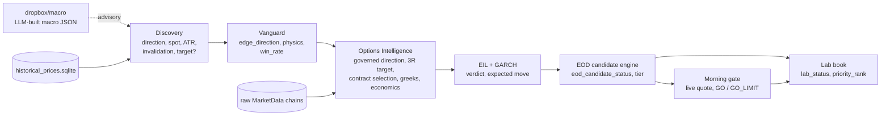

# AVSHUNTER Decision-Path Map — draft specification

Run analysed: `20260914_214012` (session 2026-09-14, code `avs-baseline-20260906-48-g0810908-dirty`), cross-checked on `20260913_143230` and `20260911_115904`.
Status: **DRAFT — read-only investigation, no pipeline code changed.** Prepared 2026-09-15.

Sources:
- Code traces of every field (file:line below, all read from the working tree).
- Measured coverage: `audit/decision_map/runs/20260914_214012/field_coverage.csv` and `field_coverage_summary.md` (script `audit/decision_map/decision_map_coverage.py`).
- Independent recomputation: `audit/signal_accuracy/runs/20260914_214012/` (script `audit/signal_accuracy/signal_accuracy_audit.py`).

Abbreviations: **OI** `scripts/avshunter_options_intelligence.py` · **DG** `contracts/direction_governance.py` · **EOD** `eod_candidate_engine.py` · **LAB** `contracts/lab_control.py` · **MG** `morning_gate.py` · **DISC** `avshunter_discovery_ULTIMATE.py` · **RVP** `scripts/run_vanguard_from_packages.py` · **PHYS** `vanguard/physics_state_engine.py` · **EIL** `execution_intelligence_runner.py`.

---

## 0. How to read this map

**Missing-input behaviour classes** (the root-cause pattern behind most defects):

| Class | Meaning | Acceptable? |
|---|---|---|
| NULL | Missing input → field is null / UNEVALUABLE and the state says so | Yes (target behaviour) |
| DEFAULT | Missing input → neutral-looking number (0.08 spread, 1M volume, 50, 0.60) | No |
| PASS | Missing input → condition counted as passed ("neutral pass") | No |
| ZERO | Missing value published as 0 / -1 | No |
| FALLBACK | Missing value replaced by a different quantity (3R target, WBS wall, stop_loss, live price) | Only if labelled and bounded |
| GUESS | Unit or meaning inferred from magnitude | No |

**Test layers:** DF = data flow · LG = logic · AL = algorithm · RR = runs against real run output. "synthetic" = unit test with hand-built rows only.

---

## 1. Decision path (stages and hand-offs)

The decision chain the trader acts on:
**direction → invalidation / target → contract (side, DTE, delta, spread) → economics (monetisability, EV3, win prob) → status / tier / verdict / rank.**

---

## 2. Segment A — Direction

| Field | Producer | Inputs → missing behaviour | Measured (run 0914) | Consumers | Tests |
|---|---|---|---|---|---|
| `precor_intent`, `dominant_trend` | DISC:292 `_reconcile_intent`; DISC:235 EMA stack | Exception → MIXED (DISC:247); OI defaults WAIT/MIXED (OI:4016) — DEFAULT | trend MIXED 52% | Structural table `domain/thesis_direction.py:103` | LG synthetic |
| `fusion_direction` | `swing_fusion.py:124` | Fusion failure → `{}` → NONE (DISC:1324) — NULL | — | `preliminary_discovery_direction` DG:84 | LG synthetic |
| `direction` / `discovery_direction_preliminary` | DG:93 via DISC:1552 (same value in both, DISC:2045/2048) | Conflict → UNRESOLVED (DG:117) — NULL (good) | CALL 60% / PUT 26% / UNRESOLVED 8% / STRANGLE 6% | OI:4106-4115 governed authority | LG synthetic (`test_direction_governance_contract.py`) |
| `governed_direction` | OI:4114-4128; competing EOD:1373, MG:233/3665 | Takes Discovery value when `DISCOVERY_GOVERNED` | = discovery on all rows | EOD:1383, EIL:2317, LAB:2496, `opportunity_tier.py:103` | LG synthetic |
| `vanguard_edge_direction` (`layer2__edge_direction`) | `vanguard/layer2_statistical/edge_detector.py:503` | Auction controller ±40, migration ±30, prob ±20, trend ±10; **neutral → CALL** (:534) — DEFAULT | null 51%; PUT 80% of non-null; **480/569 PUT edges have P(up)>P(down)** | ACTUARIAL evidence DG:175; physics signs PHYS:236 | NONE for `_determine_direction` |
| `directional_force` | PHYS:208-219 via RVP:1250 | return_5d/10d **never produced** → 0 (PHYS:186-187) — DEFAULT; volume_ratio unit likely mismatched (ratio vs ≥130) | only values ±15 / ±45 | PRICE_FLOW evidence DG:211 | AL synthetic (fixture includes returns) |
| `relative_strength_20d` | **No producer** | Always missing | absent in all stages | RELATIVE_STRENGTH evidence DG:218 | NONE |
| `catalyst_direction_bias` | `catalyst_truth_engine.py:595/681` | Needs manual directional catalyst file before pre_options | null 99.4% | CATALYST evidence DG:207 | LG synthetic |
| `direction_resolution_call/put_score` | DG:272-273 | Families skipped when missing → 0 | call 0.0 on 66% | Copied only (EOD:1412); **affect nothing** | NONE on values |
| `final_direction`, `direction_resolution_path` | DG:284-299; OI sets `allow_non_directional_resolution=False` for governed rows (OI:4114-4121) | Evidence can never change direction in fresh runs | `DIRECTION_CONFIRMED` 91%; **841/1,303 (65%) oppose their own evidence**, 63–68% every run since 06 Sep | Geometry side OI:4149; contract side; LAB:2423; `validate_direction_record` DG:392 | LG synthetic |
| `canonical_direction` | OI:4486 (duplicates EOD:1406, EOD:991/2317, LAB:2423/2491, MG:243) | = direction | = final | Contract economics applicability OI:5664; EIL arbitration :2545 | synthetic |

**Breaks in Segment A**
- **DM-01** Direction governance never adjudicates; rows labelled CONFIRMED without evidence agreement (DG:284, OI:4114-4121).
- **DM-02** "ACTUARIAL" evidence is auction-driven, defaults to CALL, contradicts its own probabilities (edge_detector.py:503-534).
- **DM-03** PRICE_FLOW evidence is a trend label + VWAP flag because returns are defaulted (PHYS:186-219). Together with DM-02 the two remaining families are one price-structure read counted twice.
- **DM-04** RELATIVE_STRENGTH has no producer; CATALYST almost never admissible. **User decision 2026-09-15: RETIRE catalyst direction evidence; RETIRE relative_strength family.**
- **DM-05** Direction written by five producers (OI, EOD fallback, MG ×2, LAB); `discovery_direction_preliminary` actually holds the final thesis (misnamed).

---

## 3. Segment B — Price geometry

| Field | Producer | Inputs → missing behaviour | Measured | Consumers | Tests |
|---|---|---|---|---|---|
| `stock_price` / `entry_price` | DISC:1950-1951 (= last close) | OI `spot = stock_price or 0` (OI:4025) — ZERO | 0% null; matches PIT close 100% (audit U03) | All geometry | AL via signal audit (RR) |
| `entry_spot`, `signal_price`, `underlying_price` | OI:4420; EOD:732-742 chain → 0.0; LAB:2874 | EOD fallback chain ends in 0.0 — ZERO | consistent across stages (audit X03) | EV3 topology `ev3_stage0.py:320`; EOD side check :341 | synthetic |
| `ATR_14` | DISC:1294 (NaN → 0.0) | ZERO | matches recompute 100% | ATR fallback stop DISC:1766; expected move OI:6542 | AL via signal audit |
| `structural_stop` | DISC:1747-1769 (asymmetry → Wyckoff ±25% → ATR fallback) | ATR fallback is always *below* price → wrong side for PUT — FALLBACK | — | Legacy only; not promoted (`contracts/thesis_geometry.py:11-64`) | `test_direction_geometry_semantic_repairs.py:41,55` |
| `governed_invalidation_spot` → `invalidation_spot` → `invalidation_price` | DISC:1791-1809 → OI:4367-4383 → EOD `_invalidation_level` :333 → LAB:2857-2864 | Missing → None (good) **but** LAB uses `first()` so legacy `stop_loss` can re-enter | null 20.7% (169 directional rows, all DATA_INSUFFICIENT / BLOCKED) | LAB execution block :3020; MG:1913; EV3 :309 | `test_eod_options_research_handoff.py:171` synthetic |
| `exit_invalidation_price` | EOD:1611 | Missing → **0.0** — ZERO | **0.0 on 300 rows (20.7%)** | MG exit plan; Lab export | NONE |
| `structural_target` (Discovery) | DISC:1747-1785 | Missing → None, source PENDING_OI | null 95% | OI target hierarchy | NONE |
| `structural_target` (Vanguard) | **RVP:790 sets it to `entry_price`** | — | — | Vanguard consumers | NONE |
| `structural_target` / `target_spot` (Options) | OI:4250-4270: Discovery → `l1_far` → CALL `target_3r` → PUT `entry - 3*stop_dist`; `target_3r` computed twice (OI:4050, 4157) | FALLBACK, **unbounded, no floor** | 3R fallback on most rows; **35 negative PUT targets**; NE 29.99 (−32%), WTTR 27.25 (+36%) | Strike filter OI:4629; wall score :6072; BLOCK_WRONG_STRIKE :6306; expected move :6537; monetisability `selected_contract_economics.py:531,799`; opportunity tier; EV3 barrier; MG:1912; EOD exits :1566 | zero/null only (`test_avs_fix_001_w11_price_null_never_zero.py`); **no negative / plausibility test** |
| `target_price` (EOD/Lab) | EOD:750-762; LAB `first_price(target_price, wbs__wall_price, structural_target…)` LAB:2869 | Negative passes (`in (None, 0.0)` check only); WBS wall can stand in — FALLBACK | null 23.5% | Lab display, MG | synthetic |
| `trigger_price` | `wall_break_scorer.py:281/287`; LAB `_trigger_price` :818 | No wall → 0.0 → '' ; Lab falls back phase C → phase B | null 21% | Trigger state / entry guidance (**shown in the Lab table column read as "target" for NE/WTTR**) | `test_ws2_trigger_spine.py` synthetic |
| `rr_underlying` / `rr` | DISC:1933-1944 (capped 50) ; EV3 recompute `ev3_stage0.py:335-337` | Null in Discovery (97%) → **0.0 in EOD** (EOD:1552, `_flt or`) — ZERO; with 3R targets EV3 R:R = 3.0 by construction | morning 0.0 on 97.4% | Tier `opportunity_tier.py:155`; EOD score | synthetic |
| `expected_move_pct` | OI:6530-6560 = **max(target distance, ATR·√hold, IV move)** | Target inflates its own feasibility test — circular | — | Breakeven feasibility OI:6715; BUYABLE `_be_ok` OI:7977 | NONE |
| `garch_expected_move_*` | `layer3_forward_variance.py:133` via `garch_runner.py:55` | Fit failure → **0.0** (:460) — ZERO; 11_20d never consumed by EOD | 0% null | MG EV3 conversion (0.60–60 heuristic, MG:3775 — GUESS); **never bounds the target** | NONE for failure path |
| `planned_hold_sessions` | OI:4385-4393 (5/10/20) | EOD default **−1.0** (EOD:1003) — ZERO; MG fallback | values 10 (77%) / 5 | DTE requirement; EV3 grid | NONE for −1 |

**Breaks in Segment B**
- **DM-06** PUT 3R fallback unbounded → negative targets that pass strike filter, monetisability and Lab (OI:4268; `selected_contract_economics.py:539`; LAB `_is_missing_price` :776).
- **DM-07** No production target is bounded by expected move or ATR; `domain/reachability.py:43` computes a reachable level that is reported but never applied.
- **DM-08** `expected_move_pct` includes the target's own distance (OI:6537) — circular feasibility.
- **DM-09** With 3R fallback, R:R = 3.0 by construction (EV3 recompute) — uninformative.
- **DM-10** Vanguard receives `structural_target = entry_price` (RVP:790).
- **DM-11** Zero/−1 for missing: `exit_invalidation_price` (EOD:1611), `rr_underlying` (EOD:1552), GARCH fit failure (layer3:460), `planned_hold_sessions` (EOD:1003).
- **DM-12** Lab `invalidation_price` via `first()` can re-admit `stop_loss` (LAB:2857); `target_price` can be a WBS wall price (LAB:2869).
- **DM-13** Morning gate replaces thesis `entry_spot` with the live price (MG:3725-3730) — thesis origin lost.

---

## 4. Segment C — Contract selection

**Selection algorithm (`select_best_contract`, OI:4534-4761)**
1. DTE window from `DTE_MATRIX` / governed horizon (OI:4168-4190); unknown horizon → `1_5d` (OI:1252).
2. Side by `right`; non-directional → None.
3. DTE strict window, else **widen ±15 days** (OI:4566-4572) — can undercut `minimum_required_dte`.
4. Hard delta 0.20–0.75 (OI:4580); NaN delta dropped.
5. Remove invalid / crossed quotes; mark > 0 (OI:4598-4612). OI and volume not gated.
6. Core delta band from `DTE_CONFIG`, default 0.15/0.35 (OI:4558); empty → keep all, flag suboptimal (OI:4615).
7. Strike reachability vs target (CALL ≤ target, PUT ≥ target) (OI:4633-4656) — a negative PUT target keeps every strike.
8. Score: delta 0.30, DTE 0.20, theta 0.20 (missing → −0.02), vega 0.15 (missing → 0.05), liquidity 0.15 minus spread penalty (missing spread → 0.15) (OI:4665-4701). **`spread_limit` computed (OI:4562) but never applied.**
9. Quote refresh (OI:7237) → "Heston" greeks overwrite (OI:7311, 3487-3494) → verdict.

| Field | Producer | Missing behaviour | Measured | Consumers | Tests |
|---|---|---|---|---|---|
| `contract_symbol` | OI:4704 / 7566 | No contract → stand-down + repair alternatives (OI:7139) | 1,312 with contract; symbol/strike/expiry/side 100% consistent (audit C01-C03) | EOD:868, LAB, MG:3903 | synthetic |
| `strike`, `contract_ask`, `contract_mid`, `contract_delta`, `contract_iv` (morning file) | OI:7567-7591 → EOD `_flt` default 0.0 (EOD:353, 2593, 2618) | No contract → **0.0** — ZERO | **0.0 on 137 rows** each | MG, Lab | NONE |
| `dte` / `contract_dte` | chain `dte` (calendar); EOD `_governed_contract_dte` → **sessions** (EOD:850-883); MG writes **calendar** back (MG:2135) | Default 30 (OI:3450, 7282; EOD:2283) — DEFAULT | values correct for their unit (audit C04/C05) | DTE policy, Lab | `test_avs_fix_001_w15_contract_dte.py` synthetic |
| `minimum_required_dte` | `domain/option_contract_liquidity.py:197-227` (sessions) | Hold not 5/10/20 → raises | 13 (68%) | **Compared to calendar `dte` at OI:5085** — unit mix | synthetic |
| `delta_band` | `option_contract_liquidity.py:262-280` | No delta → UNKNOWN (good) | NEAR_ATM 89% | EOD:2396, LAB:2620 | synthetic |
| `contract_delta` | chain → quote refresh (OI:1798) → **overwritten by `heston_greeks` (OI:3488)** which uses `sqrt(v0)` flat vol for all strikes (OI:2260-2271) | — | **58 contracts off >0.10 vs independent BS; provider delta matches BS** | Lifecycle (OI:5047), selection band, DOI | NONE vs reference |
| `heston_fit_error` | OI:2164 only when Nelder-Mead succeeds | **Calibration uses `signal.SIGALRM` (OI:2136) — unavailable on Windows → exception swallowed (OI:2149) → proxy always** | **100% null** | Display | NONE |
| `contract_iv` | OI:7591 from chain `iv` | Quote refresh updates `implied_vol` only (OI:1797) — stale IV | matches raw chain snapshot (audit R03) | Forecast-vol fallback OI:5000 | NONE |
| `iv_rank`, `ivp_label` | OI:3946-3955 | Synthetic ranks 20/40/60/80 (OI:3909-3913, 7260), flat 50 (OI:3894), clamp 20–80 (OI:3878) — DEFAULT; provider `ivRank` written but not published (OI:1818) | null 100% at Vanguard; 9% at options | Convexity :982; options_score; Lab "Val col 1" | NONE |
| `contract_spread_pct` / `spread_fraction_mid` / `spread_pct` | chain `spread_pct` (OI:2801); `quote_spread_fraction` (`domain/long_option_execution.py:46`); LAB:2674 (percent) | Missing → 0.15 in selector (OI:4674) — DEFAULT; **EOD guesses unit** (EOD:1471-1475) — GUESS | recompute 100% consistent (audit C07/C08); **405 THESIS_READY contracts >50% spread, 178 >100%** | `derive_verdict` gate 5b (OI:6262); MG 18%/25% (MG:1741, `long_option_execution.py:254`); EV3 REJECT_LIQUIDITY | `test_avs_fix_001_w16_spread_authority.py` synthetic |
| `quote_freshness`, `quote_as_of` | OI:5089, OI:4979 | **SESSION_ALIGNED for every non-synthetic quote, no age check**; `quote_as_of` falls back to session date — FALLBACK | SESSION_ALIGNED 95.5% | Lifecycle persistence; MG 15-minute rule applies only at morning | `test_avs_fix_002_quote_truth.py` synthetic |
| `contract_repair_status` | OI:6798/7202; EOD `_contract_repair_profile` :1477 | Blank → CONTRACT_OK (EIL:2706) — DEFAULT | REPAIR_REQUIRED 78%; **18 TRIGGER_READY rows also REPAIR_REQUIRED** | EOD status rule 5; opportunity tier :215 | synthetic |
| `doi_governed_contract_symbol` | `canonical_data/dynamic_options_projection.py:26` | = selected symbol (not an independent selection); mismatch only DIFFERENT_ADVISORY | = contract_symbol | LAB:167 | synthetic |

**Breaks in Segment C**
- **DM-14** Published delta is a flat-vol model delta overwriting the provider (OI:3487-3494, 2260-2271).
- **DM-15** Heston calibration cannot run on Windows (SIGALRM, OI:2136) — silent proxy on every run; `heston_fit_error` never populated.
- **DM-16** Primary selector never enforces its spread limit (OI:4562); missing spread scored as 0.15; EOD `EXECUTE → THESIS_READY` has no spread check (EOD:1281).
- **DM-17** DTE unit drift: sessions minimum vs calendar DTE (OI:5085); `contract_dte` flips calendar → sessions → calendar (EOD:850, MG:2135); ±15-day widening can undercut the minimum.
- **DM-18** `quote_freshness` is not a freshness test (OI:5089).
- **DM-19** `contract_iv` not refreshed with the quote (OI:1797).
- **DM-20** `iv_rank` synthesised from buckets / defaults (OI:3878-3913); provider IV rank discarded.
- **DM-21** EOD spread unit guessing (EOD:1471-1475) — contradicts the "never guessed" rule in `long_option_execution.py`.
- **DM-22** Zero for missing contract fields in morning file (EOD:353).
- **DM-38** **Horizon is derived from the selected contract, not from the thesis.** No stage produces `expected_holding_days` / `hold_days`, so `macro_horizon_router.py:421-447` falls back to contract DTE (≤21 → 1_5d, ≤55 → 6_10d, else 11_20d) on 100% of routed rows (`horizon_source = DTE_FALLBACK_LOW_CONFIDENCE`, 1,318 rows). The router runs after Options Intelligence and is stamped back into the OI CSV (intelligent_orchestrator.py:5224-5230). That horizon then sets `planned_hold_sessions` (OI:4385), `minimum_required_dte`, delta band and spread limit — the contract's own DTE decides the rules used to judge it (circular). It also disagrees with the actuarial horizon: of 1,014 rows routed 6_10d, 609 have `layer2__preferred_horizon = 20D`. Contract selection itself used an unknown-horizon default of `1_5d` (OI:1252) or the layer-2 hold.

---

## 5. Segment D — Economics

| Field | Producer | Missing behaviour | Measured | Consumers | Tests |
|---|---|---|---|---|---|
| `breakeven_price`, `rr_options` | OI:5733-5757 | mark ≤ 0 → 0.01 (OI:5729) — DEFAULT; uses 3R target | null 23.5%; rr_options −1.0 on 2.2% | priority_score (8 pts) | synthetic |
| `monetisability_*` | EOD:895-975; `contracts/selected_contract_economics.py:757-859` | Missing → DATA_MISSING (good) ; **target = 3R fallback** | NE 446%, WTTR 480% (both 3R) | Lab display; opportunity tier | `test_selected_contract_economics.py`, `w13`, `w34` synthetic |
| `ev3_status`, `ev3_p_target`, `ev3_p_stop` | `vanguard/ev_engine_v3.py:483-718` | Missing cell → REJECTED; defaulted rate/dividend penalty | REJECTED 1,067; **p_target null 83%** | Advisory only | `test_ev_engine_v3.py` synthetic |
| `ev3_production_authority` | `scripts/apply_ev3_authority.py:153` | Hard-coded False ("retired") | False | — | synthetic |
| `win_probability` (Discovery) | DISC:614-623 = **40 + 0.25 × composite, clamped 35–75** | OI default 50 (OI:4038) — DEFAULT | NE/WTTR 50.3 | Fallback into win rate | NONE |
| `win_prob_predicted` (Lab) | **No producer** — LAB:2785 takes first of `win_prob_predicted`, `ev2_p_win_blended` (never written), `win_rate_20d`, `win_rate_10d`; RVP:1195-1207 substitutes Discovery `win_probability` clamped 0.30–0.80 when actuarial missing | FALLBACK to a transformed composite score | **33 distinct values, median ≈ 0.50** | Lab display "win prob" | NONE |
| `layer2__raw_prob_target_hit` | `vanguard/layer2_statistical/actuarial_query.py:695` | Stub rows 0.0 (RVP:311) — ZERO | — | Lab passthrough | synthetic |

**Breaks in Segment D**
- **DM-23** `win_prob_predicted` is not a probability model output; it is a win-rate or a linear transform of the composite score, displayed as a probability (LAB:2785, RVP:1195, DISC:614).
- **DM-24** Monetisability and `rr_options` are computed from unbounded 3R targets (inherits DM-06/07).
- **DM-25** EV3 evaluates 17% of rows and has no authority; its rejections are the only gate that catches negative targets.

---

## 6. Segment E — Scores

| Field | Producer | Missing behaviour | Measured | Consumers | Tests |
|---|---|---|---|---|---|
| `composite_score` | DISC:1350 (Wyckoff + Crabel) | OI default 50 (OI:4037) | 90 distinct | Tier, win_probability | synthetic |
| `options_score` | `compute_ois` OI:5820+ | **Unknown IVP → +8** (OI:5885) — missing = bonus; stand-down 0 | 0 on 23.5% | Tier (WATCH if <15), priority (8 pts) | NONE |
| `convexity_score`, `convexity_campaign` | OI:956, called twice with empty dashboard `{}` (OI:7754-7755) | Missing vanna → PASS (OI:1100); missing sector → PASS (OI:1139) | **2 / STAGED on 100% of contract rows, 3 of 3 runs** | **EOD `classify_tier` treats `sb_conv_score ≥ 2` as campaign-ready (EOD:1983)** → tier inflation | NONE |
| `campaign_verdict` | `_options_verdict_tier_oi` OI:474-496; Lab copies convexity campaign | — | Lab STAGED 90.5% | priority_score (16 pts) | NONE |
| `liquidity_friction_score` | PHYS:268-271 | spread 0.08 and volume 1M defaults (PHYS:181-184) — DEFAULT; computed before any contract exists | **32 on 100%, 3 of 3 runs**; physics `DEGRADED_DEFAULTS` on 100% (7 inputs), flag dropped after Vanguard | `phase_transition_probability`, physics state id | NONE |
| `macro_conviction_score`, `sector_conviction_context` | `scripts/macro_quant_packet.py:605/725`; `scripts/sector_alignment.py:343` | Run-level value copied to every row (by design); defaults 0.0 / 0.60 | 63 / 0.63 | Advisory only | synthetic (test hard-codes 63.0) |
| `priority_score` / `priority_rank` | `intelligence-lab/intelligence_lab.py:971-1042`; rank :1161-1195; LAB re-sort :3068 | Missing inputs → 0 (GARCH tailwind missing → 0.5) | 0 on 9.2% | Lab ordering | NONE |

`priority_score` weights (points of 100): options_verdict 22 · campaign_verdict 16 (constant input) · EIL composite 14 · execution_verdict 12 · ev2 confidence 10 · rr_options 8 (3R-derived) · options_score 8 · WBS 5 · GARCH tailwind 5.

**Breaks in Segment E**
- **DM-26** Convexity constant (empty inputs + neutral passes) and it feeds tier (EOD:1983) and priority (16 pts).
- **DM-27** Physics scores built on defaults; degraded flag not propagated (PHYS:181-184, 366-368).
- **DM-28** `options_score` rewards unknown IVP (+8, OI:5885).
- **DM-29** Priority score weights constant / derived-from-fallback inputs (campaign 16 pts, rr_options 8 pts).

---

## 7. Segment F — Status, tier, verdict

**`eod_candidate_status` rule order** (EOD:1206, first match wins)
1. Governed direction without AVAILABLE invalidation → DATA_INSUFFICIENT (:1229)
2. Options block reason: no-route/structural → DATA_INSUFFICIENT; blocked route → THESIS_READY_REPAIR_AT_OPEN (:1234)
3. Fatal block → DATA_INSUFFICIENT (:1245)
4. Direction conflict UNRESOLVED → DATA_INSUFFICIENT; **MITIGATED_REQUIRES_CONFIRMATION → TRIGGER_READY** (:1254)
5. Contract repair required → REPAIR_AT_OPEN (:1260)
6. Liquidity state not EXECUTABLE_NOW → REPAIR_AT_OPEN (:1263)
7. `trigger_go_eligible` → TRIGGER_READY (:1269)
8. DATED_CATALYST_CONFIRMED → THESIS_READY if EIL EXECUTE*, else TRIGGER_READY (:1272)
9. Catalyst watch/quality → WATCHLIST_MONETISABLE (:1277)
10. EIL EXECUTE → THESIS_READY; EXECUTE_WITH_CAUTION → REPAIR_AT_OPEN (:1280)
11. `trigger_quality` STRONG → TRIGGER_READY (:1285)
12. NO_EDGE / DATA_MISSING / FLAT → PROBE (11–20d) else DATA_INSUFFICIENT (:1288)
13. Else WATCHLIST_MONETISABLE (:1293)

**None of monetisability, EV3, rr_options, target plausibility or spread are read by these rules.** Rule 4 precedes rule 5, which explains TRIGGER_READY rows that still require contract repair.

**`classify_tier`** (EOD:1950): WATCH if options_score < 15 or composite < 40; A needs options_score ≥ 35, composite ≥ 55 and a trigger/campaign/options clue — campaign clue satisfied by constant convexity 2 (EOD:1983).

**`lab_verdict` / `lab_status`** (LAB)
1. Morning `final_action`: BUY_NOW → GO, BUY_SMALL → GO_LIMIT, CONTRACT_REPAIR, MANUAL_REVIEW, BLOCK/SKIP → BLOCKED (LAB:1809-1821) — **the only authoritative path**.
2. Research resolver: vetoes → BLOCKED (LAB:2042-2129); GO requires options_verdict EXECUTE + thesis GO + BUY_NOW + premium/strike/expiry present + no soft flags (LAB:2153); else ARMED / WAIT.
3. Morning permission override (LAB:2169-2210); EOD without morning → MORNING_VALIDATION_REQUIRED (LAB:2218).
4. OLM guard and authority-violation overrides (LAB:2351-2393).
Advisory only: EV, EIL verdict, R:R, monetisability, EV3, macro, sector.

| Field | Measured |
|---|---|
| `eod_candidate_status` | THESIS_READY_REPAIR_AT_OPEN 997 · DATA_INSUFFICIENT 302 · TRIGGER_READY 150 |
| `tier` (EOD/Lab) | C 592 · WATCH 411 · A 225 · B 221 |
| `tier` (Options) | 0 / 1 / 2 — **different vocabulary, does not map to A/B/C** (options tier 0 → A 98, B 98, C 222, WATCH 167) |
| `opportunity_tier` | TIER_3 dominant; advisory |
| `eil_signal_verdict` | BLOCKED 73% (EOD synthetic context, EIL:1294) |
| `lab_status` | MANUAL_REVIEW 1,276 · BLOCKED 169 · CONTRACT_REPAIR 4 · **no GO / GO_LIMIT** (morning not run) |

**Breaks in Segment F**
- **DM-30** TRIGGER_READY is decided without any economics, target-plausibility or spread input (EOD:1206-1296).
- **DM-31** Rule order lets conflict-mitigated rows become TRIGGER_READY before contract repair is checked (EOD:1254 vs :1260).
- **DM-32** `tier` means two different things at Options (0/1/2) and EOD/Lab (A/B/C/WATCH).
- **DM-33** Tier A/B inflated by constant convexity campaign clue (EOD:1983).

---

## 8. Macro inputs (`dropbox/macro`)

| Input | Producer | Observations |
|---|---|---|
| `macro_intelligence_latest.json` | `build_macro_json.py` using **claude-sonnet-4-6** + ~20 CSVs in `dropbox/market_data` + FRED | Run read it (`macro_source_path`), but the file was **rewritten at 06:53 on 15 Sep**, after the run — "latest" is overwritten; only a SHA survives in the run. `us_indices_cash_*.csv` missing from build. |
| Copies | `build_macro_json.py:1987` copies to `data/macro/`; another in `pipeline_interpreter/MA_Inputs/macro/` | **Three divergent "latest" files**; `data/macro` copy lacks `macro_quant_packet`, conflict flags, and uses ETF tickers for sectors. `data/macro/macro_latest.json` is from Feb 2026. |
| `macro_conviction` | LLM output; prompt says "MUST equal macro_conviction exactly **e.g. 0.63**" (`build_macro_json.py:540`) | **0.63 in 13 of 32 run snapshots** across different regimes and dates — likely anchoring on the prompt example (inference). Several runs reuse an older macro as_of (e.g. run 0913 used 0911 macro). |
| `bond_macro_state.json` | `bond_macro_intelligence.py` | `auction_calendar.csv` contains only a header — "no auction risk" indistinguishable from "no data". |
| `avshunter_us_money_index.json`, `avshunter_macro_enrichment_delta.json` | GPT news terminal packets | AUGMENT_ONLY, execution permission NONE. |
| Coverage flags | — | GEX missing for session (10 days stale per narrative); horizon routing `bias_source: NARRATIVE_UNVERIFIED`. |

**Design decision (user, 15 Sep 2026): macro was causing too many issues, so it is reviewed manually and removed from pipeline decisions.** Advisory-only at the point of use is therefore intended, not a defect.

**Correction (15 Sep, later pass):** macro still reaches one decision gate — Vanguard's edge detector selects EV / win-rate floors and trend-exhaustion proximity by `macro_regime` (`vanguard/layer2_statistical/edge_detector.py:355-389, 420`, default TRANSITIONAL). See `END_TO_END_PIPELINE_MAP_AND_FIX_DESIGN.md` S4/S8.

**Verified: macro has no effect on scores, direction, size or EOD/Lab verdict rules in run 0914 (except via the Vanguard gate above)**
- Scores: `options_score` = `options_score_pre_macro` on every row; `options_macro_effective_score_delta` 0 and Discovery `macro_core_effective_delta` 0 on every row. The 50 rows where `composite_adjusted ≠ composite_score` are stale-data decay (`DECAY-…d(20%)`, label `CORE_MACRO_AGNOSTIC`), not macro.
- Direction: `macro_direction_authority` DISABLED, vote ABSTAIN, `macro_can_invert_direction` False on all rows.
- Size and routing: `macro_multiplier` 1.0; horizon router applies an explicit macro advisory boundary (`macro_horizon_router.py:460-486`) — every routed row GO_SELECTIVE, size 1.0.
- Status and verdict: macro fields are advisory in EOD / Lab rules (§7).

**Residual macro plumbing still executed every evening** (no decision effect, but cost, coupling and noise)
- Orchestrator still runs `apply_macro_enrichment_to_discovery` (intelligent_orchestrator.py:5097), `normalise_macro_contract.py` (:4821), sector-alignment tagging (:4759-4803), `macro_exposure_resolver` (:6220), the regime screener (:5132; produced no output files in run 0914), and the horizon router still reads `cfg.MACRO_FILE` (:5224).
- ~60 macro columns are stamped onto every row at Discovery, Options and Execution; `morning_gate.py:1278-1614` still loads macro state.
- Macro sector lead/avoid still reaches the physics engine via `ticker_sector_alignment` (ALIGNED 176 / CONFLICTED 376 / NEUTRAL 976) → `force_alignment_score`, `regime_instability_score` (PHYS:232-262). These physics fields are **display-only** (LAB:2810-2817, `intelligence_lab.py:165`) — no decision consumer found.
- Run health still counts macro: `final_run_manifest.json` lists missing macro columns (`macro_regime_label`, `macro_freshness_status`), and the handoff contract requires macro fields (`contracts/handoff_contract.py:116-120`).
- Dead configuration: `cfg.MACRO_DIRECTION_SIZING` and `HORIZON_SIZE` tables (intelligent_orchestrator.py:554-567) still declared.

**Macro owner: cloud routine "AVSHUNTER daily quant macro thesis"** (`trig_0118y1BTFNpNyBcimGxy2VJM`, weekdays 07:45 UTC = 08:45 London, claude-sonnet-5, bound to DESKTOP-H1QMFF2, reads/writes `dropbox/macro` via remote-device tools). It applies a freshness gate (all five files strictly newer than the last thesis's SOURCE BUILD and from one build) and writes `dropbox/macro/thesis/macro_thesis_YYYY-MM-DD.md`. Run `cse_016N6GQgDUg7cWTNNy9vfJnc` (15 Sep) correctly skipped: no new build; it also detected `macro_intelligence_latest.json` re-saved at 05:53Z without a rebuild (`built_at` unchanged) — an unknown local process overwrites the source file overnight.

**Morning pipeline timing (user, 15 Sep):** `run_premarket.bat` is run manually during the US session, typically ~15 minutes after the open (≈14:45 London) — always after the 08:45 London routine.

**Proposed macro design (DRAFT — not approved, no changes made)**
1. Remove macro plumbing from the evening run (stages, ~60 columns, handoff/health requirements, physics sector-alignment input, horizon-router macro read).
2. Routine adds one step: write `dropbox/macro/thesis/macro_context_YYYY-MM-DD.json` beside the markdown, **also on skipped runs**. Proposed fields:
   - `status`: `PUBLISHED` | `SKIPPED_STALE_BUILD` | `SKIPPED_INCONSISTENT` | `DEVICE_UNREACHABLE`
   - `session_date`, `prepared_at_utc`, `source_build` (report_date, built_at, per-file as_of and sha256)
   - `regime_label`, `analyst_confidence` (0–1, labelled analyst judgement)
   - `sector_lead[]`, `sector_avoid[]` (GICS names and ETF tickers)
   - `event_guards[]`: `{event, datetime_utc, severity, guard_window_hours, source}`
   - `threshold_board[]`: `{variable, value, trigger, distance}`
   - `data_quality_flags[]`
   - `execution_permission`: `NONE`
3. Morning gate replaces its direct read of `macro_intelligence_latest.json` (MG:1275) with today's context file only; records file name and hash in the run.
4. Per-ticker **advisory** Lab columns: sector on lead/avoid; event guard inside planned hold or before contract expiry (evaluated against run time, since the morning run is intraday); macro data quality. No effect on status, tier, direction or size.
5. Missing, stale, skipped or invalid context → `MACRO_CONTEXT_UNAVAILABLE` with the status reason; never yesterday's file, never NEUTRAL.
6. Separately: identify and stop the local process that re-saves `macro_intelligence_latest.json` overnight.

**Breaks (reclassified)**
- **DM-34** Manual-review quality: macro file overwritten after the run, three divergent copies — affects the reproducibility of the manual review, not pipeline decisions.
- **DM-35** ~~Dead authority~~ → **by design**. Remaining item: residual macro plumbing and macro-dependent health checks still run (coupling / noise).
- **DM-36** `macro_conviction` likely anchored on prompt example (0.63) — manual-review input quality only.
- **DM-37** Auction calendar empty — manual-review input quality only.

---

## 9. Root-cause classes across all breaks

| Class | Breaks |
|---|---|
| **Missing → neutral** (DEFAULT / PASS / ZERO / FALLBACK) | DM-03, 06, 07, 09, 10, 11, 12, 16, 20, 22, 23, 24, 26, 27, 28, 37 |
| **Label over-claims meaning or authority** | DM-01 (CONFIRMED), 02 (ACTUARIAL), 18 (SESSION_ALIGNED), 23 (win prob), 24 (MONETISABLE), 26 (STAGED), trigger shown as target |
| **Computed but not applied** | DM-01 (evidence), 07 (reachability), 16 (spread limit), 25 (EV3) |
| **Unit / vocabulary drift across stages** | DM-17 (DTE), 21 (spread guess), 32 (tier), 05 (direction producers), GARCH % heuristic MG:3775 |
| **Circular / self-referential inputs** | DM-08 (expected move includes target), 09 (R:R = 3), 23 (win prob from composite), 26→33 (convexity into tier), **38 (horizon from selected contract DTE)** |
| **Multiple producers / overwrite** | DM-05, 12, 13, 14, 19 |
| **Environment** | DM-15 (SIGALRM on Windows) |
| **Removed-component residue** (macro — by design out of decisions) | DM-35 residual plumbing and health checks; manual-review input quality DM-34, 36, 37 |

---

## 10. Test coverage today

| Segment | Existing tests | Missing-input tests | Reference / algorithm tests | Real-run tests |
|---|---|---|---|---|
| A Direction | governance contract, geometry repairs (synthetic) | governance function only | none | **none** |
| B Geometry | null-never-zero W1.1, opportunity tier, economics | missing target/stop only | none (no negative / plausibility) | **none** |
| C Contract | DTE policy, rejection taxonomy, spread authority, quote truth | repair selector no-delta only | **none** (no delta/Heston reference) | **none** |
| D Economics | economics, monetisability, EV3 | DATA_MISSING paths | none | **none** |
| E Scores | macro packet, physics (synthetic incl. returns) | none | none | **none** |
| F Verdict | Lab governed handoff, morning authority | vetoes partly | n/a | **none** (no test of EOD rule order, `classify_tier`, priority) |

Only real-data checks in the repo today: `audit/signal_accuracy/signal_accuracy_audit.py` and `audit/decision_map/decision_map_coverage.py` (both built 15 Sep, uncommitted). `tests/lab_qa_audit.py:172` flags constant columns at INFO only.

---

## 11. Tests to write first (priority order)

1. **Real-run gate (DF + AL, RR)** — extend the signal audit and run after every evening run; any failure marks run DEGRADED:
   - no decision-path field constant across the book (convexity, friction, campaign);
   - no defaulted input without a propagated flag (physics, iv_rank, spread in selector);
   - no zero / −1 standing for missing (exit_invalidation_price, rr_underlying, contract fields, GARCH, hold);
   - target > 0 and |target − spot| ≤ k × expected move (k to be decided);
   - published delta within 0.05 of independent BS on provider IV;
   - no READY status with spread above policy limit;
   - DTE fields carry an explicit unit and compare like with like;
   - `CONFIRMED` only where qualified evidence agrees.
2. **Decision tables (LG)** — spec-first tables for `resolve_governed_direction`, `_eod_candidate_status` rule order, `classify_tier`, `lab_verdict`; include every missing-input row.
3. **Missing-input tests (DF)** — drop each input for target fallback, convexity, physics, win probability, iv_rank, selector spread → expect UNEVALUABLE / null, never a number or pass.
4. **Reference algorithm tests (AL)** — BS delta, spread fraction, session DTE, monetisability intrinsic, expected move computed without target; metamorphic mirror test (flip price series → CALL↔PUT, targets mirror, no negative levels).
5. **Golden-run replay (DF + LG + AL, RR)** — freeze inputs of run 0914 (+2 more), replay Options Intelligence and EOD offline, diff against an approved expected-change manifest on every code change.
6. **Outcome scoring** — clean rows only; direction hit rate per evidence family, target hit rate by target source (structural vs 3R), calibration of any field labelled probability.

---

## 12. Decisions

**Recorded (user, 15 Sep 2026)**
- RETIRE catalyst direction evidence family.
- RETIRE relative_strength_20d evidence family (no producer).
- Macro removed from pipeline decisions; reviewed manually by the user (verified no decision effect in run 0914, §8).
- Macro is owned by the scheduled cloud routine; evening-run macro functionality not needed.
- Event guards: context-only, manual review; impact to be understood from routine output before any automation.
- No code changes until root cause and fix design are approved.

**Open — needed before fix design**
1. Direction conflict (DM-01): block (no contract, not trigger-ready) or keep with a visible CONFLICT / UNCONFIRMED status?
2. Direction evidence after retirements: which families remain admissible — e.g. rebuild ACTUARIAL from real layer-2 probabilities, keep one price-structure family, add per-ticker `macro_sector_bias`?
3. Target policy (DM-06/07): bound 3R fallback by expected move, or treat "no structural target" as UNEVALUABLE?
4. Convexity, physics friction, Heston greeks (DM-14/15/26/27): repair with real inputs, or retire?
5. `win_prob_predicted` (DM-23): remove from display until calibrated, or relabel as base rate?
6. Macro residue (DM-35): user direction 15 Sep — macro is owned by the scheduled cloud routine, so the evening-run macro functionality is not needed; approve the draft design in §8 (strip evening plumbing; morning gate reads the routine's dated context file as advisory context). **Decided (user, 15 Sep):** event guards stay context-only and are reviewed manually. Their impact is first to be understood from the scheduled routine's output; any automated rule is deferred until the system is developed further.
7. What does "tier" mean — one vocabulary across stages (DM-32)?
8. Horizon (DM-38): which stage owns the thesis hold period (e.g. layer-2 preferred horizon, target distance ÷ expected daily move, or a fixed policy), so that horizon is decided before contract selection rather than read back from the contract?
