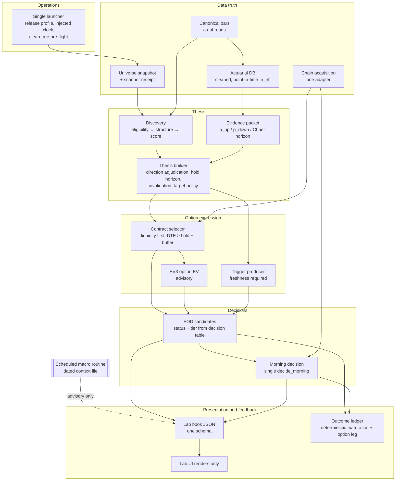

# AVSHUNTER — End-to-End Pipeline Map and Fix Design

Status: **DRAFT FOR APPROVAL — read-only investigation, no pipeline code changed.**
Prepared: 15 Sep 2026. Evidence run: `20260914_214012` (session 2026-09-14), cross-checked against earlier runs where stated.
Companion documents: `DECISION_PATH_MAP_20260914_214012.md` (field-level map, breaks DM-01..DM-38), `audit/signal_accuracy/runs/20260914_214012/` (independent recomputation).

Purpose: one map of every stage, what it really does today, and the **correct target design** for each, so the pipeline is rebuilt deliberately instead of patched.

Evidence tags: **[V]** verified in code or run data · **[I]** inferred, to confirm during build.

---

## 1. Why the pipeline keeps breaking (summary)

The same seven failure patterns appear in every stage:

| Pattern | What it looks like | Examples |
|---|---|---|
| Missing → neutral | A missing input becomes a default number, a "neutral pass", 0, or a fallback value | 3R targets, spread 0.08, returns 0, VMS silently off, `planned_hold_sessions` null in the ledger, IV tailwind 0 |
| Label over-claims | A name implies validation that never happened | `CONFIRMED`, `ACTUARIAL`, `SESSION_ALIGNED`, `MONETISABLE`, `win_probability`, `scanner_data_quality=CONFIRMED`, EIL `BLOCKED` |
| Computed, not applied | A check or model runs and nothing uses it | selector spread limit, reachability cap, EVEngineV2 in Vanguard, WBS in EIL, mp size multiplier |
| Several producers | The same field/file written by several stages, often in place | direction ×5, exit plan ×2, `superbrain_enriched` rewritten ×5, macro context ×4, two monetisation policies |
| Unit / vocabulary drift | Same name, different meaning | DTE sessions vs calendar, spread % vs fraction, tier 0/1/2 vs A/B/C, GO_LIMIT |
| Circular inputs | An output is used to justify itself | horizon from selected contract DTE, expected move includes target, R:R = 3 by construction |
| Non-reproducible | Wall clock, overwritten "latest" files, dirty tree, untracked code | `date.today()` decay, macro file overwritten, `worker3/lab_contract.py` untracked, external `vanguard/` data |

Tests pass because every test uses synthetic, complete inputs; none runs on a real run or on missing inputs.

---

## 2. Design rules for the rebuilt pipeline

These rules apply to every stage. Each stage fix below is an application of them.

| # | Rule | Enforced by |
|---|---|---|
| R1 | **Missing is never neutral.** Missing input → field null + explicit state (`NOT_EVALUATED`, `DATA_MISSING`, `UNAVAILABLE`) + reason code. No defaults, no neutral passes, no zeros, no silent fallbacks. | Real-run gate, missing-input tests, lint rule on `or 0` / neutral pass |
| R2 | **One producer per field.** A field is written once by its owning stage; later stages read it, never rewrite it. Stage outputs are immutable files. | Contract registry, file-hash check after each stage |
| R3 | **Units and vocabulary in the name.** `dte_sessions`, `dte_calendar_days`, `spread_fraction_mid`, `spread_pct_mid`; one enum per concept end to end. | Schema check |
| R4 | **Decide before you depend.** A stage decides its own quantity before downstream stages use it (thesis hold before contract; liquidity before contract selection). No read-backs. | Stage order, decision tables |
| R5 | **Authority is explicit.** Every field is `AUTHORITATIVE` or `ADVISORY` in the contract. Advisory fields are never read by status/tier/verdict code. | Contract registry, test "verdict unchanged when advisory inputs change" |
| R6 | **Labels say what was measured.** A field called probability must be a calibrated probability; otherwise rename it (score, base rate, proxy). | Review + calibration check |
| R7 | **Reproducible inputs.** Every run reads dated, hashed inputs and an injected clock; the same inputs and clock give identical outputs. | Replay runner, run_meta release profile |
| R8 | **Clean release.** Production runs only from a committed, tagged tree with a single launch path and a versioned flag profile. | Pre-flight gate |
| R9 | **Fewer, owned stages.** A stage that has no decision consumer and no validated lift is retired, not kept "for context". | Retire list (§5) |
| R10 | **Measured against reality.** Every decision stage's output is scored against outcomes before it gains authority. | Outcome ledger + scorecard |

---

## 3. Target pipeline (after redesign)

---

## 4. Stage-by-stage map and fix design

Each stage: **Verdict** (KEEP / REBUILD / MERGE / RETIRE) · current state · defects · right fix · invariants to test.

### S0 — Operations, launch and run governance

**Verdict: REBUILD** (foundation for everything else)

Current state [V]
- Four launch paths: `run_evening.bat` → `intelligent_orchestrator.py --evening`; `run.py` → `orchestrator/main.py` (older orchestrator); `orchestrator/run-avshunter.ps1`; `run_premarket.bat`.
- `canonical_data/feature_flags.py` defaults all flags OFF; only `run_evening.bat` sets them via env vars. Any other launch silently disables the canonical data store.
- `run_meta.json` for run 0914: `dirty: true`, `release_id: null`, `profile_hash: null`; 19 tracked files modified including the orchestrator.
- `worker3/lab_contract.py` is **untracked but imported** (`intelligent_orchestrator.py:2597`) — a clean checkout fails. `position_lifecycle_tracker.py` git-ignored yet run nightly.
- `--as-of-utc` only honoured on the dynamic path; many `datetime.now()` / `date.today()` calls ignore it. REPLAY operator mode always raises (`:7427`) — no replay runner exists.
- Health: file presence counts as PASS for macro/physics (`contracts/lab_control.py:1264-1271`); semantic score is `1 − max(missing)/population`.
- 95 hardcoded `C:\Users\ACKVerissimo` paths in 61 files; 136 files use `sys.path.insert`; 935 tracked audit files; permission-locked pytest temp folders inside `audit/`.
- Production stores contain test data: ledger OUTCOME `run_001 / QA_CLOSE`; `run_registry` row `DDD_REGULAR_SESSION_TEST`.

Right fix
1. **One launcher**: `avshunter run --action BUILD|VALIDATE --session-date --as-of-utc`; flags from one versioned `release_profile.json` (hash in `run_meta`). Delete `run.py`, `orchestrator/main.py`, PS1 entry points.
2. **Pre-flight gate** refuses production when: tree dirty, untracked imports (import-graph check), no release tag, profile missing. Dirty runs are forced to RESEARCH mode and excluded from baselines and the ledger.
3. **Injected clock**: one `SessionClock` passed to every stage; `datetime.now()` / `date.today()` banned in decision code (lint).
4. **Replay runner**: input = run plan + dataset registry snapshot ids; network-refusing providers; writes to a scratch run dir; diffs book, candidates and ledger against the stored run.
5. **Health**: per-stage contract of required outputs and decision-critical fields; any missing decision-critical field = FAILED; file presence is never PASS; failed non-critical stages listed by name.
6. **Repo hygiene**: config-driven paths (`AVSHUNTER_HOME`), package imports instead of `sys.path.insert`; run evidence moved out of git to an artefact store; quarantine test rows in ledger, registry and journal.

Invariants: replay of a stored run is byte-identical for decision fields; production refuses to start on a dirty tree; no decision module imports `datetime.now`.

---

### S1 — Universe and scanner

**Verdict: REBUILD** (explicit stage with receipt)

Current state [V]
- The MarketData.app scanner is not launched by anything; its manifest is from **2026-08-20**, rejected as stale and treated as empty. `vms_decision=UNKNOWN` on all 1,578 rows; the +5/+2 VMS boost to `composite_adjusted` is silently off.
- `scanner_data_quality` hardcoded `"CONFIRMED"` (orchestrator `:5061`, discovery `:2420`). Three writers of scanner context.
- `polygon_liquid_universe.csv` last modified 2026-05-17 and overwritten in place — no point-in-time membership; delisted names disappear (survivorship).

Right fix
- Scanner becomes an orchestrated stage (or a scheduled task) emitting a receipt `{run_id, session_date, universe_sha256, n_scanned, status}`; one producer of scanner context.
- Discovery receives a session-matched scanner context or `scanner_status=UNAVAILABLE` per row (R1); the VMS boost is only applied when available and is recorded as a separate score component.
- Dated universe snapshots and a membership table with add/remove dates, used by Discovery and the actuarial builder.

Invariants: missing scanner shows as DEGRADED in the manifest; universe for any past session is reconstructable.

---

### S2 — Canonical data (bars, chains, finality)

**Verdict: KEEP, tighten**

Current state [V]
- `historical_prices.sqlite` is point-in-time with a revisions table, but `read()` has no as-of-revision parameter; staleness uses calendar days against the wall clock; fallback order canonical → CSV cache → Polygon → `STALE_CACHE` (a stale frame is still scored and only labelled SUPPRESSED).
- Discovery runs with `--force-update`, bypassing the fresh-canonical short-circuit.
- Two option-chain fetchers (options stage vs GEX adapter); provider finality healthy (1,316/1,318 chains).
- Independent audit: closes, ATR, ADX, gap, range recompute exactly (0 failures on current tickers).

Right fix
- One reader: `read_bars(ticker, session_date, as_of_revision_ts) → frame + {source, last_bar_date, sessions_stale (XNYS), status}`; stale → ticker dropped with reason `STALE_BARS`, never scored.
- One chain-acquisition adapter used by options, GEX and morning, storing each chain once with dataset id and provider timestamps.
- Remove CSV-cache and stale fallback branches once canonical is authoritative; flags from the release profile, not env vars.

Invariants: same session + as-of → identical bars; no scored row with `sessions_stale > 0`.

---

### S3 — Completed-session GEX

**Verdict: FIX adapter, keep advisory** (or retire if nothing needs it after macro removal)

Current state [V]
- Fails every same-evening run: the adapter sends `date=session_date` and MarketData returns HTTP 400 "date parameter is used for historical queries only" (`canonical_data/marketdata_option_chain.py:89`). The options stage fetches the same endpoint without `date` and succeeds.
- `tests/test_completed_session_database_refresh.py:94` asserts the `date` parameter is sent — the test locks in the bug.
- Consumers are advisory (regime consensus, desk card, trap engine [I], McMillan layer).

Right fix
- Use the shared chain adapter (S2): same-day after close → cached/live chain verified by provider timestamps inside the session; `date=` only for past sessions.
- Replace the request-shape test with a provider-contract test.
- Decide whether any remaining consumer needs GEX once macro is external; if not, retire with the macro residue.

---

### S4 — Macro

**Verdict: REMOVE from pipeline** (user decision); macro owned by the scheduled cloud routine

Current state
- User decision: macro reviewed manually; owned by routine "AVSHUNTER daily quant macro thesis" (weekdays 08:45 London, freshness-gated, writes `dropbox/macro/thesis/`). Event guards stay manual.
- [V] Scores, direction, size and EOD/Lab verdicts carry no macro effect in run 0914.
- **Correction [V]:** macro still reaches one decision gate — Vanguard's edge detector picks EV / win-rate floors and trend-exhaustion proximity by `macro_regime` (`vanguard/layer2_statistical/edge_detector.py:355-389, 420`), defaulting to `TRANSITIONAL` when absent. 465 rows fail `REGIME_MINIMUM_EV`; 774 of 1,528 rows `has_edge=False`. `has_edge` / signal feeds EOD rule "NO_EDGE → DATA_INSUFFICIENT/PROBE" (`eod_candidate_engine.py:1288`). Final-status impact not yet quantified.
- Residue still executed nightly: macro enrichment of Discovery, normalisation, sector alignment, exposure resolver, regime screener (no output), horizon router macro read, ~60 macro columns, macro fields in handoff contract and run health, macro context built in four places (MG:1275, MHF:758, LC:3628-3644, Worker 3). `macro_intelligence_latest.json` re-saved overnight without rebuild (unknown local process).

Right fix
1. Strip macro stages, columns, handoff/health requirements and the physics sector-alignment input from the evening run.
2. **Remove `macro_regime` from Vanguard gates** — one regime-independent EV/win-rate hurdle (see S8).
3. Routine writes `macro_context_YYYY-MM-DD.json` (also on skips); **Worker 3 is its only reader**; its output is display-only in the Lab; morning decision never reads it (R5).
4. Missing/stale/skipped context → `MACRO_CONTEXT_UNAVAILABLE`.
5. Find and stop the process that re-saves `macro_intelligence_latest.json`.

Invariants: verdicts identical when macro files change or are deleted; no decision module imports macro fields.

---

### S5 — Discovery

**Verdict: REBUILD as four pure sub-stages**

Current state [V]
- Eligibility drops are mislabelled: 1,714 `NO_SIGNAL_AT_ANY_HORIZON` are almost all liquidity/bar filters (vol20 < 500k 872, price range 417, ATR < $0.40 298, < 30 bars 113, ATR% 14 — replay approximation [I]).
- Two Wyckoff engines (root 1,096 lines used; `orchestrator/` copy dead). Precor phase can override Wyckoff; swing_fusion fails closed on 1,576/1,578 rows so asymmetry geometry never applies (`asymmetry_pass` False on all rows); `structural_stop_source=ATR_FALLBACK` on 1,504.
- `composite_adjusted` decays 3%/calendar day from `date.today()` — a replay the next day changes tiers.
- `win_probability = clip(40 + 0.25·composite, 35, 75)` — a rescaled score, read downstream as a probability.
- Tier 0 "EARLY" = 38% of output; structural target PENDING_OI on 95%; direction table (Precor/Fusion/Wyckoff) with UNRESOLVED on conflict (correct).
- 40 stale tickers emitted (contained before options).

Right fix
1. **Eligibility**: pure filter with reason codes `PRICE_RANGE | VOL20 | ADV | ATR_ABS | ATR_PCT | MIN_BARS | STALE_BARS`; lifecycle reasons must sum to the universe.
2. **Structure**: one Wyckoff engine; one phase producer (Precor recorded as an alternative, not an override); fix or retire swing_fusion/asymmetry as authorities (if retired, no columns claim them).
3. **Score**: composite computed once; decay measured in trading sessions from bar date to the evidence session (injected clock).
4. **Tier/lane**: explicit rule table; no emitted stale rows.
5. Rename `win_probability` → `structure_score_scaled` (or remove); probabilities come only from S7 evidence.
6. Discovery emits **structure and a candidate direction hint**, not a final thesis — adjudication moves to S9.

Invariants: same inputs + session → same tier; no row with stale bars; eligibility reasons exhaustive.

---

### S6 — Packages

**Verdict: REBUILD (slim references)**

Current state [V]
- 1,579 packages, ~3 MB each (~4.7 GB per run): macro copied 4×, OHLCV 4×, option fields null by construction.
- Data-contract flags computed before backfill and never recomputed: AAPL shows `data_failure=True`, `dcv_reason=NO_OHLCV` next to 1,270 bars and `eligible_for_trade=True`.

Right fix
- Package = `{ticker, run_id, session_date, discovery_row_ref, bars_ref (dataset_id, last_bar_date), actuarial_ref (nullable), data_contract}`; bars and context stored once per run and referenced by hash.
- Validate after the last writer; `eligible_for_trade` false unless `dcv_valid`.

Invariants: package flags agree with contents; package < ~50 KB.

---

### S7 — Actuarial database and query

**Verdict: REBUILD (statistical validity first)**

Current state [V]
- `actuarial_database_v7.parquet` lives **outside the repo** (`C:\Users\ACKVerissimo\vanguard\data`, untracked; builder `actuarial_cache_builder.py` untracked; ~20 DB versions 0.4–0.87 GB).
- 3,816,857 rows, 3,608 tickers, 2021-10-28 → 2026-07-31; last 20d-mature label 2026-07-02 — **~10 weeks stale** although the cache was rebuilt 14 Sep.
- **Uncleaned outliers**: `outcome_20d_return` |x|>1 on 8,712 rows, >10 on 305, max 46,929,999, mean 72.3 vs median 0.0004 (5d and 10d similar). Mean-based fields are corrupted: cache `outcome_20d_return_mean` max 1,970; `expected_move_10d`, `efficiency_10d`, Sharpe and Kelly averages affected. The winsorise patch targets only the legacy parquet.
- Overlapping daily windows and same-date rows treated as independent; `confidence = min(1, n/50)` → **1.0 on 1,528/1,528 rows**, gate 2 never fires.
- Two state keys: cache 7 dims (508 states, 54 with n < 30) vs Vanguard query 9–10 dims.
- Cache `no_match` returns win rate 0.52 (neutral default); intraday multipliers 0.4–2.5× are hand-set; calibration weights hand-set.
- Look-ahead: core technical state uses trailing ranks (no leak found; test exists). Survivorship of delisted names unproven [I]. `iv_regime` derived from price bars, not implied vol.
- Dead: `actuarial_live_updater.py`, `data/actuarial_db.sqlite` (0 bytes), `*old*` query copies.

Right fix
1. One governed, in-repo, versioned builder (or at minimum sha256 manifests tracked in repo): point-in-time universe incl. delisted → adjusted bars → corporate-action and outlier validation (reject or cap at ±100% with logged counts) → labels with `label_asof_date`.
2. One state key and one query library for all consumers.
3. Output an **evidence packet per direction and horizon**: `p_up_h`, `p_down_h`, `p_target_first_h`, medians/quantiles, `n_eff_h` (date-block count), Wilson/beta CI; null when insufficient — never 0.52.
4. Staleness gate: fail if max mature label date < session − 30 days.
5. Remove intraday multipliers and hand-set calibration until estimated walk-forward.
6. Retire live updater, sqlite file, old copies.

Invariants: no return magnitude beyond cap; CALL/PUT statistics mirror; `confidence < 1` when `n_eff` small; staleness gate enforced.

---

### S8 — Vanguard edge assessment and direction evidence

**Verdict: REBUILD as evidence producer** (no final verdicts, no macro)

Current state [V]
- Gates: intraday, auction conflict, confidence (never fires), trend exhaustion (macro-dependent threshold), options viability, EV (macro-regime floors), then verdict tiers. 754 TRADE / 465 REGIME_MINIMUM_EV / 168 TREND_EXHAUSTED / 141 SETUP_FORMING.
- `EVEngineV2.evaluate` result discarded (`edge_detector.py:284-288`); `net_ev = expected_value_20d` (corrupted mean inputs, S7).
- PUT signals judged on long-underlying EV and P(ret>0) — direction-asymmetric.
- `_determine_direction` auction-driven, neutral → CALL (`:534`); 480/569 PUT edges have P(up) > P(down) (DM-02).
- `actuarial_source` says V6_DB on all rows (it is v7).
- `directional_force` built on defaulted returns; physics fields defaulted on 100% of rows (display-only).

Right fix
- Vanguard outputs **state + the S7 evidence packet** only; no TRADE/NO_EDGE verdict, no direction guess.
- If a coarse edge flag is still wanted: direction-specific CI lower bound vs one regime-independent hurdle; no macro inputs.
- Direction evidence families after retirements (catalyst, relative strength): **ACTUARIAL** = S7 `p_up`/`p_down` with CI and `n_eff`; **PRICE_FLOW** = real 5/10-day returns + trend, deduplicated against Discovery structure.
- Retire: `_determine_direction` CALL default, discarded EVEngineV2 call, macro gate inputs, physics engine (see §5).

Invariants: no gate reads `macro_*`; mirrored inputs give mirrored outputs; evidence null when `n_eff` below minimum.

---

### S9 — Thesis builder (new consolidated stage)

**Verdict: NEW** — replaces scattered logic in DG, Options Intelligence, router and EOD

Owns: **direction adjudication, hold horizon, invalidation, target policy.** Everything downstream reads the frozen thesis.

Current state [V]
- Direction: governance keeps Discovery direction and labels it CONFIRMED; evidence never adjudicates (DM-01); 65% of rows oppose their evidence; written by five producers.
- Hold horizon: no producer; router derives it from the **selected contract's DTE** on 100% of rows (DM-38); three horizon producers (router, `layer2__preferred_horizon` argmax, macro preferred horizon).
- Invalidation: governed Wyckoff validation level (good), null on 169 directional rows; Lab can re-admit `stop_loss`.
- Target: PENDING_OI 95% → Options 3R fallback (unbounded, negative PUT targets, R:R = 3 by construction); expected move includes the target; no cap by expected move or ATR.

Right fix
1. **Direction** (pending decision D1/D2): `direction_state ∈ {CONFIRMED, UNCONFIRMED, CONFLICT, NON_DIRECTIONAL}`. CONFIRMED only when qualified evidence agrees; CONFLICT when qualified evidence opposes; UNCONFIRMED when no qualified evidence. Never auto-flip.
2. **Hold horizon**: `thesis_hold_sessions ∈ {5,10,20}` chosen from the S7 evidence packet (best direction-specific CI lower bound beating the next horizon by a margin); null → thesis not routable (BLOCKED with reason). DTE is chosen later from the hold.
3. **Invalidation**: governed level required for a directional thesis; missing → `THESIS_INCOMPLETE`, never a fallback stop.
4. **Target** (pending decision D3): structural target when available; otherwise `target_state=UNEVALUABLE` and an optional `reference_target` = spot ± k × expected move (expected move computed without the target), labelled REFERENCE and never used for monetisability, R:R or EV.
5. Thesis frozen with `thesis_id`, evidence ids and formula version; downstream stages may not rewrite direction, hold, invalidation or target.

Invariants: CALL invalidation < spot < target (mirrored PUT), target > 0; horizon independent of any contract; thesis fields identical in every downstream file.

---

### S10 — Options Intelligence (contract selection, quotes, greeks, economics)

**Verdict: REBUILD selector and quote handling; KEEP chain parsing**

Current state [V]
- 9,578-line module. Selector: DTE window (unknown horizon → 1_5d), ±15-day widening can undercut minimum DTE, hard delta 0.20–0.75, invalid quotes removed, delta band, reachability vs target (negative PUT target keeps every strike), weighted score with missing theta/vega/spread defaults; **`spread_limit` computed but never applied** (`:4562`).
- Liquidity is judged after selection: EV3 later rejects 525 contracts for liquidity, 213 with no evaluable contract, 85 spread, 46 zero bid.
- Delta: provider delta overwritten by a flat-vol "Heston" delta (`:3487-3494`); Heston calibration unreachable on Windows (`signal.SIGALRM`, `:2136`) → proxy always; 58 contracts off > 0.10 vs Black-Scholes.
- `contract_iv` not refreshed with the quote; `iv_rank` synthesised from buckets/defaults while provider `ivRank` is discarded; `quote_freshness=SESSION_ALIGNED` without an age check.
- DTE unit drift (sessions minimum vs calendar DTE; `contract_dte` flips calendar → sessions → calendar); EOD guesses spread units.
- Zero published for missing contract fields in morning file (137 rows).
- Independent audit: bid/ask/IV match the raw chain exactly; strike/expiry/side/DTE/mid/spread recompute exactly.

Right fix
1. Selector input = frozen thesis (S9). Order: side → **liquidity eligibility first** (OI, volume, two-sided quote, spread ≤ policy for the horizon) → `dte_sessions ≥ thesis_hold_sessions + buffer` → delta band → strike reachability vs a valid target (skipped when target UNEVALUABLE) → score. No widening below the minimum. No defaults for missing greeks: contract ineligible.
2. Greeks: publish provider delta/gamma/vega/theta; any model greeks in separate `model_*` fields, only after a successful, cross-platform calibration with `fit_error` populated.
3. Quote: `quote_provider_timestamp_utc`, `quote_age_seconds`, `quote_freshness ∈ {FRESH, STALE, UNKNOWN}` from real age; IV refreshed with the quote; provider IV rank published, synthetic ranks removed.
4. Units: `dte_sessions` and `dte_calendar_days` both explicit; `spread_fraction_mid` only (percent derived for display).
5. No contract → contract fields null with `contract_state=NO_ELIGIBLE_CONTRACT` and reason.

Invariants: published delta within 0.05 of BS on provider IV; no selected contract fails the spread policy; `dte_sessions ≥ hold + buffer`; no zero prices.

---

### S11 — EV3 and DOI (option EV)

**Verdict: MERGE into one advisory option-EV producer**

Current state [V]
- EV3 barrier model evaluates 245/1,449 rows; rejections mostly upstream (liquidity, missing target), not the model. Authority permanently False; calibration readiness INSUFFICIENT_OUTCOMES (0 matched outcomes).
- Barrier cache outside the repo, built from the stale v7 DB; `n_effective` min 1, median 84.
- EV3 hold comes from DTE-derived horizon — circular despite a unit test forbidding it.
- Dead copies: `vanguard/ev_engine.py`, `vanguard/ev_engine_v2.py` (byte-identical, unused); root `ev_engine_v2.py` live in Vanguard, EIL, final decision engine, superbrain.
- DOI: 703 families ranked, all probability fields blank on 1,449 rows (no models, no outcome labels); preferred contract ≠ governed contract on 703/703; Lab v4 contract state depends on a DOI join that misses 746 rows.

Right fix
- EV3 is the single option-EV producer; retire EVEngineV2 and dead copies.
- Input contract: frozen thesis (direction, entry, target, invalidation, `thesis_hold_sessions`) + the selected, liquidity-eligible contract.
- Status split: `NOT_EVALUATED_UPSTREAM_*` vs `REJECTED_MODEL_*`.
- Authority stays off until ≥ 30 matched outcomes and ≥ 10 per EV band with calibration checked.
- DOI kept as advisory alternative-contract ranking only; probability fields hidden while `doi_probability_state=NO_MODEL`; never feeds contract state or verdicts.

Invariants: barrier probabilities sum to 1; verdicts unchanged with EV3/DOI disabled; rejection report split upstream vs model.

---

### S12 — Execution layer

**Verdict: SPLIT, KEEP three, RETIRE the rest**

Current state [V]
- Order: core intel → trigger layer → SuperBrain passthrough → catastrophe gate → WBS → actuarial injection → EIL → actuarial injection → GARCH → merge. `superbrain_enriched` (27 MB) rewritten in place ≥ 5 times.
- **Trigger layer**: `trigger_go_eligible` True on 896 rows (62%); `trigger_freshness_state` UNKNOWN on all rows and a missing timestamp resolves to not-stale, so the stale gate never fires; RANGE_BREAK_EARLY alone (quality SINGLE) is GO; package pass and spine pass disagree (903 vs 896).
- **EIL**: mode chosen from wall-clock market hours → EOD_SYNTHETIC on all rows (non-reproducible); 73% BLOCKED = exactly the rows failing the liquidity gate on end-of-day quotes; evaluation failures also written as BLOCKED; PSE retired so size fields are computed and unused.
- **WBS**: advisory; EIL looks for its file in the wrong folder, so `eil_enriched` has zero `wbs_` columns; walls are an OI proxy labelled "gamma wall"; `wall_break_scorer.py` has uncommitted changes.
- **GARCH/Layer 3**: HAR_RV on all rows (named GARCH); runs after EIL, so EIL never saw it; merge rewrites four other stages' files; IV tailwind 0 when IV missing.
- **Monetisation policy**: production imports `scripts/` copy; tests most likely import the root copy [I]; thresholds differ (hard spread 0.20 vs 0.15).
- Dead: core intel exporter (display-only), SuperBrain 2,771-line script (never run), catastrophe gate (no-op), EDE (commented out), PSE fields.

Right fix
1. **Trigger producer** (keep, single authority): freshness required (UNKNOWN → not GO-eligible); GO requires STRONG quality or a primary trigger other than RANGE_BREAK_EARLY (decision to confirm); one pass only.
2. **Forward variance** (keep, renamed): runs before the execution join; outputs expected moves (null on failure) and `l3_iv_status`; no in-place writes to other files.
3. **WBS** (keep, advisory): nullable fields, `wall_source ∈ {GEX, OI_PROXY, NONE}`, one row per input ticker, single consumer (EOD); rename trigger prices to `wbs_break_level`.
4. **EIL** (reduce): in EOD mode output `NOT_EVALUATED_EOD`; microstructure verdicts only in live (morning) mode, chosen by run argument; failures as `eil_status=FAILED`; EOD status never reads EIL.
5. **Direction/catalyst conflict**: one producer (S9); a conflict can never promote a row.
6. **Monetisation policy**: one copy imported by package path; tests import the production file.
7. **One immutable execution input join** replaces SuperBrain passthrough and in-place merges.

Invariants: no BLOCKED when data mode ≠ LIVE; EOD replay independent of wall clock; package and spine trigger counts equal; monetisation policy import origin = production path.

---

### S13 — EOD candidate engine

**Verdict: REBUILD decision logic as tables; slim output**

Current state [V]
- Status rule order (first match): invalidation → options block → fatal → direction conflict (MITIGATED → **TRIGGER_READY**) → contract repair → liquidity → trigger GO → catalyst → EIL → trigger STRONG (unreachable `or trigger_go`) → NO_EDGE/flat → watchlist. No economics, target plausibility or spread input; 18 TRIGGER_READY rows also CONTRACT_REPAIR_REQUIRED.
- `classify_tier`: WATCH if options_score < 15 or composite < 40; campaign clue satisfied by constant convexity 2.
- Slate = all 1,449 rows (no cap); only 347 capital-authorised; unstable sort with duplicate ordinals; `monetisation_fit_score` additive with missing → 0; copied into `confidence_score`.
- Exit plan produced twice (EOD `_exit_intelligence_plan` with magic 1.03/0.97 t3 and invented target; `exit_rules_engine` rewrites the CSV in place); catalyst layer also mutates the CSV.
- Zero/−1 for missing (`exit_invalidation_price` 300 rows, `rr_underlying`, `planned_hold_sessions` −1); `EOD_DATA_INSUFFICIENT_REVIEW` mapped to `VALID_THESIS_DATA_REVIEW`.

Right fix
1. **Status as a decision table** (spec-first), inputs from frozen thesis + contract state + trigger + liquidity: THESIS_INCOMPLETE / CONFLICT / NO_ELIGIBLE_CONTRACT / TRIGGER_READY / THESIS_READY / WATCH. A conflict or incomplete thesis can never be TRIGGER_READY; spread-policy failure can never be READY.
2. **Tier** (pending D6): one tier definition used end to end; options quality bucket renamed.
3. Output `morning_candidates_v2`: authorised rows only; required `thesis_id`, direction state, invalidation, hold; nullable contract/target with reasons; one exit block from one producer; written once, immutable (enrichments as sidecars).
4. Stable sort, unique ordinals; scores that are not confidences are not named confidence.

Invariants: row count = authorised count; file hash unchanged after the stage; decision table covers every input combination including missing.

---

### S14 — Lab book

**Verdict: SIMPLIFY to one schema and one producer per field**

Current state [V]
- Three schema versions stamped on one row (v2 builder, v4 overwrite, server serves v4 projection); JSON authoritative, CSVs derived.
- `thesis_state` "VALID_THESIS_*" on all rows including insufficient data; `lab_v4_quote_freshness=SESSION_ALIGNED` on 1,063 prior-session quotes.
- EOD `final_action` comes from the OLM guard, not the Execution Gate; authority-contract check bypassed when `execution_authority_policy_version` is blank (blank on all EOD rows); `sync_interpreter` swallows exceptions.
- `invalidation_price` via `first()` can re-admit legacy `stop_loss`; `target_price` can be a WBS wall price.

Right fix
- v4 only; CSV/triage views generated from the JSON.
- `final_action` written only by the morning decision (S15); at EOD null with `lab_verdict=MORNING_VALIDATION_REQUIRED`.
- Policy version required; missing = violation.
- Thesis fields copied from the frozen thesis only (no alias fallbacks); freshness `PRIOR_SESSION` at EOD.

Invariants: every Lab field traceable to one producer; no alias fallback for prices.

---

### S15 — Morning decision (manual run ~15 min after US open)

**Verdict: MERGE Morning Gate + Execution Gate into one `decide_morning`**

Current state [V]
- Live fetch for all 1,449 rows although only 347 can pass; ~3–4 provider calls per row.
- Decision ladder (first match) includes an ordering bug: "economics not viable" (FLAG) precedes "invalidation failed" (BLOCK), so a broken thesis with a bad quote becomes FLAG; a missing stop is reported as "thesis invalidated by price action".
- Execution Gate invents `READY_EXECUTE/BUY_NOW` from a morning GO because `campaign_verdict` is absent from morning candidates; delta max 0.75 (MG) vs 0.85 (EG); two spread rules; spread units flip; `iv_rank` defaults 50; runway uses `put_wall` regardless of direction.
- GO_LIMIT means human-approved GO in the Morning Gate but BUY_SMALL in the Lab.
- At least seven later steps can downgrade or relabel the decision (authority contract, OLM guard, execution authority guard, direction re-check, macro mutation check, Lab server EOD_PREP override, Lab server re-ranking).
- Morning gate replaces thesis `entry_spot` with the live price; macro read from the mutable latest file.

Right fix
1. Hydrate only authorised candidates.
2. One pure function `decide_morning(frozen_thesis, candidate, live_quote, policy) → {action ∈ BUY_NOW, BUY_SMALL, CONTRACT_REPAIR, MANUAL_REVIEW, BLOCK; reason_code}` with one policy table (spread fraction, delta band, quote age ≤ N s).
3. Rule order: authority → direction state → structure → thesis invalidated (live vs stop; missing stop = `DATA_MISSING` BLOCK) → move realised → quote missing/stale → spread → contract → model risk → BUY.
4. Missing upstream verdict → MANUAL_REVIEW, never invented.
5. Thesis origin preserved; live price stored separately.
6. After `decide_morning`, only presentation steps; no later overrides.
7. Macro context display-only via Worker 3 (S4).

Invariants: broken thesis always BLOCK; decision unchanged when macro/advisory fields change; one vocabulary end to end.

---

### S16 — Lab UI, Worker 3 and pipeline interpreter

**Verdict: UI renders only; Worker 3 advisory context; interpreter advisory and logged**

Current state [V]
- UI server recomputes priority with superbrain-era weights and fields stripped from the book, then overwrites `lab_rank`.
- "Trigger" column shows a WBS wall level; it lies beyond the structural target on 430/1,143 directional rows (e.g. NE PUT 43.88 → target 29.99 → trigger 24.88).
- Dead copies: 3 old `intelligence_lab*.py`, 5 old `index*.html`, 13 `.bak`, more under `backups/`.
- Worker 3: advisory enforced in dataclasses; one of four macro context producers.
- Interpreter automation_v2: no order path, but writes the API key into global env, can deploy packages over production targets, hardcoded paths, deployment folders inside the source tree; LLM brief is the trader's main readable narrative (influence without measurement).

Right fix
- UI renders the book JSON; rank = book rank from one producer; `wbs_break_level` renamed; explicit nullable `entry_trigger_level` with geometry invariant.
- Worker 3 is the only macro-context reader (S4).
- Interpreter: provider injected (no global env writes), deployment only from a signed clean-tree release with output outside the repo, brief generated from frozen Lab fields only, each brief logged to the ledger against `thesis_id`.
- Delete old UI and interpreter copies.

---

### S17 — Outcome ledger, maturation and trade journal

**Verdict: REBUILD recording contract; this is what proves or disproves edge**

Current state [V]
- Ledger: 7,531 CANDIDATE_DECISION rows over 7 runs; **`planned_hold_sessions` null on all 7,531**; `completed_session` null for the five oldest runs (4,931 rows); target missing 1,332, invalidation 1,126; `evidence_dataset_ids` and `formula_version` null.
- Latest state: 21,990 of 35,112 candidate-horizons DATA_EXCEPTION; 1,078 complete (all from one run); **0 fit-eligible** (PLANNED_HOLD_UNAVAILABLE); option leg absent (`doi_outcome_labels` 0 rows).
- Maturation uses wall-clock `as_of`; observations re-appended every run (61,250 stored vs 35,112 unique); summary reports `data_exceptions: 0` beside 21,990 exception horizons.
- Journal: 14 closed trades (Mar–Jun), none with `thesis_id`; smoke and duplicate trades included; 10 calibration reports on them; no TRADE_ENTRY/FILL_RECORDED in the ledger.

Right fix
1. **Recording contract**: one immutable candidate per `thesis_id` requiring completed session (from run plan/registry), reference close, frozen target/invalidation, integer `thesis_hold_sessions`, selected contract and quote snapshot id, evidence dataset ids and formula version; refuse rows lacking them and count as named rejects.
2. **History correction**: append CORRECTION events backfilling `completed_session` from `run_registry.session_date` and hold where derivable.
3. **Deterministic maturation** keyed on (candidate, horizon) with plan clock; each horizon written once when terminal.
4. **Option leg**: mature the selected contract from `option_contract_observations` (bid-based exit, MFE/MAE) into outcome labels.
5. **Scorecard per run and cumulative**: underlying hit rate, directional return, option return — by tier, direction state, evidence family, target source, and acted vs not acted, with counts and CIs.
6. **Journal = fill ledger**: entry requires `thesis_id` + contract; exits from broker confirmations; quarantine smoke/duplicates; one scorer (the ledger).

Invariants: 0 candidates missing required fields; maturation idempotent; scorecard counts reconcile to ledger.

---

### S18 — Tests and quality gates

**Verdict: REBUILD test strategy**

Current state [V]
- 226 test files; last clean full run in this session: 1,909 passed / 52 failed, 0 errors (an earlier run's 197 errors were caused by the run configuration).
- No `conftest.py`; imports via `sys.path.insert`; no injected clock; tests read live `data/`.
- Failure causes [V/I]: real-data dependence (stage 6 outcome learning), untracked import (stage 0), dirty-tree work in progress (GEX refresh, anthropic runtime), wall clock (CDS2), tests asserting defects still exist (MSI flow), brittle source-string tests (phase 2, liquidity morning lab, DDD liquidity), config-hash drift (provider finality), obsolete macro tests, likely real regressions from uncommitted edits (EV3 calibration report, projection outbox, opportunity tier).
- Only real-run checks: the two read-only audit scripts built 15 Sep (uncommitted).

Right fix — four tiers
1. **Decision tables** (spec-first) for thesis builder, contract eligibility, EOD status, tier, `decide_morning`, outcome labels — every missing-input row included.
2. **Reference algorithm tests**: BS delta, spread fraction, session DTE, monetisability intrinsic, expected move without target, barrier probability sum; metamorphic mirror test (flip price series → CALL↔PUT, levels mirror, none negative).
3. **Golden replay**: 2–3 frozen runs through the replay runner; diff decision fields against an approved expected-change manifest on every change.
4. **Real-run gate** after every run: constant decision fields, defaulted inputs without flags, zero/−1 for missing, target > 0 and within k × expected move, delta vs BS, READY with spread failure, DTE units, direction state vs evidence, ledger required fields, macro independence.

Also: `conftest.py` with injected clock, temp data root, governed flag profile, network and real-DB access blocked; delete source-string tests, "defect still exists" tests, obsolete macro tests; move stored-run tests into golden snapshots.

---

## 5. Retire list

| Item | Reason |
|---|---|
| `run.py`, `orchestrator/main.py`, `orchestrator/run-avshunter.ps1` as entry points | Competing launch paths (S0) |
| Macro enrichment, normalisation, sector alignment, exposure resolver, regime screener, horizon-router macro read, ~60 macro columns, macro health/handoff requirements | Macro owned by scheduled routine (S4) |
| Macro-regime floors in Vanguard gates | Macro still reaching a decision gate (S4/S8) |
| Core intel exporter | Display-only duplicate ranking (S12) |
| SuperBrain passthrough and 2,771-line script | Never run; in-place rewrites (S12) |
| Catastrophe gate | No-op (S12) |
| EDE, PSE size fields | Commented out / retired authority (S12) |
| Physics state engine | 100% defaulted inputs, display-only (S8) |
| Convexity score and campaign | Constant 2 / STAGED from neutral passes; inflates tier (pending D4) |
| Heston greek overwrite | Unreachable calibration on Windows; flat-vol delta replaces provider delta (S10, pending D4) |
| Synthetic `iv_rank` buckets | Provider rank discarded (S10) |
| `EVEngineV2` in Vanguard; `vanguard/ev_engine.py`, `vanguard/ev_engine_v2.py` | Discarded result / byte-identical dead copies (S11) |
| Root copy of `avshunter_monetisation_policy.py` | Two policies with different thresholds (S12) |
| Duplicate exit-plan producer | Two producers rewrite the same file (S13) |
| `orchestrator/WyckoffEngine_3101_v2.py` | Dead competing engine (S5) |
| `actuarial_live_updater.py`, `data/actuarial_db.sqlite`, `*old*` query copies | Dead (S7) |
| Intraday probability multipliers, hand-set calibration weights | Not estimated from data (S7) |
| `relative_strength_20d` and catalyst direction evidence families | User decision (retired) |
| `win_probability` as a probability | Rescaled score (S5, pending D5) |
| Old UI and interpreter copies (`*old*`, `*dnu*`, `.bak`, `0505`) | Dead (S16) |
| Source-string tests, "defect still exists" tests, obsolete macro tests | Test design (S18) |

---

## 6. Decisions needed (with recommendation)

| # | Decision | Options | Recommendation | Why |
|---|---|---|---|---|
| D1 | Direction when qualified evidence opposes | Block · Keep with CONFLICT | **Keep with CONFLICT, never TRIGGER_READY, no contract authorisation; manual review** | Consistent with manual oversight; preserves data for outcome scoring of both views |
| D2 | Direction evidence families | Rebuilt ACTUARIAL (p_up/p_down with CI) + PRICE_FLOW (real returns) · Structure only | **Rebuilt ACTUARIAL + PRICE_FLOW, deduplicated; until S7 is rebuilt every direction is UNCONFIRMED** | Current evidence is defaulted and double-counted; honesty over false confirmation |
| D3 | No structural target | Cap 3R by expected move · UNEVALUABLE | **UNEVALUABLE for economics; optional REFERENCE target = spot ± k × expected move (display only)** | 3R fallback drives inflated monetisable % and R:R = 3 by construction |
| D4 | Convexity, physics, Heston greeks | Repair · Retire | **Retire all three; publish provider greeks; rebuild only with walk-forward lift evidence** | All three are defaults or unreachable today and feed tier/delta |
| D5 | `win_prob_predicted` | Hide · Relabel base rate | **Remove from display; show S7 probability with CI and n_eff when available** | It is a rescaled composite, not a probability |
| D6 | Tier | One definition · Separate names | **One tier at EOD from a decision table; rename options quality bucket** | Same word means different things today |
| D7 | Hold horizon owner | Thesis builder from evidence · Fixed policy · Router | **Thesis builder (S9) from S7 evidence; null → not routable; DTE chosen after** | Removes the circular DTE → horizon → DTE loop |
| D8 | Trigger GO rule | Keep SINGLE RANGE_BREAK_EARLY as GO · Require STRONG or non-early primary | **Require freshness + (STRONG or non-early primary)** | 62% GO-eligible with a freshness check that cannot fire |
| D9 | EIL at end of day | Keep EOD_SYNTHETIC verdicts · NOT_EVALUATED_EOD | **NOT_EVALUATED_EOD; microstructure verdicts only in the live morning run** | 73% BLOCKED is end-of-day spreads, not execution quality |
| D10 | GEX | Fix adapter and keep · Retire | **Fix via shared chain adapter only if a remaining consumer needs it; otherwise retire** | Advisory only after macro removal |
| D11 | External `vanguard/` data and builder | Bring into repo · sha256 manifest | **Builder into repo; data by sha256 manifest in repo** | Reproducibility without committing GB files |

Already decided (user, 15 Sep): retire catalyst and relative-strength evidence; macro out of pipeline decisions and owned by the scheduled routine; event guards manual; no code changes until the design is approved.

**Business requirements (user, 15 Sep — supersede conflicting recommendations above):**
- The pipeline must follow DDD principles and implement decision-tree calculation logic using the data and correct algorithms.
- It must identify **cheap convexity** (D4 "retire convexity" is superseded: convexity is to be rebuilt correctly, not retired).
- The **EV engine must work correctly** and drive the outcome.
- **Rank instead of gate**; always look for the **strongest expression**; determine whether there is money in the option or the ticker.
- Expression set to compare: **long calls / long puts, debit verticals, short shares for PUT theses**. (Long shares for CALL theses not selected — to confirm.)
- Ranking objective: **risk-adjusted EV** (expected profit per $ at risk, discounted by uncertainty and costs).
- Hard exclusions limited to **integrity and tradeability**: invalid/missing data, broken or incomplete thesis, untradeable expression (no two-sided quote, spread above execution limit). Everything else becomes a ranking penalty.
A business-domain design addendum (bounded contexts, decision tree, EV and convexity algorithms, ranking) will be added after the EV algorithm audit completes.

---

## 7. Build sequence

Each phase has an exit criterion measured on real runs, not only unit tests. Phases 0–1 change no trading logic.

| Phase | Scope | Exit criterion |
|---|---|---|
| **0 — Foundation** | Commit or remove untracked production code; single launcher + release profile + pre-flight gate; `conftest.py` with injected clock; quarantine test data in ledger/registry/journal; capture 3 golden run snapshots (inputs + outputs); run the real-run gate nightly (extend the two audit scripts); stop the overnight macro-file overwrite | Clean-tree runs only; gate report produced for 5 consecutive sessions |
| **1 — Data truth** | Canonical as-of reader; scanner stage with receipt; universe snapshots; shared chain adapter (fixes GEX); actuarial DB rebuild (clean outliers, point-in-time universe, `n_eff`, CIs, staleness gate, one state key, in-repo builder/manifests); replay runner | Replay reproduces golden runs; actuarial validation report passes; no stale/defaulted inputs in gate |
| **2 — Thesis core** | Discovery split (eligibility reasons, one Wyckoff, session decay); Vanguard as evidence packet (no macro, no CALL default, direction-symmetric); thesis builder (direction state, hold horizon, invalidation, target policy); strip macro residue | Decision tables pass; gate shows 0 negative targets, 0 horizon-from-DTE, direction states reconcile with evidence |
| **3 — Contract and economics** | Selector rebuild (liquidity first, spread applied, DTE units, no defaults); provider greeks; real quote freshness; EV3 single EV with upstream/model split; one monetisation policy; DOI advisory | Gate: delta within 0.05 of BS, 0 READY rows failing spread, EV3 rejection report upstream vs model |
| **4 — Decisions and presentation** | EOD status/tier decision tables and slim `morning_candidates_v2`; trigger freshness; EIL split; `decide_morning` single function; Lab book single schema/producer; UI renders only; execute retire list | Golden replay diff approved; morning decisions reproducible from stored inputs; no post-decision overrides |
| **5 — Feedback** | Ledger recording contract and corrections; deterministic maturation; option leg; scorecard | 0 candidates missing required fields; scorecard published per run; evidence families and target sources measured against outcomes |

Ordering rationale: without Phase 0 (clean releases, clock, golden snapshots) and Phase 1 (clean actuarial data, replay), later fixes cannot be verified and would repeat the patch cycle. Phase 5's recording contract can start in parallel with Phase 2 so outcomes accumulate while logic is rebuilt.

---

## 8. Verification notes

- Verified in this pass: macro regime floors in Vanguard gates (`edge_detector.py:355-389, 420`); `worker3/lab_contract.py` untracked yet imported (`intelligent_orchestrator.py:2597`); ledger `planned_hold_sessions` null on all 7,531 candidates and `completed_session` null on runs 0905–0911 (4,931 rows); actuarial DB return outliers (5d/10d/20d max 45.1M/48.7M/46.9M, |x|>1 on 1,503/3,522/8,712 rows); Heston `signal.SIGALRM` path; selector `spread_limit` unused in `select_best_contract`.
- Correction to the decision map: macro is not fully out of decisions — it still sets Vanguard gate floors (S4).
- To confirm during build [I]: survivorship of delisted names in the actuarial universe; whether tests import the root monetisation policy; source of constant `sb_final_verdict=WATCHLIST`; whether the trap engine consumes GEX for decisions; morning live-path behaviours (morning not yet run for session 2026-09-14); final-status impact of Vanguard macro floors.
