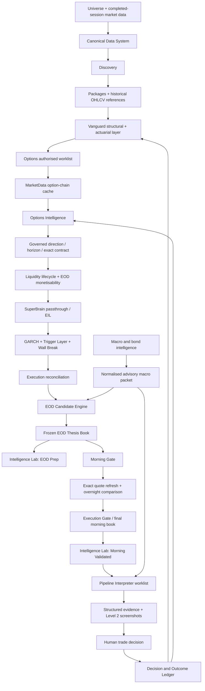

# AVSHUNTER End-to-End Data, Logic and Monetisation Report

**Document ID:** AVS-E2E-DATA-LOGIC-001  
**Baseline date:** 31 August 2026  
**Current evidence run:** `20260831_010309`  
**Purpose:** Uploadable system context for GPT, developers, testers and operators  
**Scope:** Evening pipeline, Morning Gate, Intelligence Lab and Pipeline Interpreter  
**Status:** Current-state architecture and remediation specification; this document does not claim that the outstanding defects are fixed

---

## 1. How GPT and future developers must use this report

This report exists because AVSHUNTER has accumulated many individually sophisticated components whose field meanings, execution order and authority boundaries have repeatedly drifted apart. A local calculation can be mathematically correct and still damage the system when it consumes the wrong field, the wrong contract, the wrong timestamp or the wrong semantic version.

When reviewing or changing AVSHUNTER:

1. Treat the current production code and a named run directory as evidence. Treat old phase numbers and old design documents as historical context only.
2. Never infer that two similarly named fields mean the same thing. Trace producer, formula, timestamp, version and consumer.
3. Never substitute one semantic type for another. A numeric score cannot replace a categorical quality; a pending value cannot become zero; an advisory verdict cannot become capital permission.
4. Preserve one authority per business concept. All other copies must be immutable aliases with lineage, not independent recalculations.
5. Evaluate every change across the complete boundary: producer → persisted artefact → merge → consumer → governed book → UI.
6. Use the frozen EOD thesis as the morning comparison baseline. Morning Gate enhances, repairs or invalidates that thesis; it does not invent a new one without recording a versioned replacement.
7. Do not claim that a pipeline signal is profitable merely because the engineering path completes. Profitability requires point-in-time outcome evidence, including rejected opportunities.

---

## 2. Executive conclusion

AVSHUNTER has capabilities most manual traders do not have:

- broad-universe discovery;
- governed CALL/PUT direction resolution;
- a 3.8-million-row actuarial database and state matching;
- completed-session option-chain acquisition and reuse;
- exact-contract selection, Greeks, IV, liquidity and GEX-related structure;
- volatility forecasting;
- trigger and Wall Break analysis;
- an EOD preparation book;
- a Morning Gate capable of comparing fresh evidence with the EOD thesis;
- a trader-facing Intelligence Lab;
- a final Pipeline Interpreter lane combining structured evidence with screenshots where genuine Level 2 data is unavailable.

The problem is not primarily a lack of data or models. The dominant problem is **semantic and temporal inconsistency between stages**.

The latest verified run demonstrates this clearly:

- the system began its final EOD slate with a balanced **111 PUT / 90 CALL** mix;
- a lifecycle adapter then falsely invalidated 106 of the PUT theses in the final 201-row book;
- the DTE selector and DTE lifecycle checker used different holding-period conventions;
- correct trigger categories existed in EIL but were dropped before candidate construction and replaced in the Lab with the numeric value `55.0`;
- EOD monetisability was not evaluated, but the UI described it as missing data rather than pending Morning Gate;
- the dashboard mixed statistics calculated over 1,527, 1,481, 1,248 and 201-row populations without consistently showing the denominator.

This produces a system that can look highly intelligent while the trader-facing answer is contradictory or empty. It also creates false negatives: potentially valuable PUT and Wall Break candidates are removed before a human can review them.

### Commercial thesis

AVSHUNTER can become a monetisable decision-support pipeline, but its next commercial advantage will not come from adding another model. It will come from:

1. enforcing one data and calculation contract end to end;
2. producing a complete, balanced and auditable EOD thesis book;
3. using Morning Gate strictly to assess what changed overnight;
4. recording every decision and subsequent outcome;
5. measuring which signals and combinations actually close profitably.

The pipeline cannot guarantee profits. It can, however, create a repeatable informational advantage if its outputs become consistent enough to trust and its outcomes become measurable enough to calibrate.

---

## 3. Current operating decisions — do not reinterpret

These decisions supersede contradictory claims in older audits and conversations.

| Topic | Current decision |
|---|---|
| Trading mandate | Long single-leg CALLs and PUTs. Exotic strategies and debit spreads are not the production default. |
| Capital execution | Human-controlled. The pipeline identifies and validates opportunities; it does not automatically transmit orders or determine final cash allocation. |
| Macro | Advisory sidecar. It may describe regime, sector rotation, rates, credit, volatility and risk context. It must not decide CALL versus PUT or independently block a ticker. |
| EV3 | Advisory evidence. It must be calculated accurately where possible but is not the sole GO/NO-GO authority. |
| Legacy R:R | Research/display evidence only. It has no capital authority and has been removed from the principal Lab table. |
| Monetisability | A deterministic check that the exact selected long option can profit if the structural target is reached. It must be computed at EOD and refreshed at Morning Gate. |
| Direction | Ticker-specific governed CALL/PUT logic. Ambiguity fails closed or remains non-directional; it never defaults to CALL. |
| Liquidity | Current liquidity and possible future liquidity are separate states. Low OI/volume can be monitoring evidence, not an automatic permanent rejection. Invalid quote, impossible geometry and hard spread limits remain protective. |
| Polygon options | Disabled. Canonical production options data is MarketData. No code or report should imply a live Polygon options fallback. |
| Catalyst overlay | No longer a required pipeline input. Empty catalyst data must not block the core pipeline. |
| Screenshots | Still required only where structured APIs do not provide the necessary evidence, particularly genuine Level 2/order-book context in the Pipeline Interpreter. |
| Intelligence Lab | The human source of truth for signals. The user should not need to search multiple CSVs to understand a trade. |

---

## 4. Intended two-cycle operating model

### 4.1 Evening cycle — prepare the thesis

The evening pipeline must do the heavy lifting. It must produce a complete, non-executable but decision-useful thesis for every surviving ticker.

An EOD thesis must include:

- ticker and completed market session;
- governed CALL/PUT direction and evidence chain;
- structural entry reference, target and direction-correct invalidation;
- planned horizon and holding period;
- selected OCC contract and ranked alternatives;
- completed-session bid, ask, midpoint, spread and quote timestamp;
- strike, expiry, DTE, multiplier and contract identity;
- delta, gamma, theta, vega and IV;
- IV percentile/rank, realised volatility and IV-versus-HV state;
- open interest, volume, quote-quality and current liquidity state;
- EOD monetisability for that exact contract;
- trigger primary, trigger quality, trigger codes and freshness;
- Wall Break grade, wall level and distance;
- actuarial sample, match level and historical outcome context;
- positive and negative thesis factors;
- advisory macro and sector context;
- a clear EOD lifecycle state such as `THESIS_READY`, `TRIGGER_PENDING`, `LIQUIDITY_DEVELOPING`, `CONTRACT_REPAIR_REQUIRED` or `THESIS_INVALID`;
- explicit `MORNING_VALIDATION_PENDING`, without pretending that morning-only data is missing.

EOD must not authorise capital. Its purpose is to freeze the hypothesis and the evidence that existed at the close.

### 4.2 Morning cycle — assess what changed

Morning Gate must consume the frozen EOD thesis and refresh only time-sensitive evidence:

- current underlying price and overnight gap;
- current exact-contract bid, ask, midpoint, spread and displayed size where available;
- refreshed IV and Greeks where available;
- trigger progression;
- distance to structural and gamma walls;
- remaining runway to target;
- invalidation breach status;
- whether the selected contract remains the correct contract;
- current liquidity and monetisability;
- quote-change diagnostics from EOD/morning to current;
- final human execution route.

The resulting transition must be one of:

- `THESIS_CONFIRMED`;
- `THESIS_IMPROVED`;
- `WAIT_FOR_TRIGGER`;
- `LIQUIDITY_DEVELOPING`;
- `REQUOTE_OR_REPAIR_CONTRACT`;
- `THESIS_INVALIDATED`.

Morning Gate must not silently change direction, target, invalidation, horizon or contract. A change requires a recorded repair/replacement event, new calculation identity and full recomputation of every contract-dependent field.

---

## 5. End-to-end architecture

### Important execution-order warning

The codebase's phase numbers do not reliably represent execution order. Examples include a Horizon Router labelled Phase 1B running after Options Intelligence, and a Trigger Layer labelled 8.6b running after EIL/GARCH. Future GPT or developer work must follow actual orchestrator call order and run artefact timestamps, not numerical labels.

---

## 6. Data stores and their roles

| Store | Role | Write policy | Primary consumers |
|---|---|---|---|
| `data/canonical/control_plane.sqlite` | Registry, worklists, dataset lineage, option lifecycle events and exact identities | Append/version; never silently rewrite historical evidence | CDS services, Options Intelligence, Morning Gate |
| `data/canonical/options/` and market-observation payloads | Completed-session MarketData option chains | One canonical payload per ticker/session/scope; immutable dataset ID | Options selector, GEX/IV/Greeks, repair selector |
| `data/canonical/live_options/` | Selected exact-contract quote snapshots | Append by quote identity | Lifecycle store, Morning Gate, Lab lineage |
| Canonical equity/OHLCV store | Historical and newly fetched equity bars | Write-through on successful fetch; reuse thereafter | Discovery, packages, Vanguard, GARCH, morning context |
| `C:\Users\ACKVerissimo\vanguard\data\actuarial_database_v7.parquet` | Historical labelled state/outcome observations | Controlled incremental update/rebuild; backed up before promotion | Actuarial cache builder |
| `actuarial_cache_v7.parquet` | Aggregated state-level historical evidence | Rebuild/increment from canonical actuarial DB | Vanguard actuarial query |
| `dropbox/macro/` | Macro, bond, auction and related advisory inputs | Newest compatible files normalised into run packet | Macro normaliser, Lab, Interpreter |
| `dropbox/market_data/` | GEX/VIX/FRED/market sidecars used by macro generation | Input staging; validate schema and timestamp | Macro module |
| `data/output/runs/{run_id}/` | Immutable point-in-time evidence for one pipeline run | Writers during the run only; readers must not mutate | Lab, Morning Gate, audits, Interpreter |
| `phantom_history.db` and related stores | Historical advisory scoring/feedback | Append governed observations | Phantom advisory layer |
| Trade journal / future Decision and Outcome Ledger | Decisions, rejected candidates, fills and realised paths | Append-only, point-in-time | Calibration and business performance analysis |

### Current lineage defect

The Intelligence Lab currently calls `write_final_run_manifest()` while loading a run. This changes a completed manifest's timestamp. A UI read must never mutate a run artefact; manifest construction belongs to pipeline writers only.

---

## 7. Actual data flow by stage

### 7.1 Preflight and run identity

**Inputs:** universe, dependency scripts, configuration, macro availability.  
**Processing:** validates that the core pipeline can run. Macro absence or staleness should degrade the advisory sidecar, not block core analysis.  
**Output:** canonical `run_id`, resolved paths and preflight status.

Required invariants:

- one `run_id` across all outputs;
- one completed market-session date separate from wall-clock run date;
- explicit `pipeline_mode = EOD | MORNING`;
- no stale file chosen merely because its modification time is newest.

### 7.2 Canonical equity acquisition and reuse

The canonical data layer should resolve OHLCV once per ticker/session/scope:

1. consult registry;
2. reuse compatible complete data if available;
3. fetch only missing ranges;
4. normalise and validate;
5. write through to the historical store;
6. register dataset identity;
7. expose the same dataset ID to later stages.

If a ticker is removed at Discovery or another governed drop stage, subsequent stages must consume the surviving worklist and must not initiate new API calls for that ticker.

### 7.3 Actuarial database and cache

The actuarial database contains approximately 3.8 million labelled historical observations. A 20-session delay at its newest edge is correct for 20-day outcome labels; that does not remove the need for a separate current-state store.

The query ladder uses exact and progressively relaxed state matching. Each result must expose:

- canonical state key and version;
- match level;
- sample size;
- confidence penalty;
- outcome horizon;
- source database fingerprint.

The actuarial layer describes historical evidence. It does not determine the selected option contract and must not overwrite live ticker direction.

### 7.4 Discovery

Discovery scans the equity universe and produces structural candidates. Its current composite includes:

`composite_score = 0.60 × wyckoff_score + 0.40 × crabel_score`

Discovery's `win_probability` has historically been a bounded heuristic rather than a calibrated probability. Consumers must not treat it as equivalent to an empirical win rate.

Outputs include ticker, phase, trend, intent, preliminary direction, score, tier, price structure, volatility features and preliminary horizons.

### 7.5 Package build and historical enrichment

Per-ticker packages collect discovery, OHLCV, macro reference and actuarial context. Large arrays should be referenced by canonical dataset ID where possible rather than repeatedly copied.

Known recurring anti-pattern: a package is validated before backfill, then receives real OHLCV while its earlier `data_failure` flag remains unchanged. Every write-through enrichment must recompute or supersede its completeness status.

### 7.6 Vanguard structural and actuarial layer

Vanguard combines structure and historical state evidence. It produces:

- structural phase and trend;
- behaviour/state keys;
- historical win rates and expected outcomes by horizon;
- sample confidence;
- edge direction/context;
- preferred horizon evidence.

These are advisory inputs to governed direction and contract selection. A broad historical match must not masquerade as an exact match.

### 7.7 Options authorised worklist

Before any option-chain request:

- the ticker must be in the current surviving worklist;
- direction must be governed CALL or PUT;
- STRANGLE/UNRESOLVED remains non-directional and is not forced into a PUT/CALL;
- the request must specify completed session and MarketData provider;
- the worklist must reconcile input = authorised + excluded.

This prevents dropped tickers from generating later API costs.

### 7.8 MarketData chain acquisition and reuse

For each authorised ticker/session:

1. query the canonical registry;
2. return an exact compatible chain if present;
3. otherwise call MarketData once;
4. normalise OCC symbols, bid/ask, Greeks, IV, OI, volume and timestamps;
5. write the chain into the canonical store;
6. reuse it for contract selection, alternatives, GEX, IV and lifecycle calculations.

The latest run recorded MarketData usage, zero Polygon options fallbacks and canonical cache hits. This is the correct provider model.

### 7.9 Governed direction

Structural direction rules are deterministic:

- `BUY_SETUP → CALL`;
- `SELL_SETUP → PUT`;
- transitional bullish structure → CALL;
- transitional bearish structure → PUT;
- ambiguous transition → STRANGLE;
- WAIT/missing → UNRESOLVED.

An unresolved state can only become directional when independent evidence meets all policy thresholds:

- at least two evidence families;
- winning share at least 60%;
- directional margin at least 20%.

Every resolved direction has a hashed governed direction record. Direction-dependent target, invalidation and contract side must agree with it.

Macro cannot be an independent direction authority.

### 7.10 Horizon routing and planned hold

Current production horizons are:

| Horizon | Planned hold | Contract-selection DTE window |
|---|---:|---:|
| `1_5d` | 5 sessions | 7–21 DTE |
| `6_10d` | 10 sessions | 21–35 DTE |
| `11_20d` | 20 sessions | 35–60 DTE |

The planned hold belongs to the governed thesis. An actuarial 20-day outcome horizon may inform context but must not overwrite a routed five-day holding period.

### 7.11 Exact-contract selection

The selector ranks valid long CALL/PUT contracts using:

- side consistency;
- DTE/horizon geometry;
- delta/moneyness fit;
- valid bid/ask;
- spread;
- IV/Greeks completeness;
- OI and volume as ranking/monitoring evidence;
- target and breakeven geometry.

OI and volume are not permanent hard rejections. A currently thin OTM contract may become liquid as the underlying approaches the strike. Its correct state is monitoring/developing liquidity, provided quote integrity and geometry remain valid.

Any contract change must produce a new selected-structure identity and recompute:

- premium;
- breakeven;
- monetisability;
- EV evidence;
- Greeks and IV;
- spread and liquidity;
- lifecycle state;
- Lab display fields.

### 7.12 Options liquidity lifecycle

The lifecycle separates three questions:

1. Is the underlying thesis valid?
2. Is this exact contract executable now?
3. If not executable, is it worth monitoring for liquidity maturation?

The governed DTE requirement is:

`minimum_required_dte = planned_hold_sessions + monitor_sessions + exit_buffer_sessions`

Current defaults are three monitor sessions and five exit-buffer sessions.

Direction geometry invariants:

- CALL target > entry and CALL invalidation < entry;
- PUT target < entry and PUT invalidation > entry.

At EOD, where current spot equals thesis-entry spot, a correctly formed thesis cannot already be invalidated.

Runway is based on directional movement from thesis spot toward target. The lifecycle score is a deterministic prioritisation score, not a probability and not capital authority.

### 7.13 EOD monetisability

Monetisability answers a simple question: **if the underlying reaches the structural target, does the exact selected long option produce sufficient profit using a conservative intrinsic-value assumption?**

For a CALL:

- breakeven = strike + current ask;
- target intrinsic = max(target spot − strike, 0);
- target profit = target intrinsic − current ask.

For a PUT:

- breakeven = strike − current ask;
- target intrinsic = max(strike − target spot, 0);
- target profit = target intrinsic − current ask.

`target_profit_pct = target_profit / ask × 100`

Current states:

- `MONETISABLE`: target clears breakeven and profit floor;
- `LIMITED`: positive profit below the configured 20% floor;
- `NOT_MONETISABLE`: target does not clear breakeven;
- `DATA_MISSING` or `CONTRACT_REPAIR`: exact structure cannot be evaluated.

This deliberately ignores remaining time value at target and is therefore conservative. It must be evaluated using the EOD completed-session ask, then recomputed using the Morning Gate exact quote. It is not equivalent to legacy R:R or EV3.

### 7.14 Wall Break Scorer

WBS describes structural energy and proximity to important option walls. It must expose grade, score, nearest wall, direction, distance, momentum alignment and evidence timestamp.

WBS is trader evidence, not independent capital permission. However, a `PROBABLE` or `IMMINENT` WBS candidate must not disappear because of an unrelated false lifecycle state.

### 7.15 EIL, GARCH and Trigger Layer

EIL combines options and structural evidence. GARCH/HAR-RV forecasts forward realised volatility. The Trigger Layer must run once as the canonical producer of:

- `trigger_codes`;
- `trigger_count`;
- `trigger_primary`;
- `trigger_quality`;
- `trigger_score`;
- `trigger_go_eligible`;
- trigger freshness and data-as-of.

Trigger quality is categorical:

- `STRONG` when weighted score ≥ 3.5;
- `SINGLE` when weighted score ≥ 1.5;
- `NONE` otherwise.

Typical weights include TRAP 2.5, VOL_COMPRESSION 2.0, RANGE_BREAK 2.0 and RANGE_BREAK_EARLY 1.5.

No later stage may replace `trigger_quality` with `trigger_score`.

### 7.16 Execution reconciliation

The Execution CSV is the final EOD authority spine for resolved verdict and route fields, but it is not allowed to discard non-authority evidence needed downstream.

The correct design is an allow-listed evidence join:

- Execution owns execution/campaign route fields.
- EIL Trigger Layer owns trigger fields.
- Options owns contract and option-economics fields.
- WBS owns wall-break fields.
- Macro owns advisory macro fields.

The EOD candidate builder must merge these by exact ticker/run/session identity without allowing any advisory source to overwrite execution authority fields.

### 7.17 EOD Candidate Engine

The EOD Candidate Engine ranks and limits the preparation slate. It must preserve:

- balanced governed direction;
- valid developing opportunities;
- Wall Break candidates;
- selected contract identity;
- correct trigger evidence;
- explicit reasons for exclusion.

Every dropped ticker must appear in a reconciliation audit with one terminal reason.

### 7.18 Governed EOD book and Intelligence Lab

The final opportunity book is the read model for the Lab. It must not invent values or recompute business logic. It may format fields and resolve documented aliases only when their semantics are identical.

The Lab must show:

- EOD thesis completeness;
- direction and evidence;
- contract and quote state;
- monetisability at EOD;
- lifecycle/trigger/WBS state;
- what Morning Gate still needs to refresh;
- data lineage and timestamps;
- advisory macro context in a separate panel.

It must not show `DATA MISS` when the correct state is `PENDING_MORNING_REFRESH`.

### 7.19 Morning Gate and execution finalisation

Morning Gate hydrates the exact selected contract and recomputes monetisability. Legacy R:R remains research-only. EV3 and macro remain advisory.

Load-bearing morning protections include:

- frozen EOD thesis exists and is authorised for morning review;
- direction record is valid;
- invalidation remains intact;
- exact contract identity is known;
- quote is current and valid;
- spread/liquidity policy is satisfied or explicitly routed to repair;
- monetisability is recomputed for the exact current contract;
- no lifecycle/action contradiction exists.

The Execution Gate translates these results into human routes such as `BUY_NOW`, `BUY_SMALL`, `MANUAL_REVIEW`, `CONTRACT_REPAIR` or `BLOCK`. The human retains final capital control.

### 7.20 Pipeline Interpreter

The Interpreter should receive only the Lab's governed GO/review worklist, not rediscover tickers from raw pipeline files.

Its structured input bundle should include:

- exact run, ticker, thesis and contract identities;
- EOD thesis fields;
- Morning Gate delta fields;
- current bid/ask and quote timestamp;
- advisory macro packet and relevant sector data;
- Lab evidence manifest and hashes;
- explicit missing/unsupported fields.

Screenshots remain necessary only for evidence not available structurally, especially genuine Webull Level 2/order-book context. Screenshots must supplement—not override—the governed numeric bundle.

---

## 8. One-source-of-truth and data-reuse contract

| Data object | Canonical producer | Reused by | Fetch rule |
|---|---|---|---|
| Equity OHLCV | CDS equity resolver | Discovery, packages, Vanguard, GARCH, Morning Gate | Fetch missing range only; write through |
| Completed-session option chain | CDS MarketData chain resolver | Options selection, alternatives, IV, Greeks, GEX, lifecycle | One compatible chain per ticker/session/scope |
| Exact selected EOD quote | Options Intelligence from canonical chain | Monetisability, EOD book, morning baseline | No new call if chain contains complete quote |
| Exact morning quote | Morning Gate | Monetisability, execution gate, Interpreter | Refresh only shortlisted selected contracts |
| Governed direction record | Direction Governance | Options, EOD, Morning, Lab, Interpreter | Compute once; validate hash downstream |
| Trigger block | Trigger Layer post-EIL | EOD Candidate Engine, Lab, Morning | Compute once; allow-listed commute |
| WBS block | Wall Break Scorer | EOD, Lab, Morning, Interpreter | Compute once per run/session |
| Macro packet | Macro normaliser | Lab and Interpreter advisory panels | Normalise newest compatible macro inputs once |
| Actuarial state outcome | Vanguard query/cache | EOD context, Lab | Reuse match result and state key |
| Selected contract economics | Contract economics module | Morning, execution, Lab | Recompute on any contract/quote change |

### Dropped-ticker rule

Every stage operates from a governed worklist. Once a ticker is dropped:

- record stage and reason;
- close its current worklist authorisation;
- do not fetch new ticker or option data downstream;
- retain already-acquired point-in-time evidence for audit;
- permit re-entry only through a new versioned run/worklist decision.

---

## 9. Field-authority matrix

| Business concept | Sole authority | May Morning Gate change it? | Required lineage |
|---|---|---|---|
| Run identity | Orchestrator | No | run ID, created time |
| Completed session | CDS session resolver | No | session date and source |
| Direction | Direction Governance | Only via explicit governed replacement | version, hash, evidence families |
| Entry/target/invalidation | Governed thesis adapter | Morning observes breach; does not silently rewrite | source and calculation version |
| Horizon/planned hold | Horizon Router/thesis contract | No silent overwrite | route source/version |
| EOD selected contract | Options Intelligence | Yes, only through repair event | OCC, structure ID, reason, previous OCC |
| EOD quote | Canonical MarketData chain | Replaced by morning snapshot, never overwritten historically | dataset ID and timestamp |
| Greeks/IV | Exact quote/chain normaliser | Refresh with exact contract quote | provider, contract, timestamp |
| Trigger | Trigger Layer | Refresh/advance, not reinterpret | codes, score, quality, as-of |
| WBS | WBS module | May refresh wall distance | score version and wall source |
| Lifecycle | Lifecycle module using governed thesis inputs | Transition only | state version, prior state, reason |
| EOD monetisability | Contract economics module | Recompute with fresh quote | OCC, evaluation ID, formula version |
| EV3 | EV3 module | Recompute/advisory | exact contract and barrier-state identity |
| Macro | Macro normaliser | Refresh advisory context | source files and timestamps |
| Morning permission | Morning Gate/Execution Gate | This is its purpose | check results and reasons |
| Lab display | Governed book | No business recomputation | source field map |

Every important field should travel with five attributes:

`value + source + as_of + calculation_version + data_state`

Where relevant it also needs `authority = AUTHORITATIVE | ADVISORY | DISPLAY_ONLY`.

---

## 10. Missing-data semantics

Blank, zero, false, unavailable and pending are different states.

Required states:

- `AVAILABLE`: populated and valid;
- `PENDING_MORNING_REFRESH`: not expected until Morning Gate;
- `NOT_APPLICABLE`: concept does not apply;
- `UNAVAILABLE_PROVIDER`: source cannot supply it;
- `DATA_DEFECT`: expected field is missing or malformed;
- `STALE_ADVISORY`: usable only as labelled context;
- `CONTRACT_REPAIR_REQUIRED`: exact selected structure cannot be evaluated;
- `SYNTHETIC_RESEARCH_ONLY`: calculated estimate, not executable quote.

Forbidden fallbacks:

- `trigger_quality ← trigger_score`;
- missing direction ← CALL;
- missing monetisability ← zero;
- pending morning quote ← data failure;
- missing macro ← core pipeline block;
- different contract's EV/R:R/Greeks ← selected contract display;
- stale quote ← fresh simply because the run itself is recent.

---

## 11. Current-run reconciliation: `20260831_010309`

### 11.1 Population flow

| Artefact | Rows | Unique tickers | Duplicate tickers |
|---|---:|---:|---:|
| Discovery | 1,527 | 1,527 | 0 |
| Vanguard | 1,481 | 1,481 | 0 |
| Options Intelligence | 1,248 | 1,248 | 0 |
| Execution | 1,248 | 1,248 | 0 |
| EIL | 1,248 | 1,248 | 0 |
| Wall Break | 31 | 31 | 0 |
| EOD morning-candidate preparation file | 201 | 201 | 0 |
| Final Intelligence Lab book | 201 | 201 | 0 |

### 11.2 Data that is valid

- Direction population is 111 PUT / 90 CALL in the final 201-row book.
- 191 of 201 rows have a selected contract.
- 175 have positive two-sided completed-session quotes.
- MarketData is the option provider; Polygon options fallback count is zero.
- EIL has correct trigger fields for all 201 final tickers: 61 STRONG, 92 SINGLE and 48 NONE.
- Wall Break produced 31 scored candidates.
- Run membership and ticker uniqueness reconcile.
- The manifest correctly states EOD mode and Morning Validation pending.

### 11.3 Confirmed critical defect A — false lifecycle invalidation

The lifecycle calculation consumes `ctx.stop`, while the published governed handoff separately mirrors an incorrectly-sided stop into a direction-correct invalidation.

Therefore the calculation and published evidence refer to different invalidation values.

Measured impact:

- 442 Options rows classified `THESIS_INVALIDATED`;
- 437 were PUTs and five CALLs;
- 106 of the final 201 Lab rows were blocked as invalidated;
- all 106 were PUTs;
- recomputation using the published governed entry/invalidation values produces zero invalidations for those 442 EOD rows.

This is the principal reason the human view appears CALL-concentrated even though the initial final slate is balanced.

It also removed 17 of the 31 Wall Break rows from the 201-row book. Excluded `PROBABLE` candidates included WHD, HD, SMCI and FORM.

### 11.4 Confirmed critical defect B — DTE convention conflict

Contract selection uses governed horizon windows, but lifecycle evaluation uses `layer2__recommended_hold_days`, normally 20, as the remaining hold.

For a 1–5-day thesis:

- selector accepts 7–21 DTE;
- a typical contract has 19 DTE;
- lifecycle calculates 20 + 3 + 5 = 28 required DTE;
- the selected contract is immediately labelled unsuitable.

Measured impact:

- 657 Options rows currently labelled `DTE_UNSUITABLE`;
- only 32 remain unsuitable when the governed 5/10/20-session holds are used;
- 625 are false DTE rejections;
- in the final book, 145 are labelled unsuitable and approximately 140 are false.

### 11.5 Confirmed critical defect C — trigger commutation failure

Trigger Layer correctly writes categories into EIL after Execution output has already been produced. The EOD Candidate Engine then deliberately reads Execution as its authority source, but no allow-listed trigger join is performed.

Impact in 201 candidates:

- `trigger_quality` is null for all 201 candidate rows;
- `trigger_primary` is null at that boundary;
- legacy `trigger_score` remains `55.0` for 191 rows;
- the Lab fallback maps `trigger_quality` to `trigger_score`;
- the UI consequently displays `55.0` as trigger quality/evidence.

This affects sorting and candidate status as well as display.

### 11.6 Confirmed defect D — EOD monetisability presentation

Monetisability is currently computed inside Morning Gate. The EOD book therefore contains blank monetisability fields, and the Lab presents `DATA MISS / NOT COMPARABLE` even where selected completed-session contract data exists.

Correct EOD behaviour is to compute `MONETISABLE_AT_EOD_CLOSE`, `LIMITED`, `NOT_MONETISABLE_AT_EOD_CLOSE` or a specific contract/data defect, then mark the morning refresh pending.

### 11.7 Confirmed defect E — mixed dashboard denominators

The screenshot's summary cards refer to different populations:

- Discovery: 1,527;
- Vanguard: 1,481;
- Q-Omega cheap-vol count 632: calculated over 1,248 GARCH rows;
- Wall Break 14: intersection with the 201 final candidates, although 31 WBS rows exist;
- table: 201.

The values are individually explainable but visually misleading without denominators.

### 11.8 Confirmed defect F — temporal identity mismatch

- Options `asof_date`: 31 August 2026;
- selected quote timestamps: completed Friday, 28 August 2026.

Lifecycle thesis identity currently uses the run/as-of calendar date rather than the completed option-session date. Repeated weekend runs can therefore create separate thesis identities for the same market evidence.

### 11.9 Confirmed defect G — read path mutates evidence

Loading the Intelligence Lab calls manifest-writing logic and changes the completed manifest timestamp. The Lab must be a read-only consumer.

### 11.10 Advisory macro status

The run macro packet was approximately 39.8 hours old and labelled `STALE/PARTIAL`. This must be visible but cannot explain or authorise the false PUT suppression because macro has no direction or capital authority.

---

## 12. Why issues keep recurring

### 12.1 Too many independent writers for the same concept

Direction, horizon, verdict, trigger, contract identity, EV, R:R and permission have appeared under multiple names and have been recomputed at multiple stages. The last writer often wins even when it is not the authority.

### 12.2 Field-name fallback hides schema failures

Generic helpers such as `first(field_a, field_b, field_c)` keep the pipeline running but can silently replace a missing categorical value with a numeric or unrelated legacy field. Operational continuity is achieved at the cost of correctness.

### 12.3 Unit tests do not protect integration boundaries

OLM formula tests passed while Execution Gate had no lifecycle awareness. Low-OI tests passed for the primary selector while a separate repair selector still hard-gated OI. These were real examples where component tests were green but the end-to-end system was wrong.

### 12.4 Persistent state preserves bad calculations

Lifecycle events are intentionally immutable. That is correct only when the calculation that creates a terminal event is correct. A false invalidation can become permanently authoritative unless a correction/supersession protocol exists.

### 12.5 Run date, data date and quote timestamp are conflated

Running on Saturday/Sunday with Friday data is valid, but every field must distinguish:

- process execution time;
- completed equity session;
- completed options session;
- quote observation time;
- thesis creation time;
- morning refresh time.

### 12.6 UI performs semantic recovery

When the governed book is incomplete, the UI and Lab adapter attempt to reconstruct values from legacy aliases. A display layer cannot safely repair broken upstream contracts.

### 12.7 Dashboard counts mix universes

Counts are correct only relative to their denominator. Mixing upstream universe health with final-candidate trading statistics makes the system look contradictory.

### 12.8 Historical documents describe retired authority models

Older reports describe macro, EV, R:R or retired position sizing as decision authorities. Current policy is different. GPT agents that ingest those reports without the superseding decisions in Section 3 will solve the wrong problem.

### 12.9 No complete outcome feedback loop

The system records too few closed trades and does not yet capture every rejected candidate's MFE, MAE and realised path. Without this, the team can diagnose engineering correctness but cannot reliably prove which signals improve profitable closes.

---

## 13. Why the system is not consistently making money yet

The current limitation has four layers.

### 13.1 Opportunity loss from false negatives

Good candidates are suppressed by interface defects, as demonstrated by false PUT invalidation and excluded Wall Break candidates.

### 13.2 Trader-facing uncertainty

The Lab shows missing, contradictory or mixed-population information. A human either avoids a potentially good trade or spends time manually reconciling files, defeating automation.

### 13.3 No stable daily measurement basis

Test runs, changing schemas, changing contracts and changing formulas make historical score trajectories difficult to compare. The pipeline needs versioned clean production runs and stable calculation identities.

### 13.4 Insufficient outcome calibration

Even after all logic defects are fixed, the business still needs evidence showing:

- which EOD states become profitable morning entries;
- which triggers predict favourable excursion;
- whether Wall Break grade adds incremental value;
- whether cheap IV/HV improves long-option outcomes;
- which contract maturity states become liquid within one, two or three sessions;
- when puts versus calls perform by structural regime;
- how rejected candidates behave after rejection.

The key commercial dataset is therefore the pipeline's own Decision and Outcome Ledger, not another external feed.

---

## 14. Target-state controls

### 14.1 Typed stage contracts

Every stage must publish a schema manifest defining:

- required fields and types;
- producer and owner;
- semantic description;
- authority class;
- calculation version;
- timestamp basis;
- allowed missing-data states;
- downstream consumers.

### 14.2 No semantic fallback

Fallback may resolve true aliases only, for example `contract_symbol` and `recommended_contract` when both are contract identities. It may not bridge different meanings.

### 14.3 Contract-first economics

Every economics result must carry:

- OCC symbol;
- selected structure ID/evaluation ID;
- quote snapshot ID;
- direction;
- target/invalidation version;
- formula version.

If any identity changes, prior economics becomes historical evidence and cannot be displayed as current.

### 14.4 Append-only correction protocol

Do not delete erroneous lifecycle events. Add:

- `calculation_version`;
- `supersedes_event_id`;
- `correction_reason`;
- `corrected_by_run_id`;
- status `SUPERSEDED_DATA_DEFECT`.

Only the newest valid non-superseded event can govern current state.

### 14.5 Reconciliation invariants

At every filtering stage:

`input unique tickers = passed + rejected + deferred`

Every rejected/deferred ticker must have exactly one primary reason and may have secondary advisory reasons.

### 14.6 Immutable run evidence

- write temporary artefact;
- validate;
- atomically promote;
- write hash manifest;
- close run;
- prohibit all UI/read-path writes.

### 14.7 UI trust contract

The Lab can show a signal only if it can identify:

- source run;
- completed session;
- thesis ID/version;
- contract and quote timestamp;
- direction authority;
- EOD/morning state;
- field freshness;
- reason for any pending or unavailable value.

---

## 15. Remediation build sequence

### Phase P0 — correct lifecycle inputs and persistent state

1. Make lifecycle consume the same governed invalidation published in the handoff.
2. Use governed planned hold, not actuarial recommended outcome horizon.
3. Add CALL/PUT geometry invariants before persistence.
4. Version lifecycle calculation as a new schema/calculation version.
5. Supersede false terminal events from affected runs without deleting history.
6. Replay unit tests and exact latest-run reproductions.

Acceptance:

- no EOD row with current spot equal to entry can be invalidated when governed geometry is valid;
- PUT and CALL symmetry tests pass;
- DTE selector and lifecycle requirement agree;
- latest run's false invalidations and false DTE counts fall to expected governed counts.

### Phase P1 — restore trigger evidence end to end

1. Define Trigger Layer as sole trigger authority.
2. Allow-list trigger fields into the Execution→EOD boundary without importing EIL verdict authority.
3. Remove numeric fallback for `trigger_quality` and `trigger_evidence`.
4. Add type and domain assertions.

Acceptance:

- the 201-row replay reconciles to 61 STRONG, 92 SINGLE and 48 NONE;
- no numeric trigger category appears in governed CSV, JSON or UI;
- EOD ranks/statuses are recomputed using correct trigger evidence.

### Phase P2 — implement EOD monetisability

1. Hydrate selected long-single structure from completed-session MarketData chain.
2. Run deterministic monetisability at EOD.
3. Stamp exact OCC/evaluation/quote identity.
4. Display EOD state and separate morning-refresh status.
5. Recompute after any morning contract repair.

Acceptance:

- every selected evaluable contract has a complete EOD state;
- Morning Gate compares the same contract or records a repaired replacement;
- no `DATA_MISSING` is emitted merely because Morning Gate is pending.

### Phase P3 — harden Intelligence Lab semantics

1. Show denominators on all summary cards.
2. Distinguish EOD Prep from Morning Validated views.
3. Show pending/unavailable/data-defect states explicitly.
4. Remove manifest writes from read paths.
5. Enforce governed-book/UI schema parity.
6. Present advisory macro separately from ticker authority.

### Phase P4 — correct time and identity governance

1. Separate run date, completed session and quote timestamp.
2. Anchor lifecycle thesis identity to completed session plus thesis version.
3. Add contract/quote snapshot IDs to every economics result.
4. Prevent same-data weekend reruns from creating misleading new market evidence.

### Phase P5 — Decision and Outcome Ledger

Capture every accepted and rejected candidate:

- frozen EOD evidence;
- morning transition;
- selected/repaired contract;
- human decision;
- entry/exit/fill where traded;
- MFE, MAE and close outcome;
- rejected-candidate counterfactual path;
- formula/schema versions.

Use this to calibrate—not merely assert—the value of direction, WBS, triggers, actuarial state, IV/HV and liquidity maturation.

### Phase P6 — production acceptance

1. Full offline regression.
2. Cached-chain replay with zero unnecessary API calls.
3. Fresh evening run.
4. Morning Gate during a valid market session.
5. Intelligence Lab field reconciliation.
6. Pipeline Interpreter handoff and screenshot-evidence test.
7. Human acceptance of at least representative CALL, PUT, developing-liquidity, contract-repair and invalidated cases.

---

## 16. Required regression matrix

| Test family | Required scenarios |
|---|---|
| Direction | CALL/PUT symmetry, transition ambiguity, two-family resolution, macro contradiction ignored |
| Target/invalidation | CALL target/stop geometry, PUT target/stop geometry, mirrored stop, invalid input fail-closed |
| DTE | 1–5, 6–10, 11–20 horizons; selection and lifecycle agreement; calendar/session conversion |
| Liquidity | executable, reviewable spread, zero bid, missing size, stale quote, developing OTM, invalid quote |
| Contract repair | replacement OCC, all economics recomputed, prior contract retained as history |
| Monetisability | CALL/PUT breakeven, limited profit, not monetisable, missing ask, contract mismatch |
| Trigger | STRONG/SINGLE/NONE, categorical type, stale trigger, post-EIL commutation |
| WBS | grade persistence, direction agreement, inclusion in final worklist |
| Macro | missing/stale/bullish/bearish context cannot change direction or independently block |
| Persistence | idempotent replay, terminal correction/supersession, no immutable-data collision |
| EOD→Morning | unchanged, improved, gapped beyond target, invalidated, contract repaired |
| Lab | CSV/JSON/UI parity, pending semantics, denominators, strict JSON, read-only behaviour |
| Interpreter | exact ticker/run/OCC handoff, current bid/ask, macro sidecar, screenshot provenance |

Every business-critical test must run against both CALL and PUT. Passing only one direction is insufficient.

---

## 17. Daily operating acceptance checklist

### Evening

- Run completed without enforced-stage abort.
- Manifest run/session identity reconciles.
- Discovery, Vanguard, Options, EIL, Execution and EOD counts reconcile.
- No duplicate ticker rows.
- CALL/PUT distribution is reported before and after every directional filter.
- Selected-contract coverage, real two-sided quote coverage and repair coverage are reported.
- Trigger categorical distribution is reported.
- WBS total and final-book intersection are reported.
- False-invalid/geometry invariants are zero.
- EOD monetisability coverage is reported.
- Macro freshness is visible and advisory.
- Lab loads without mutating run artefacts.

### Morning

- Morning refresh refers to the same EOD run and thesis identities.
- Quote timestamps are current enough for the configured policy.
- Contract changes are explicit and economics recomputed.
- Overnight gap, runway and invalidation transitions reconcile.
- Final GO/review/block counts have reasons.
- Lab switches from EOD Prep to Morning Validated mode.
- Interpreter worklist contains only governed Lab candidates.

### Post-trade/outcome

- Human decision recorded, including no-trade reason.
- Selected contract and observed execution price recorded.
- Exit and realised result recorded.
- MFE/MAE computed at governed horizons.
- Rejected candidates retained for counterfactual analysis.

---

## 18. Principal source artefacts for the current evidence run

- `data/output/runs/20260831_010309/discovery/discovery_candidates_ultimate_20260831_010309.csv`
- `data/output/runs/20260831_010309/vanguard/vanguard_signals.csv`
- `data/output/runs/20260831_010309/options/options_intelligence_20260831_010309.csv`
- `data/output/runs/20260831_010309/execution/execution_v3_5_20260831_010309.csv`
- `data/output/runs/20260831_010309/superbrain/eil_enriched_20260831_010309.csv`
- `data/output/runs/20260831_010309/superbrain/wall_break_scores_20260831_010309.csv`
- `data/output/runs/20260831_010309/morning_validation/morning_candidates_20260831_010309.csv`
- `data/output/runs/20260831_010309/intelligence_lab/final_opportunity_book_20260831_010309.csv`
- `data/output/runs/20260831_010309/final_run_manifest.json`
- `data/canonical/control_plane.sqlite`

Principal code contracts:

- `contracts/direction_governance.py`
- `contracts/options_liquidity_lifecycle.py`
- `contracts/selected_contract_economics.py`
- `contracts/lab_control.py`
- `canonical_data/`
- `scripts/avshunter_options_intelligence.py`
- `trigger_layer.py`
- `eod_candidate_engine.py`
- `morning_gate.py`
- `execution_gate.py`
- `intelligent_orchestrator.py`
- `intelligence-lab/intelligence_lab.py`

---

## 19. Final assessment

AVSHUNTER's breadth is an asset, but breadth without semantic governance creates more ways to be wrong. The system already possesses enough market, option, actuarial, volatility, trigger and structural evidence to produce valuable trade preparation. Its immediate weakness is that the same thesis is described differently as it travels through the pipeline.

The correct objective is not to make every stage issue a GO. It is to make every stage agree on:

- which ticker and session are being evaluated;
- whether the thesis is CALL or PUT;
- what target and invalidation govern it;
- which exact contract is selected;
- which quote and timestamp support the calculations;
- what is known at EOD;
- what changed by morning;
- which evidence is advisory;
- why the final human route was produced.

Once those invariants hold, the Decision and Outcome Ledger can answer the business question the code cannot answer today: **which combinations of evidence repeatedly lead to long CALL or PUT trades that close profitably?**

That is the point at which AVSHUNTER becomes not merely a sophisticated pipeline, but a measurable trading system.

---

## 20. Developer approval and implementation addendum — 31 August 2026

### Decision

**APPROVED WITH CHANGES.**

The target architecture, authority separation, two-cycle operating model and
remediation sequence are approved. The release boundary was changed so P0,
P1 and the deterministic EOD portion of P2 deploy as one coherent tranche.
Correcting only the lifecycle formula would leave false v1 terminal state,
missing trigger categories and UI semantic fallback able to recreate the same
trader-facing errors.

### Implemented release tranche: `E2E-REL-1`

1. Lifecycle calculation version advanced to
   `options-liquidity-lifecycle-v2`; the execution guard accepts both governed
   v1 history and new v2 evidence.
2. Options lifecycle now consumes direction-correct governed invalidation and
   routed 5/10/20-session planned hold—not the Layer 2 actuarial outcome
   window.
3. The lifecycle thesis identity is anchored to the selected contract quote
   session and versioned with `OLM2`. Immutable erroneous v1 history remains
   auditable but cannot govern the corrected v2 thesis.
4. The EOD Candidate Engine keeps Final Execution as its authority source and
   imports only an explicit Trigger Layer allow-list from post-trigger EIL.
5. Trigger quality remains categorical end to end. The valid `NONE` state is
   preserved, and numeric trigger score can no longer substitute for trigger
   quality in the governed book or Lab API.
6. EOD monetisability is calculated from the exact completed-session
   MarketData contract, ask, strike, structural target, quote timestamp and
   dataset identity. Morning refresh remains explicitly pending.
7. Morning lifecycle evaluation prioritises the governed planned hold.

### Verification evidence

- 209 focused and integration regression tests passed, zero failed.
- Exact latest-run lifecycle replay over 927 evaluable contracts reduced DTE
  unsuitable from 657 to 32 and initial false thesis invalidations from 442 to
  zero.
- Exact BAM production-row replay changed the false state from
  `THESIS_INVALIDATED / DTE_UNSUITABLE` to
  `THESIS_ACTIVE / EXECUTABLE_NOW`, using PUT invalidation 54.05 and a
  five-session planned hold.
- Candidate replay reproduced 61 `STRONG`, 92 `SINGLE` and 48 `NONE` trigger
  categories.
- EOD exact-contract monetisability completed for 191 of 201 candidates:
  116 `MONETISABLE`, 15 `LIMITED`, 60 `NOT_MONETISABLE`; ten remained explicit
  `DATA_MISSING` because no selected evaluable contract existed.

### Still outstanding

P3 UI denominator/read-only hardening, the remaining P4 run/time governance,
P5 Decision and Outcome Ledger, and P6 live Evening-to-Morning acceptance are
not claimed complete by this tranche. A fresh Evening run followed by its
Morning Gate is required before `E2E-REL-1` is accepted as live-cycle proven.
